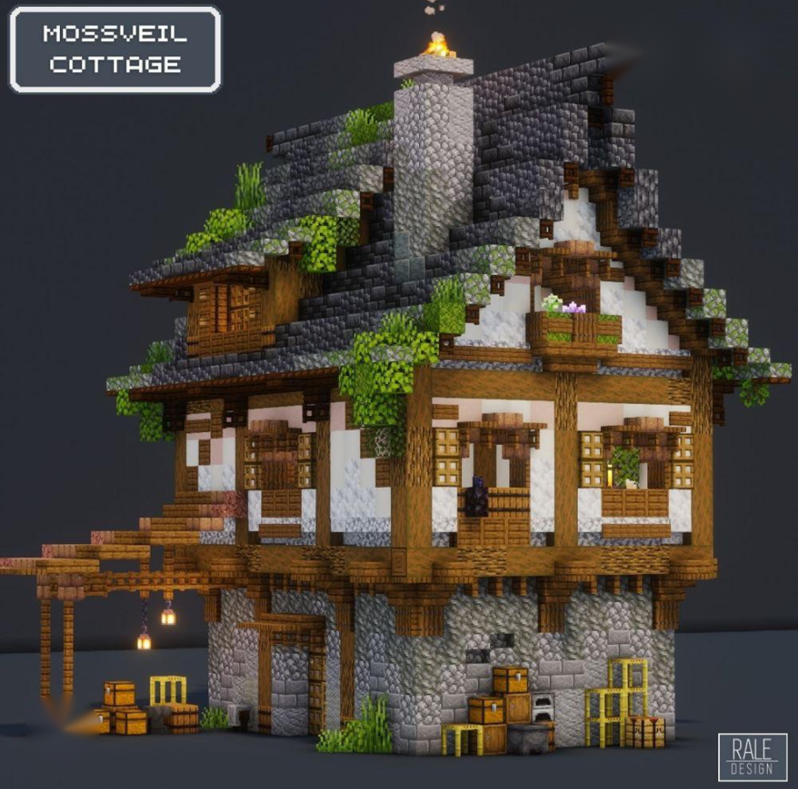
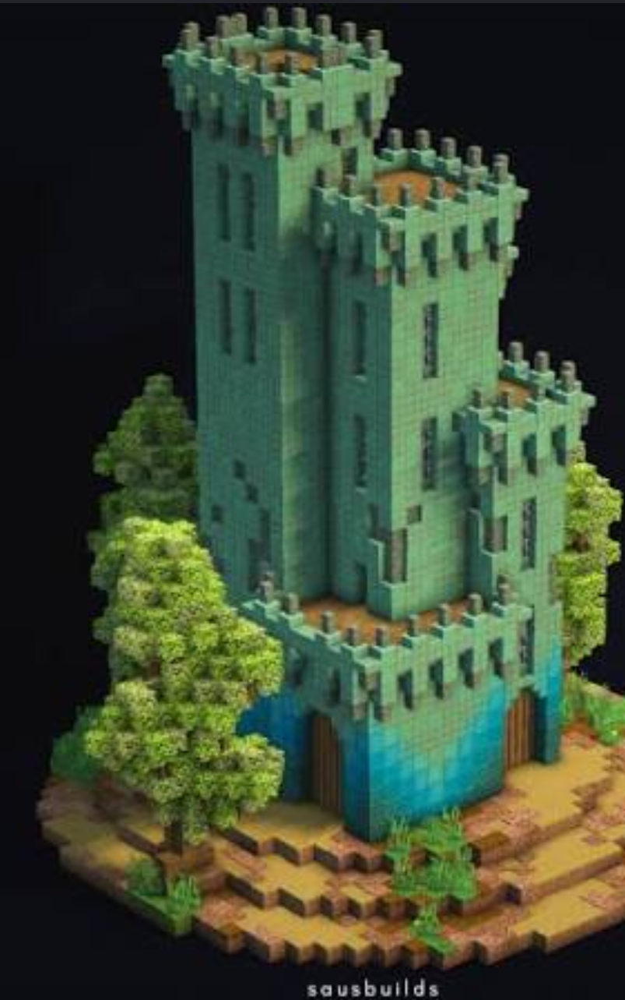

# Building style

How to make it look good without stalling.

## Palette

Pick one block palette and stick to it. Either of these reads as finished:

- Deepslate plus spruce
- Stone bricks plus poplar

**Chosen palette:** _not picked yet_

Style direction: **grand architecture** (see [Inspiration](#inspiration) below). The earlier "cozy autumn village" (spruce, cobble, thatch, copper accents) was only a placeholder suggestion.

## Guidelines

- [ ] Pick a palette (above)
- Mix in stairs, slabs, and walls so walls are not flat.
- Wool and concrete stairs and slabs (new in this drop) are useful for colored trim that is not just full blocks. Don't count on wool stairs to muffle a sculk sensor, though: per the wiki they **don't** block vibrations the way wool blocks do. Sculk sensors only fail to detect them being placed or broken and mobs walking on them ([Wool Stairs](https://minecraft.wiki/w/Wool_Stairs#Vibration_occlusion)).
- Cushions are seats. Put them at a table; they are not structural.
- Build the shell one floor at a time. Roof and light the first floor before you start a tower.
- Leave a 3-block service gap behind storage walls so you can run redstone later without tearing the front off.

## Inspiration

Jeffrey's style references (2026-10-07). The direction is **grand architecture, not simple boxes**: mossy timber-framed buildings, plus towers and spires in oxidized copper.

- **"Mossveil Cottage" by Rale Design:** a timber-framed medieval cottage. Cobblestone base, white plaster walls with a dark oak/spruce timber frame, and a steep dark slate roof with moss and overgrowth. It has a chimney, balconies, and overhangs.
- **"Copper Castle" by sausbuilds:** a castle of oxidized copper towers with crenellations, at several different tower heights.
- **A tall stone tower with an oxidized-copper spire.**

These are other creators' builds, kept here only as style references.

| Mossveil Cottage, Rale Design | Copper Castle, sausbuilds |
| --- | --- |
|  |  |

**Takeaways for our builds:**
- Timber framing with overhangs and balconies for the living and village buildings.
- Steep, mossy, overgrown roofs.
- Oxidized copper for towers, spires, and roofs on the landmark builds (storage hall, lighthouse/watchtower, gatehouse).
- Varied tower heights, so skylines aren't flat.

## Building goals

The nine architecture projects that use this style live in [building-goals.md](building-goals.md).

## Notes

_Style ideas, screenshots, and palette tests go here._
