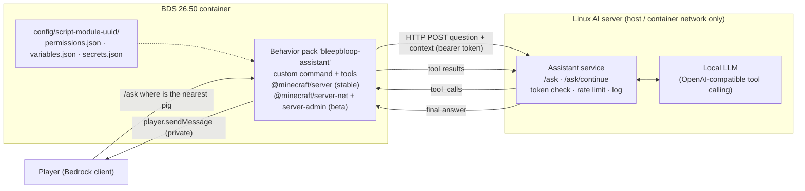

# Big goal: In-game LLM chat assistant ("where is the nearest pig?")

**Goal:** Jeffrey asks a question in plain English inside the game, for example "where is the nearest pig". A behavior pack on the Bedrock Dedicated Server sends the question to a small service on the Linux AI server. That service runs the local LLM with a few **read-only** game tools. The pack runs the tools in the world and privately tells the asker the answer.
**Status:** ⬜ Not started. **This is a plan.** Nothing here is built or tested yet.
**Depends on:** [Server migration](server-migration.md) Stage 0 (the server must be BDS in the container on the AI server). It shares a pack, a service and the Beta APIs decision with the [Live API](live-api.md).
**Verdict:** **Feasible** on our setup (self-hosted BDS 26.50 + local LLM). It is not possible on Realms or in a normal client world, because the HTTP module is BDS-only.

> **Sources (checked 2026-10-07, against Bedrock 26.50 / `@minecraft/server` 2.10.0 stable, 2.11.0-beta for beta):**
> [Custom commands (Learn)](https://learn.microsoft.com/en-us/minecraft/creator/documents/scripting/custom-commands?view=minecraft-bedrock-stable) ·
> [CustomCommandRegistry](https://learn.microsoft.com/en-us/minecraft/creator/scriptapi/minecraft/server/customcommandregistry?view=minecraft-bedrock-stable) ·
> [ChatSendBeforeEvent (beta)](https://learn.microsoft.com/en-us/minecraft/creator/scriptapi/minecraft/server/chatsendbeforeevent?view=minecraft-bedrock-experimental) ·
> [Dimension](https://learn.microsoft.com/en-us/minecraft/creator/scriptapi/minecraft/server/dimension?view=minecraft-bedrock-stable) ·
> [EntityQueryOptions](https://learn.microsoft.com/en-us/minecraft/creator/scriptapi/minecraft/server/entityqueryoptions?view=minecraft-bedrock-stable) ·
> [BlockQueryOptions](https://learn.microsoft.com/en-us/minecraft/creator/scriptapi/minecraft/server/blockqueryoptions?view=minecraft-bedrock-stable) ·
> [System (run, runJob)](https://learn.microsoft.com/en-us/minecraft/creator/scriptapi/minecraft/server/system?view=minecraft-bedrock-stable) ·
> [ModalFormData](https://learn.microsoft.com/en-us/minecraft/creator/scriptapi/minecraft/server-ui/modalformdata?view=minecraft-bedrock-stable) ·
> [HttpRequest (beta)](https://learn.microsoft.com/en-us/minecraft/creator/scriptapi/minecraft/server-net/httprequest?view=minecraft-bedrock-experimental) ·
> [BDS scripting](https://learn.microsoft.com/en-us/minecraft/creator/documents/bedrockserver/scripting?view=minecraft-bedrock-stable) ·
> [1.26.10 changelog: server-net HTTP config](https://learn.microsoft.com/en-us/minecraft/creator/documents/update1.26.10?view=minecraft-bedrock-stable) ·
> wiki: [Argument types](https://minecraft.wiki/w/Argument_types), [/scriptevent](https://minecraft.wiki/w/Commands/scriptevent), [server.properties](https://minecraft.wiki/w/Server.properties), [Coordinates](https://minecraft.wiki/w/Coordinates), [Bedrock Edition 26.50](https://minecraft.wiki/w/Bedrock_Edition_26.50)

## What it does

- A player on the allowlist types `/ask "where is the nearest pig"`, or just `/ask` to get a text box.
- They privately see "Thinking…", then an answer such as: *"Nearest pig: 38 blocks north-east, a little below you. That's toward the village."*
- The LLM decides **which tool to call** (find an entity, find a block, check the time…) and phrases the answer. The **pack** does all the world reading, and every tool is **read-only**.
- Answers go **only to the asker** (`player.sendMessage`). Nobody else sees the question or the answer.
- **Reply format is a server setting** (open decision below):
  - `direction` mode gives distance + compass direction + nearest landmark. It keeps the server's "coordinates off" rule.
  - `coords` mode adds X Y Z. That is what Jeffrey asked for, but it **bypasses the coordinates-off rule**, so it's Jeffrey's call.

## Architecture



The service is **never exposed to the internet**. It listens only on the container network or localhost. Grok Bot's remote access (if any) stays on the [Live API](live-api.md) read endpoints.

## Input method (recommendation)

| Option | Stable/beta (26.50) | Private? | Typing | Who can use it | Verdict |
| --- | --- | --- | --- | --- | --- |
| **Custom slash command `/bb:ask`** (alias `/ask`) | **Stable** in `@minecraft/server` 2.10.0 | Yes. Commands aren't broadcast, and the reply uses `sendMessage` | Multi-word text **must be in double quotes**: Bedrock `string` arguments are one word or a `"quoted string"` (wiki). `/ask` with **no text opens a text box** (no quotes needed). | `permissionLevel: Any` + `cheatsRequired: false`, then our own allowlist | **Recommended** |
| Chat prefix `!ask …` via `world.beforeEvents.chatSend` | **Beta only** (not in 2.10.0) | Yes, if the handler sets `cancel = true` ("this message is not broadcast out") | Most natural: plain chat, no quotes | Anyone who can chat, then our allowlist | Optional extra, later. It would force the whole pack onto the beta `@minecraft/server` version, which breaks more often on updates. |
| `/scriptevent bb:ask …` | Stable | Yes | Rest of the line is the message (no quotes) | **Operator level 1 and cheats on** (wiki) | Not suitable for normal players |

**How the command works (verified against the docs):**
- Register in `system.beforeEvents.startup.subscribe(init => init.customCommandRegistry.registerCommand(...))`.
  - `name: "bb:ask"`. A namespace is required, and since 1.21.90 an alias without the namespace (`/ask`) is created automatically.
  - `permissionLevel: CommandPermissionLevel.Any`.
  - **`cheatsRequired: false`**. It defaults to *true*, which would hide the command with cheats off.
  - `optionalParameters: [{ name: "question", type: CustomCommandParamType.String }]`.
- The callback gets `(origin, question)`. `origin.sourceEntity` is the asking player.
  - The callback runs in a **restricted ("before") context**, so it returns `{ status: CustomCommandStatus.Success }` right away and does the real work in `system.run(...)`.
- **No text given:** open a `ModalFormData` with one `textField` (`@minecraft/server-ui` 2.2.0, stable).
  - `show()` can be rejected with `UserBusy` (for example while the chat screen is still open), so retry a few times over the next ticks. **Untested in game.**
- **Fast path, no LLM:** a second command `/bb:find <EntityType>` (`CustomCommandParamType.EntityType` gives in-game autocomplete for mob names) runs the same "nearest entity" tool directly. It still works when the AI server is down.

## Tools (starter set, all read-only)

The LLM sees each tool as a function with a JSON schema. The pack implements it with these Script API calls. "Stable" means `@minecraft/server` 2.10.0.

| Tool | Arguments | Script API behind it | Notes / limits |
| --- | --- | --- | --- |
| **`find_nearest_entity`** (MVP) | `type` (e.g. `minecraft:pig`), `max_distance` (capped by the pack) | `player.dimension.getEntities({ location: player.location, type, closest: 1, maxDistance })` → `entity.location` (stable). Validate `type` with `EntityTypes.get()`. | Only sees **loaded chunks** (see Limitations). Can also filter by `families` (e.g. "monster") or `name` (name-tagged pets). |
| `count_entities` | `type` or `family`, `max_distance` | Same query without `closest`, then count | "How many cows are nearby?" |
| `find_nearest_block` | `block` (e.g. `minecraft:diamond_ore`), `radius` | `dimension.getBlocks(new BlockVolume(a, b), { includeTypes: [block], closest: 1, location }, true)` (stable; `closest`/`location` added in 26.50). `containsBlock(...)` first as a cheap check. | **Synchronous.** Split big areas into smaller volumes and run them in `system.runJob` (one sub-volume per step). `allowUnloadedChunks = true` skips unloaded chunks instead of throwing `UnloadedChunksError`. Cap the radius. |
| `locate_biome` | `biome` (e.g. `minecraft:cherry_grove`) | `dimension.calculateClosestBiomeFromSeed(location, biome, { boundingSize })` (stable since 2.9.0, formerly `findClosestBiome`) | Works from the **seed**, so it can reach unloaded areas, but terrain may have changed since generation. The docs call it **expensive**: at most one call per tick. |
| `biome_here` | none | `dimension.getBiome(player.location)` (stable) | Throws for unloaded/out-of-range spots |
| `surface_at` | relative offset | `dimension.getTopmostBlock({ x, z })` (stable) | "What's on the surface over there?" |
| `inventory_count` | `item` (optional) | `player.getComponent("minecraft:inventory").container`, loop over slots (stable) | Asker's own inventory only |
| `time_and_weather` | none | `world.getTimeOfDay()`, `world.getDay()`, `world.getMoonPhase()` (stable). Weather is tracked from the stable `world.afterEvents.weatherChange`. | `dimension.getWeather()` is **beta only**. Use the event so the pack stays on stable `@minecraft/server`. |
| `my_spawn_point` | none | `player.getSpawnPoint()` (stable) | Returns bed/anchor spawn, if set |
| `list_landmarks` / `nearest_landmark` | `name` (optional) | Landmarks stored in `variables.json` or world dynamic properties (`world.getDynamicProperty`) | Seeded from [notes/coordinates.md](../notes/coordinates.md) once coordinates are recorded. Gives answers like "toward the village". |
| `where_is_player` | `name` | `world.getPlayers({ name })` → `location` | **Privacy:** only for players who opted in (open decision) |

**Never:** a tool that runs commands (`runCommand`), places or breaks blocks, moves players or teleports. The chapmanjw MCP pack's `mc_run_command` (see [live-api.md](live-api.md#companion-bot-references-researched-2026-10-07)) is exactly what we leave out.

**No structure search.** The Script API has no "locate structure" call, and `runCommand("locate …")` doesn't return the text result. So "nearest village" can only come from landmarks or `locate_biome`.

## LLM service contract (tool loop)

The recommended pattern is **(b) a tool loop**: the service asks the LLM, the LLM requests tools, the pack runs them in the world and returns results, and this repeats until the LLM answers. Pattern (a), sending one big context snapshot up front, can't answer "nearest pig" without scanning everything first, and it wastes tokens. A small fixed tool set keeps the loop short.

All bodies are JSON. Header: `Authorization: Bearer <token>`, where the token comes from `secrets.get("assistantToken")`. These are **example shapes, not a fixed format**.

**1. Pack → service: `POST /ask`**
```json
{
  "request_id": "a1b2c3",
  "player": { "id": "<player.id>", "name": "<gamertag>" },
  "question": "where is the nearest pig",
  "context": {
    "dimension": "minecraft:overworld",
    "reply_mode": "direction",
    "time_of_day": 6000,
    "tools": ["find_nearest_entity", "count_entities", "time_and_weather"]
  }
}
```
`tools` lists what this pack version supports, so the service only offers those to the LLM. The asker's absolute position is **not sent** in `direction` mode.

**2. Service → pack: either tool calls…**
```json
{
  "request_id": "a1b2c3",
  "type": "tool_calls",
  "calls": [
    { "id": "call_1", "name": "find_nearest_entity", "args": { "type": "minecraft:pig", "max_distance": 128 } }
  ]
}
```

**…or a final answer**
```json
{ "request_id": "a1b2c3", "type": "answer", "text": "Nearest pig: 38 blocks north-east, a bit below you, toward the village." }
```

**3. Pack → service: `POST /ask/continue`**
```json
{
  "request_id": "a1b2c3",
  "results": [
    { "id": "call_1", "ok": true,
      "result": { "found": true, "type": "minecraft:pig", "distance": 38, "direction": "north-east",
                  "dy": -4, "nearest_landmark": { "name": "Village", "direction": "north-east", "distance": 60 } } }
  ]
}
```
- The reply is step 2 again. The loop stops at a final answer or after **max 4 rounds**, then the pack says "Sorry, I couldn't work that out."
- Errors use `{ "ok": false, "error": "unloaded_chunks" | "unknown_type" | "too_far" | "timeout" }`.

**Rules for the pack:**
- The pack works out distance and direction itself (8-point compass: −Z is north, +X is east, per the wiki).
- In `direction` mode the pack **never puts absolute coordinates in tool results**, so the LLM can't leak them. In `coords` mode, results also carry `x`, `y`, `z`.
- The pack validates every tool name and argument (known tool, known entity/block type, capped radius) before running anything.

**Service side (Jeffrey's stack choice):**
- Keeps per-`request_id` conversation state, maps the calls to the LLM's function-calling format (OpenAI-style `tools` / `tool_calls`), and expires state after ~60 s.
- System prompt: answer briefly, use tools, never invent locations, say when nothing was found in loaded range.

## Example exchange: "where is the nearest pig"

1. Jeffrey types `/ask "where is the nearest pig"`.
2. The pack checks that he's on the allowlist and not rate-limited. It privately sends *"Thinking…"* and POSTs `/ask`.
3. The LLM picks `find_nearest_entity { type: "minecraft:pig", max_distance: 128 }`, and the service returns that tool call.
4. The pack runs `getEntities({ location, type: "minecraft:pig", closest: 1, maxDistance: 128 })`. It finds one pig 38 blocks away (dx +27, dz −27, dy −4). That's north-east, and the nearest landmark is the Village to the north-east. It POSTs `/ask/continue`.
5. The LLM answers: *"Nearest pig: 38 blocks north-east, a little below you, toward the village."* In `coords` mode it would add *"at X Y Z"*.
6. The pack sends the answer privately to Jeffrey. The service logs the question, the tool call and the answer.

If no pig is in loaded range: *"I can't see any pigs within the loaded area around players (about 64 blocks by default). Try exploring, or look for grass plains."*

## Limitations

- **Only loaded chunks.** Entity and block queries only see chunks the server has loaded: around online players (ticking range `tick-distance`, default **4 chunks**, max 12) and any ticking areas. "Nearest pig" really means "nearest pig near any player". **To test:** how far `getEntities` actually reaches on our server, including loaded but non-ticking chunks out to `view-distance`.
- **Biomes are the exception:** `calculateClosestBiomeFromSeed` uses the seed, so it can find distant biomes (expensive; once per tick at most).
- **Restricted contexts.** Command and `beforeEvents` callbacks can't change the world or do heavy work. Defer with `system.run`.
- **Tick budget.** Work runs on the server thread. The script watchdog (server.properties) warns about slow or spiky scripts (`script-watchdog-slow-threshold=10` ms, `script-watchdog-spike-threshold=100` ms) and treats a hang over `script-watchdog-hang-threshold=10000` ms as fatal. Memory is capped (`script-watchdog-memory-limit=250` MB saves and shuts down). Big block searches therefore go through `system.runJob` in small slices, with capped radii.
- **HTTP is async.** `http.request()` returns a promise, so waiting on the LLM doesn't block ticks. Set `HttpRequest.timeout` (seconds) and handle `HttpRequestLimitExceededError`, `RequestBodyTooLargeError`, `UriNotAllowedError`, `TLSOnlyError` and network errors.
- **Latency.** A local LLM tool loop may take a few seconds per round, hence the "Thinking…" message. A small fast model with good tool calling is better here than a big slow one.
- **Beta APIs.**
  - `@minecraft/server-net` and `@minecraft/server-admin` exist only as beta (`1.0.0-beta.1.26.50-stable`) and need the **Beta APIs** experiment. Beta modules can change on any BDS update: pin the BDS version and retest before upgrading.
  - Experiments **can't be turned off** once a world uses them. Test on a copy first. The same experiment is already needed for Canopy and the Live API.
- **Quotes.** Multi-word `/ask` text needs double quotes (Bedrock argument parsing); the text box avoids this.
- **No structure locate** (see Tools).

## Security

- [ ] The service listens on **localhost / the container network only**. No port forward and no tunnel for `/ask`.
- [ ] Use a **bearer token** shared by the pack and the service. The pack reads it with `secrets.get()`; it resolves only inside `HttpRequest.addHeader` and isn't readable by the script. Keep `secrets.json` on the box only and **never commit it** (public repo). Hand the token over through a secure secret input, never chat.
- [ ] Grant `server-net` **only to this pack** with `config/<script-module-uuid>/permissions.json`. Since 26.10 that file can also limit HTTP (all options optional; unenforced if left out). Example shape:
  ```json
  {
    "allowed_modules": ["@minecraft/server", "@minecraft/server-ui", "@minecraft/server-admin", "@minecraft/server-net"],
    "module_permissions": {
      "@minecraft/server-net": {
        "allowed_uris": ["http://bleepbloop-assistant:8090/"],
        "max_body_bytes": 65536,
        "max_concurrent_requests": 2
      }
    }
  }
  ```
  - The 26.10 changelog example used `force_https`. 26.20 renamed it **`force_tls`**. Leave it off for a plain-HTTP container-network address, or turn it on if the service gets TLS.
  - **To test:** whether `allowed_uris` is a prefix match.
- [ ] **Player allowlist** in `variables.json` (e.g. `"assistantPlayers": ["<gamertag>"]`), checked before anything else. Everyone else gets "The assistant isn't enabled for you."
- [ ] **Rate limits:** a per-player cooldown in the pack (e.g. one question per 10 s, one in flight) and the same in the service. `max_concurrent_requests` caps the pack overall.
- [ ] **Read-only tools only,** with a fixed list and validated arguments. No `runCommand`, and no free-form code from the LLM.
- [ ] **Logging:** the service logs time, player, question, tool calls and answer, plus failed auth. Logs stay on the box and are **never committed**. Retention is an open decision.
- [ ] Answers go only to the asker. `where_is_player` stays off unless players opt in.

## Build steps (in order)

### Step 0: Prerequisites
- [ ] [Server migration](server-migration.md) Stage 0 done (BDS in the container on the AI server)
- [ ] Beta APIs enabled on a **test copy** of the world; confirm it loads (shared with [Live API](live-api.md) Stage 3a)
- [ ] Pack skeleton `bleepbloop-assistant`:
  - Depends on `@minecraft/server` **2.10.0** (stable), `@minecraft/server-ui` 2.2.0, `@minecraft/server-net` and `@minecraft/server-admin` `1.0.0-beta.1.26.50-stable`
  - Per-pack `permissions.json` / `variables.json` / `secrets.json`

### Step 1: MVP (one command, one tool, direction + distance)
- [ ] Service: `POST /ask` and `/ask/continue` with a token check, talking to the local LLM with **one tool**, `find_nearest_entity`
- [ ] Pack: `/bb:ask` (alias `/ask`) with `cheatsRequired: false`, an optional quoted question, and a text box when empty
- [ ] Pack: allowlist + cooldown, a private "Thinking…" message, and HTTP with a timeout and error handling
- [ ] Pack: `find_nearest_entity` via `getEntities({ closest: 1, ... })`, replying with **distance + 8-point compass direction + up/down**
- [ ] Test on the world copy: "where is the nearest pig / cow / sheep", plus "nothing in range" and "AI server down"

### Step 2: No-LLM fast path
- [ ] `/bb:find <EntityType>` (autocomplete) calls the same tool directly; works when the LLM is offline

### Step 3: More tools
- [ ] `count_entities`, `time_and_weather`, `inventory_count`, `my_spawn_point`, `biome_here`
- [ ] `find_nearest_block` with `getBlocks` + `closest`, chunked through `system.runJob`, with a capped radius
- [ ] `locate_biome` with `calculateClosestBiomeFromSeed` (one call per request)

### Step 4: Landmarks
- [ ] Landmark list (name, dimension, position) in `variables.json` or dynamic properties, seeded from [notes/coordinates.md](../notes/coordinates.md)
- [ ] `nearest_landmark` / `list_landmarks`, and replies that mention "toward the village"

### Step 5: Optional extras
- [ ] `!ask` chat prefix through beta `chatSend` with `cancel = true` (only if Jeffrey wants it; moves the pack to beta `@minecraft/server`)
- [ ] `coords` reply mode, if Jeffrey turns it on
- [ ] Merge with the [Live API](live-api.md) pack so one pack and one service do telemetry, chat assistant and, later, the companion bot

## Overlap with the Live API and companion bot

- **Same pack, same service, same experiment.** The [Live API](live-api.md) pack already needs `server-net`, `server-admin`, per-pack `permissions.json`, a token in `secrets.json`, and Beta APIs (also needed for Canopy).
  - The assistant adds a command, a tool runner and two endpoints.
  - Build them as one pack (`bleepbloop-telemetry` + assistant) with one service on the AI server, keeping separate tokens per job.
- The tool runner here is also the "eyes" a future [companion bot](live-api.md#plan-of-record) would need. The LLM controller there can reuse the same tool contract.

## Open decisions for Jeffrey

- [ ] **Reply format:** distance + direction only (keeps coordinates off), or include coordinates (what you asked for, but it bypasses the coordinates-off rule)? Could be per player.
- [ ] **Who can use it:** just you, or every allowlisted player? Can players look each other up (`where_is_player`)?
- [ ] **LLM and service stack:** which model and server on the AI box (it needs OpenAI-style tool calling), and Python or Node for the service?
- [ ] **Beta APIs:** OK to enable it on the world (shared with the Live API and Canopy; can't be undone)?
- [ ] **Input:** `/ask` command only (stable, recommended), or also an `!ask` chat prefix (beta)?
- [ ] **Logging:** keep question logs? For how long (suggest 30 days)?

## Done when

- [ ] `/ask "where is the nearest pig"` privately returns the right distance and direction on the real server
- [ ] Non-allowlisted players are refused, rate limits work, and nothing but the asker sees the answer
- [ ] The service is reachable only from the BDS container, with token auth and `server-net` allowed only for this pack
- [ ] The starter tools from Step 3 work and stay within the script watchdog limits
