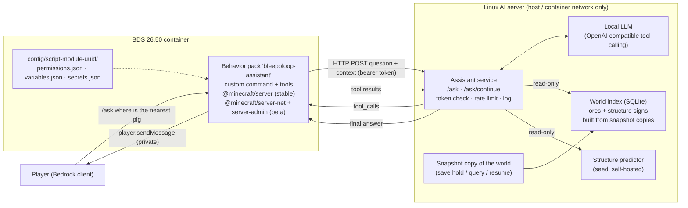

# Big goal: In-game LLM chat assistant ("where is the nearest pig?")

**Goal:** Jeffrey asks a question in plain English inside the game, for example "where is the nearest pig". A behavior pack on the Bedrock Dedicated Server sends the question to a small service on the Linux AI server. That service runs the local LLM with a few **read-only** game tools. The pack runs the tools in the world and privately tells the asker the answer.
**Status:** see the [tracker](../progress/tracker.md). **This is a plan.** Nothing in this repo's design is built yet; jbrain2 plans the same feature (below).
**Depends on:** [Server migration](server-migration.md) Stage 0 (the server must be BDS in the container on the AI server). It shares a pack, a service and the Beta APIs decision with the [Live API](live-api.md).
**Verdict:** **Feasible** on our setup (self-hosted BDS 26.50 + local LLM). It is not possible on Realms or in a normal client world, because the HTTP module is BDS-only.
**Lore:** in-world, the assistant is the satellite left in orbit by an ancient civilization (brainstorm, not canon): see [notes/lore.md](../notes/lore.md).

> **Sources (checked 2026-10-07, against Bedrock 26.50 / `@minecraft/server` 2.10.0 stable, 2.11.0-beta for beta):**
> [Custom commands (Learn)](https://learn.microsoft.com/en-us/minecraft/creator/documents/scripting/custom-commands?view=minecraft-bedrock-stable) ·
> [CustomCommandRegistry](https://learn.microsoft.com/en-us/minecraft/creator/scriptapi/minecraft/server/customcommandregistry?view=minecraft-bedrock-stable) ·
> [ChatSendBeforeEvent (beta)](https://learn.microsoft.com/en-us/minecraft/creator/scriptapi/minecraft/server/chatsendbeforeevent?view=minecraft-bedrock-experimental) ·
> [Dimension](https://learn.microsoft.com/en-us/minecraft/creator/scriptapi/minecraft/server/dimension?view=minecraft-bedrock-stable) ·
> [EntityQueryOptions](https://learn.microsoft.com/en-us/minecraft/creator/scriptapi/minecraft/server/entityqueryoptions?view=minecraft-bedrock-stable) ·
> [BlockQueryOptions](https://learn.microsoft.com/en-us/minecraft/creator/scriptapi/minecraft/server/blockqueryoptions?view=minecraft-bedrock-stable) ·
> [System (run, runJob)](https://learn.microsoft.com/en-us/minecraft/creator/scriptapi/minecraft/server/system?view=minecraft-bedrock-stable) ·
> [ModalFormData](https://learn.microsoft.com/en-us/minecraft/creator/scriptapi/minecraft/server-ui/modalformdata?view=minecraft-bedrock-stable) ·
> [HttpRequest (beta)](https://learn.microsoft.com/en-us/minecraft/creator/scriptapi/minecraft/server-net/httprequest?view=minecraft-bedrock-experimental) ·
> [BDS scripting](https://learn.microsoft.com/en-us/minecraft/creator/documents/bedrockserver/scripting?view=minecraft-bedrock-stable) ·
> [1.26.10 changelog: server-net HTTP config](https://learn.microsoft.com/en-us/minecraft/creator/documents/update1.26.10?view=minecraft-bedrock-stable) ·
> wiki: [Argument types](https://minecraft.wiki/w/Argument_types), [/scriptevent](https://minecraft.wiki/w/Commands/scriptevent), [server.properties](https://minecraft.wiki/w/Server.properties), [Coordinates](https://minecraft.wiki/w/Coordinates), [Bedrock Edition 26.50](https://minecraft.wiki/w/Bedrock_Edition_26.50)
>
> **World files and structure search (checked 2026-10-07):**
> wiki: [Bedrock level format](https://minecraft.wiki/w/Bedrock_Edition_level_format), [Stronghold (Bedrock generation)](https://minecraft.wiki/w/Stronghold#Bedrock_Edition), [/locate](https://minecraft.wiki/w/Commands/locate) ·
> LevelDB readers: [Mojang/leveldb](https://github.com/Mojang/leveldb) (Mojang's fork with zlib), [Amulet-Core](https://github.com/Amulet-Team/Amulet-Core) (Python, 1.9.49 released 2026-09-24), [amulet-leveldb](https://pypi.org/project/amulet-leveldb/) (Cython wrapper for Mojang's LevelDB), [mcbe-leveldb](https://www.npmjs.com/package/mcbe-leveldb) (TypeScript, 1.23.0, 2026-09-13), [leveldb-mcpe-java](https://github.com/HiveGamesOSS/leveldb-mcpe-java), [rbedrock](https://github.com/reedacartwright/rbedrock) (R) ·
> Seed prediction: [Chunkbase seed map accuracy notes](https://www.chunkbase.com/apps/seed-map), [MC Seed View accuracy postmortem (2026-07-15, checked against BDS 1.26.33 `/locate`)](https://mcseedview.com/blog/accuracy-report-july-2026), [SeedFinder](https://github.com/zebedelu/SeedFinder) (C engine + REST API for Bedrock; GitHub lists the license as Zlib, the README badge says Apache-2.0), [cubiomes-bedrock](https://github.com/FragrantResult186/cubiomes-bedrock) (MIT), [cubiomes](https://github.com/Cubitect/cubiomes) (Java-only original) ·
> Live structure check: [`Dimension.getGeneratedStructures` (beta)](https://learn.microsoft.com/en-us/minecraft/creator/scriptapi/minecraft/server/dimension?view=minecraft-bedrock-experimental#getgeneratedstructures)

> **jbrain2 findings (merged PRs #1595–#1596, on the AI box's fresh test world, 2026-10-10).** [jbrain2](https://github.com/jeffmhopkins/jbrain2/blob/main/docs/plans/MINECRAFT_BEDROCK_PLAN.md) tested a script bridge that needs **no Beta APIs**:
> - A behavior pack on stable `@minecraft/server` 2.0.0 loaded with **no experiments** on.
> - `scriptevent jb:… <json>` typed into the BDS console reached the script's `scriptEventReceive` in about 1 ms with the JSON intact, and the script's `console.log` came back on the console (`content-log-console-output-enabled=true`). Together that's a two-way channel without `@minecraft/server-net`.
> - A `jb:dave` custom command registered for all players. `world.afterEvents.chatSend` is **not** on stable.
> - `execute positioned X Y Z run locate structure <id>` and `locate biome minecraft:<id>` printed their answers on the console with no player online. Biome ids need the `minecraft:` namespace; structure ids don't.
> - jbrain2 also records join/leave events and per-player play time (`app.mc_player_sessions`).
>
> jbrain2's own companion, "Dave" (its waves M5–M6, not built), is the same feature: players type `/jb:dave <question>`, it uses read-only `mc_*` tools and replies privately with `tellraw`. It's planned on that console bridge and refuses the Beta APIs experiment. If this repo's pack is built on the same bridge, the Beta APIs step below may not be needed. That's Jeffrey's call; nothing here has been changed on the world.

## What it does

- Any player on the server types `/ask "where is the nearest pig"`, or just `/ask` to get a text box.
- They privately see "Thinking…", then an answer such as: *"Nearest pig: 38 blocks north-east, a little below you. That's toward the village."*
- The LLM decides **which tool to call** (find an entity, find a block, check the time…) and phrases the answer. The **pack** does the live world reading, the **service** reads the seed and saved-world snapshots (structures and ores), and every tool is **read-only**.
- Answers go **only to the asker** (`player.sendMessage`). Nobody else sees the question or the answer.
- **Reply format:** **`coords` mode for every player** (decided 2026-10-07, see [Access policy](#access-policy)): distance + compass direction + nearest landmark, **plus X Y Z**. Coordinates are on in-game too (`showcoordinates` true, reported 2026-10-08), so an X Y Z in a reply matches what players already see on screen.
  - `direction` mode (no X Y Z) stays in the code as a setting, in case that ever changes.
- It can also find **structures** (from the seed, confirmed against the saved world) and **ores** (from a scan of saved world snapshots). See [Structure and ore search](#structure-and-ore-search-world-files--seed).

## Architecture



The service is **never exposed to the internet**. It listens only on the container network or localhost. Grok Bot's remote access (if any) stays on the [Live API](live-api.md) read endpoints.

## Input method (recommendation)

| Option | Stable/beta (26.50) | Private? | Typing | Who can use it | Verdict |
| --- | --- | --- | --- | --- | --- |
| **Custom slash command `/bb:ask`** (alias `/ask`) | **Stable** in `@minecraft/server` 2.10.0 | Yes. Commands aren't broadcast, and the reply uses `sendMessage` | Multi-word text **must be in double quotes**: Bedrock `string` arguments are one word or a `"quoted string"` (wiki). `/ask` with **no text opens a text box** (no quotes needed). | `permissionLevel: Any` + `cheatsRequired: false`; every player on the server can use it | **Recommended** |
| Chat prefix `!ask …` via `world.beforeEvents.chatSend` | **Beta only** (not in 2.10.0) | Yes, if the handler sets `cancel = true` ("this message is not broadcast out") | Most natural: plain chat, no quotes | Anyone who can chat | Optional extra, later. It would force the whole pack onto the beta `@minecraft/server` version, which breaks more often on updates. |
| `/scriptevent bb:ask …` | Stable | Yes | Rest of the line is the message (no quotes) | **Operator level 1 and cheats on** (wiki) | Not suitable for normal players |

**How the command works (verified against the docs):**
- Register in `system.beforeEvents.startup.subscribe(init => init.customCommandRegistry.registerCommand(...))`.
  - `name: "bb:ask"`. A namespace is required, and since 1.21.90 an alias without the namespace (`/ask`) is created automatically.
  - `permissionLevel: CommandPermissionLevel.Any`.
  - **`cheatsRequired: false`**. It defaults to *true*, which would hide the command with cheats off.
  - `optionalParameters: [{ name: "question", type: CustomCommandParamType.String }]`.
- The callback gets `(origin, question)`. `origin.sourceEntity` is the asking player.
  - The callback runs in a **restricted ("before") context**, so it returns `{ status: CustomCommandStatus.Success }` right away and does the real work in `system.run(...)`.
- **No text given:** open a `ModalFormData` with one `textField` (`@minecraft/server-ui` 2.2.0, stable).
  - `show()` can be rejected with `UserBusy` (for example while the chat screen is still open), so retry a few times over the next ticks. **Untested in game.**
- **Fast path, no LLM:** a second command `/bb:find <EntityType>` (`CustomCommandParamType.EntityType` gives in-game autocomplete for mob names) runs the same "nearest entity" tool directly. It still works when the AI server is down.

## Tools (all read-only)

The LLM sees each tool as a function with a JSON schema. **Pack tools** run in the world through these Script API calls ("stable" means `@minecraft/server` 2.10.0). **Service tools** run on the AI server against the seed and saved-world snapshots; they're listed after the table.

| Tool | Arguments | Script API behind it | Notes / limits |
| --- | --- | --- | --- |
| **`find_nearest_entity`** (MVP) | `type` (e.g. `minecraft:pig`), `max_distance` (capped by the pack) | `player.dimension.getEntities({ location: player.location, type, closest: 1, maxDistance })` → `entity.location` (stable). Validate `type` with `EntityTypes.get()`. | Only sees **loaded chunks** (see Limitations). Can also filter by `families` (e.g. "monster") or `name` (name-tagged pets). |
| `count_entities` | `type` or `family`, `max_distance` | Same query without `closest`, then count | "How many cows are nearby?" |
| `find_nearest_block` | `block` (e.g. `minecraft:diamond_ore`), `radius` | `dimension.getBlocks(new BlockVolume(a, b), { includeTypes: [block], closest: 1, location }, true)` (stable; `closest`/`location` added in 26.50). `containsBlock(...)` first as a cheap check. | **Synchronous.** Split big areas into smaller volumes and run them in `system.runJob` (one sub-volume per step). `allowUnloadedChunks = true` skips unloaded chunks instead of throwing `UnloadedChunksError`. Cap the radius. |
| `locate_biome` | `biome` (e.g. `minecraft:cherry_grove`) | `dimension.calculateClosestBiomeFromSeed(location, biome, { boundingSize })` (stable since 2.9.0, formerly `findClosestBiome`) | Works from the **seed**, so it can reach unloaded areas, but terrain may have changed since generation. The docs call it **expensive**: at most one call per tick. |
| `biome_here` | none | `dimension.getBiome(player.location)` (stable) | Throws for unloaded/out-of-range spots |
| `surface_at` | relative offset | `dimension.getTopmostBlock({ x, z })` (stable) | "What's on the surface over there?" |
| `inventory_count` | `item` (optional) | `player.getComponent("minecraft:inventory").container`, loop over slots (stable) | Asker's own inventory only |
| `time_and_weather` | none | `world.getTimeOfDay()`, `world.getDay()`, `world.getMoonPhase()` (stable). Weather is tracked from the stable `world.afterEvents.weatherChange`. | `dimension.getWeather()` is **beta only**. Use the event so the pack stays on stable `@minecraft/server`. |
| `my_spawn_point` | none | `player.getSpawnPoint()` (stable) | Returns bed/anchor spawn, if set |
| `list_landmarks` / `nearest_landmark` | `name` (optional) | Landmarks stored in `variables.json` or world dynamic properties (`world.getDynamicProperty`) | Seeded from [notes/coordinates.md](../notes/coordinates.md) once coordinates are recorded. Gives answers like "toward the village". |
| `where_is_player` | `name` | **Online:** `world.getPlayers({ name })` → `location` + `dimension` (stable, live). **Offline:** last known position (see notes). | **On for every player** (decided 2026-10-07). Read-only: it only reads positions. Offline answers say "last seen … at <time>". Last-known positions come from the pack recording online players' positions every ~30 s in a world dynamic property (pack bookkeeping, not an LLM tool). The fallback is the player's `player_…` record in the saved-world snapshot, which needs the player ID ↔ gamertag mapping from [server migration](server-migration.md#snapshot-pipeline-stage-2) Stage 2. **To test:** which is simpler on 26.50. |
| `structure_here` | none | `dimension.getGeneratedStructures(player.location)` (**beta**) | "What structure am I standing in?" Loaded chunks only. Also used to confirm a predicted structure when someone is near it. |

**Never:** a tool that runs commands (`runCommand`), places or breaks blocks, moves players or teleports. The chapmanjw MCP pack's `mc_run_command` (see [live-api.md](live-api.md#companion-bot-references-researched-2026-10-07)) is exactly what we leave out.

**Service tools** (run on the AI server, never in the pack; read-only):

| Tool | Arguments | How | Notes / limits |
| --- | --- | --- | --- |
| **`find_structure`** | `type` (e.g. `village`, `trial_chambers`), `max_results` | Seed prediction near the asker, then each candidate is checked against the world index: **confirmed** (signature blocks found in a saved chunk), **predicted** (land not explored yet), or **missing** (explored but nothing there, so it probably failed to generate). | Reliability depends on the structure type (table below). Answers say which of the three it is. |
| **`find_nearest_ore`** | `block` (e.g. `diamond_ore`; deepslate variants included), `max_results` | Nearest matching blocks in the world index, from the latest snapshot | **Explored (saved) chunks only.** Answers carry the snapshot time ("as of 4:10 PM"). Ore mined since then may be gone. |
| `index_status` | none | Snapshot time, how many chunks are indexed per dimension | So the LLM can say how fresh its answer is |

## Structure and ore search (world files + seed)

The Script API alone can't do this. It has no "locate structure" call, `runCommand("locate …")` only returns a success count (not the text), and block search only covers loaded chunks. The AI server hosts the world, though, so the **service** can use two other sources. The LLM's tools stay read-only either way.

**1. The saved world (what has been generated or explored).**
- BDS saves the world in **Mojang's LevelDB fork with zlib compression** (`db/` folder; wiki: Bedrock level format). Normal LevelDB libraries can't read it; use a reader built on Mojang's fork:
  - **Amulet-Core** (Python, actively released) or **amulet-leveldb** (just the Cython LevelDB wrapper) plus our own subchunk palette parsing for speed. **To test:** 26.50 support, same as the [snapshot pipeline](server-migration.md#snapshot-pipeline-stage-2).
  - **mcbe-leveldb** (TypeScript) if the service is Node.
- **Never read the live `db/`.** Use the same consistent copy method as the backups (`save hold` → `save query` → copy and truncate → `save resume`), from [server migration](server-migration.md#snapshot-pipeline-stage-2).
- **Index it, don't scan per question.** After each snapshot, an indexer walks the chunks that changed and stores the positions of the ores (all ore blocks and ancient debris) and **structure signature blocks** in SQLite. Example signatures: `trial_spawner`/`vault` (trial chambers), `reinforced_deepslate` (ancient city), `end_portal_frame` (stronghold), `suspicious_gravel` (trail ruins). Questions then become a fast nearest-point lookup.
  - The level format also has `HardcodedSpawners` records (bounding boxes for structure spawn areas) and `AABBVolumes` / `JigsawStructureBlueprint` records. **To test:** whether these can be decoded to list structures directly; the wiki doesn't document their contents.
- **Saves lag behind play.** The snapshot only has what the server has written to disk, so it's minutes behind. Live mobs stay with the pack's Script API tools; only ores and structures use the files.

**2. The seed (what the world was made to have, even where nobody has been).**
- Seed maps like Chunkbase predict structure positions from the seed. For a self-hosted service, the open-source options for **Bedrock** are small, young projects: **SeedFinder** (C engine on cubiomes with Bedrock-specific placement, HTTP API, 17 structure types) and **cubiomes-bedrock** (MIT C library). The original **cubiomes** is Java-only. Chunkbase itself has no API.
- **Self-host only.** Don't send the seed to a hosted API (for example SeedFinder's public endpoint): the seed reveals the whole world. The seed stays on the box (it's in `level.dat`) and is **never committed** to this public repo.
- **Validate before trusting.** Check the predictor against our own world: structures confirmed in the index, and spot checks in game. Predictions are version-specific, so retest after BDS updates that change world generation.

**How reliable is seed prediction on Bedrock?** (From Chunkbase's own accuracy notes, MC Seed View's July 2026 check against BDS 1.26.33 `/locate`, the SeedFinder support table, and the wiki's Bedrock stronghold rules.)

| Reliability | Structures | Why |
| --- | --- | --- |
| **Good** (region-grid placement, verified by tools against BDS) | Villages, pillager outposts, desert pyramids, jungle temples, swamp huts, igloos, shipwrecks, ocean ruins, ocean monuments, woodland mansions, buried treasure, ruined portals, ancient cities, trail ruins, trial chambers, mineshafts | One placement attempt per region, so the position can be computed. Some can still fail to generate in game (villages about 2% in MC Seed View's check). Terrain-dependent ones (pyramids, jungle temples, mansions) can give false positives. Trail ruins, ruined portals and fossils may only be accurate to the chunk, and things can be buried. Accuracy drops millions of blocks from 0,0. |
| **Unreliable or unsupported** | **Strongholds** (Bedrock places them randomly, at least 160 blocks out, plus 3 extra under village meeting points; MC Seed View hides them until verified), **Nether structures** (fortresses, bastions: approximate or not exposed), **Nether fossils and dried ghasts** (Chunkbase lists them as unreliable on Bedrock), **End cities** (not exposed in SeedFinder), **per-chunk features** (dungeons, amethyst geodes, desert wells, fossils), **abandoned camps** (new in 26.50; no open-source support found) | Different or unknown placement on Bedrock, or decided chunk by chunk during decoration |
| **Not predictable** | **Individual ores** (diamonds and so on) in land that hasn't generated | Ore placement happens during chunk decoration. We found no tool that predicts individual Bedrock ore blocks from the seed. Ores only come from the saved-world scan. |

For unreliable types, the answer comes from the saved world only (confirmed structures), or the bot says it can't predict them. For strongholds, the in-game answer stays the eye of ender.

**3. Optional ground truth: the game's own `/locate`.** BDS can run `/locate structure <type>` from the console (the itzg image's `send-command`, output in the container logs). It's the game's own answer, so it's exact, including strongholds. **To test:** `/locate` is a **cheat-only** command on Bedrock. jbrain2 found that `execute positioned X Y Z run locate structure|biome …` from the console prints its answer with no player online, on its fresh test world; check it again on the real world. This would be the service sending a console command, so it stays service-side, limited to `locate`, and is never an LLM tool that runs arbitrary commands.

## LLM service contract (tool loop)

The recommended pattern is **(b) a tool loop**: the service asks the LLM, the LLM requests tools, the pack runs them in the world and returns results, and this repeats until the LLM answers. Pattern (a), sending one big context snapshot up front, can't answer "nearest pig" without scanning everything first, and it wastes tokens. A small fixed tool set keeps the loop short.

All bodies are JSON. Header: `Authorization: Bearer <token>`, where the token comes from `secrets.get("assistantToken")`. These are **example shapes, not a fixed format**.

**1. Pack → service: `POST /ask`**
```json
{
  "request_id": "a1b2c3",
  "player": { "id": "<player.id>", "name": "<gamertag>" },
  "question": "where is the nearest pig",
  "context": {
    "dimension": "minecraft:overworld",
    "reply_mode": "direction",
    "time_of_day": 6000,
    "tools": ["find_nearest_entity", "count_entities", "time_and_weather"]
  }
}
```
`tools` lists what this pack version supports, so the service only offers those to the LLM. The service adds its own tools (`find_structure`, `find_nearest_ore`, `index_status`) and runs those itself, without a round trip to the pack.
- **Position:** the service tools need the asker's position, so the pack sends `"position": {x, y, z}` with every question. In `coords` mode (everyone, decided) the LLM may see coordinates. In `direction` mode the service turns results into distance and direction **before** the LLM sees them, so the LLM still never gets absolute coordinates.

**2. Service → pack: either tool calls…**
```json
{
  "request_id": "a1b2c3",
  "type": "tool_calls",
  "calls": [
    { "id": "call_1", "name": "find_nearest_entity", "args": { "type": "minecraft:pig", "max_distance": 128 } }
  ]
}
```

**…or a final answer**
```json
{ "request_id": "a1b2c3", "type": "answer", "text": "Nearest pig: 38 blocks north-east, a bit below you, toward the village." }
```

**3. Pack → service: `POST /ask/continue`**
```json
{
  "request_id": "a1b2c3",
  "results": [
    { "id": "call_1", "ok": true,
      "result": { "found": true, "type": "minecraft:pig", "distance": 38, "direction": "north-east",
                  "dy": -4, "nearest_landmark": { "name": "Village", "direction": "north-east", "distance": 60 } } }
  ]
}
```
- The reply is step 2 again. The loop stops at a final answer or after **max 4 rounds**, then the pack says "Sorry, I couldn't work that out."
- Errors use `{ "ok": false, "error": "unloaded_chunks" | "unknown_type" | "too_far" | "timeout" }`.

**Rules for the pack:**
- The pack works out distance and direction itself (8-point compass: −Z is north, +X is east, per the wiki).
- In `direction` mode the pack **never puts absolute coordinates in tool results**, so the LLM can't leak them. In `coords` mode, results also carry `x`, `y`, `z`.
- The pack validates every tool name and argument (known tool, known entity/block type, capped radius) before running anything.

**Service side (Jeffrey's stack choice):**
- Keeps per-`request_id` conversation state, maps the calls to the LLM's function-calling format (OpenAI-style `tools` / `tool_calls`), and expires state after ~60 s.
- System prompt: answer briefly, use tools, never invent locations, say when nothing was found in loaded range.

## Example exchange: "where is the nearest pig"

1. Jeffrey types `/ask "where is the nearest pig"`.
2. The pack checks that he's a player and not rate-limited. It privately sends *"Thinking…"* and POSTs `/ask`.
3. The LLM picks `find_nearest_entity { type: "minecraft:pig", max_distance: 128 }`, and the service returns that tool call.
4. The pack runs `getEntities({ location, type: "minecraft:pig", closest: 1, maxDistance: 128 })`. It finds one pig 38 blocks away (dx +27, dz −27, dy −4). That's north-east, and the nearest landmark is the Village to the north-east. It POSTs `/ask/continue`.
5. The LLM answers: *"Nearest pig: 38 blocks north-east, a little below you, toward the village."* In `coords` mode it would add *"at X Y Z"*.
6. The pack sends the answer privately to Jeffrey. The service logs the question, the tool call and the answer.

If no pig is in loaded range: *"I can't see any pigs within the loaded area around players (about 64 blocks by default). Try exploring, or look for grass plains."*

## Limitations

- **Only loaded chunks.** Entity and block queries only see chunks the server has loaded: around online players (ticking range `tick-distance`, default **4 chunks**, max 12) and any ticking areas. "Nearest pig" really means "nearest pig near any player". **To test:** how far `getEntities` actually reaches on our server, including loaded but non-ticking chunks out to `view-distance`.
- **Biomes are the exception:** `calculateClosestBiomeFromSeed` uses the seed, so it can find distant biomes (expensive; once per tick at most).
- **Restricted contexts.** Command and `beforeEvents` callbacks can't change the world or do heavy work. Defer with `system.run`.
- **Tick budget.** Work runs on the server thread. The script watchdog (server.properties) warns about slow or spiky scripts (`script-watchdog-slow-threshold=10` ms, `script-watchdog-spike-threshold=100` ms) and treats a hang over `script-watchdog-hang-threshold=10000` ms as fatal. Memory is capped (`script-watchdog-memory-limit=250` MB saves and shuts down). Big block searches therefore go through `system.runJob` in small slices, with capped radii.
- **HTTP is async.** `http.request()` returns a promise, so waiting on the LLM doesn't block ticks. Set `HttpRequest.timeout` (seconds) and handle `HttpRequestLimitExceededError`, `RequestBodyTooLargeError`, `UriNotAllowedError`, `TLSOnlyError` and network errors.
- **Latency.** A local LLM tool loop may take a few seconds per round, hence the "Thinking…" message. A small fast model with good tool calling is better here than a big slow one.
- **Beta APIs.**
  - `@minecraft/server-net` and `@minecraft/server-admin` exist only as beta (`1.0.0-beta.1.26.50-stable`) and need the **Beta APIs** experiment. Beta modules can change on any BDS update: pin the BDS version and retest before upgrading.
  - Experiments **can't be turned off** once a world uses them. Test on a copy first. The same experiment is already needed for Canopy and the Live API.
- **Quotes.** Multi-word `/ask` text needs double quotes (Bedrock argument parsing); the text box avoids this.
- **Structures and ores come from files, not the live world** (see [Structure and ore search](#structure-and-ore-search-world-files--seed)): ore answers are as fresh as the last snapshot, and seed predictions vary in reliability by structure type.

## Security

- [ ] The service listens on **localhost / the container network only**. No port forward and no tunnel for `/ask`.
- [ ] Use a **bearer token** shared by the pack and the service. The pack reads it with `secrets.get()`; it resolves only inside `HttpRequest.addHeader` and isn't readable by the script. Keep `secrets.json` on the box only and **never commit it** (public repo). Hand the token over through a secure secret input, never chat.
- [ ] Grant `server-net` **only to this pack** with `config/<script-module-uuid>/permissions.json`. Since 26.10 that file can also limit HTTP (all options optional; unenforced if left out). Example shape:
  ```json
  {
    "allowed_modules": ["@minecraft/server", "@minecraft/server-ui", "@minecraft/server-admin", "@minecraft/server-net"],
    "module_permissions": {
      "@minecraft/server-net": {
        "allowed_uris": ["http://bleepbloop-assistant:8090/"],
        "max_body_bytes": 65536,
        "max_concurrent_requests": 2
      }
    }
  }
  ```
  - The 26.10 changelog example used `force_https`. 26.20 renamed it **`force_tls`**. Leave it off for a plain-HTTP container-network address, or turn it on if the service gets TLS.
  - **To test:** whether `allowed_uris` is a prefix match.
- [ ] **Who can ask:** every player on the server (decided; [assumes a trusted-friends server](#access-policy)). The BDS allowlist (`allow-list=true`) controls who can join; the pack only checks that the sender is a real player (not a command block or script).
- [ ] **Rate limits:** a per-player cooldown in the pack (e.g. one question per 10 s, one in flight) and the same in the service. `max_concurrent_requests` caps the pack overall.
- [ ] **Read-only tools only,** with a fixed list and validated arguments. No `runCommand`, and no free-form code from the LLM.
- [ ] **Logging:** the service logs time, player, question, tool calls and answer, plus failed auth. Logs stay on the box and are **never committed**. Retention is an open decision.
- [ ] Answers go only to the asker. Any player can look up any other player with `where_is_player` (decided); the looked-up player isn't notified.
- [ ] **World files:** the service and indexer read **snapshot copies only**, mounted read-only. Never the live `db/`.
- [ ] **Seed and index stay on the box.** The seed, the SQLite index and the snapshots are **never committed** and never sent to a hosted seed API.

## Access policy

**Decided 2026-10-07.** Jeffrey: "I should be able to ask, no restrictions," then "Each player should have access."
- **Every player on the server gets the same unrestricted access** to all tools: live entity and block search, structure search, ore search, and **coordinates in replies** (`coords` mode). There are no roles or tiers.
- Unrestricted means *what players can ask*, not what the tools can do. **Every LLM game tool stays read-only.** No tool runs commands, edits blocks, moves players or writes to the world files.
- Lore "seals" in [notes/lore.md](../notes/lore.md) are story flavor only. They never gate what anyone can ask.
- Rate limits still apply to everyone (they protect the server and the LLM, not access).

- **Anyone can look up any other player** (`where_is_player`, decided 2026-10-07): live position if they're online, last known position if they're offline. Still read-only.

> **Assumes a trusted-friends server.** Open access (player lookup, ore search, coordinates) is safe only because everyone on the server is a friend Jeffrey trusts.
> - **Enforced by the BDS allowlist:** set `allow-list=true` in `server.properties`, so only gamertags in `allowlist.json` can join. Add people with `allowlist add <Gamertag>` from the console. The allowlist needs `online-mode=true` (leave it on). Property and file names checked against [Microsoft's BDS server.properties docs](https://learn.microsoft.com/en-us/minecraft/creator/documents/bedrockserver/server-properties) (2026-10-08). Microsoft documents the default as `allow-list=false`, so it **must be set to `true` explicitly**, and it only works with `online-mode=true`. `allowlist on`/`off` from the console only lasts until the next restart; the file setting is what sticks.
> - **If a stranger is ever added,** revisit these before they join:
>   - `where_is_player` and ore search: either a per-player toggle in `assistantAccess`, or a config flag in the service that turns those two tools off for everyone not on a trusted list.
>   - The vanilla **`playerwaypoints`** game rule (the locator bar). Its default, `everyone`, shows every online player's marker to everyone, so it leaks positions **even before the assistant exists**. Set it to `off` if needed. Documented in [multiplayer server: game rules](multiplayer-server.md#game-version-and-new-game-rules) and [coordinates: navigating](../notes/coordinates.md#navigating).
> - **The seed is never sent to players or put in the LLM's replies.** Only answers go out (a position, a distance and direction). The LLM never sees the seed either; the service keeps it on the box and uses it internally.

The pack and the service share one access setting in `variables.json`, e.g. `"assistantAccess": { "players": "all", "reply_mode": "coords", "tools": "all", "where_is_player": "all" }`. The service enforces the same setting, so a modified request can't change it.

## Build steps (in order)

### Step 0: Prerequisites
- [ ] [Server migration](server-migration.md) Stage 0 done (BDS in the container on the AI server)
- [ ] Beta APIs enabled on a **test copy** of the world; confirm it loads (shared with [Live API](live-api.md) Stage 3a)
- [ ] Pack skeleton `bleepbloop-assistant`:
  - Depends on `@minecraft/server` **2.10.0** (stable), `@minecraft/server-ui` 2.2.0, `@minecraft/server-net` and `@minecraft/server-admin` `1.0.0-beta.1.26.50-stable`
  - Per-pack `permissions.json` / `variables.json` / `secrets.json`

### Step 1: MVP (one command, one tool)
- [ ] Service: `POST /ask` and `/ask/continue` with a token check, talking to the local LLM with **one tool**, `find_nearest_entity`
- [ ] Pack: `/bb:ask` (alias `/ask`) with `cheatsRequired: false`, an optional quoted question, and a text box when empty
- [ ] Pack: player check + cooldown, a private "Thinking…" message, and HTTP with a timeout and error handling
- [ ] Pack: `find_nearest_entity` via `getEntities({ closest: 1, ... })`, replying with **distance + 8-point compass direction + up/down**, plus **X Y Z** (`coords` mode for everyone, decided)
- [ ] Pack + service: the shared access setting (all players, all tools, coordinates on, player lookups on)
- [ ] Test on the world copy: "where is the nearest pig / cow / sheep", plus "nothing in range" and "AI server down"

### Step 2: No-LLM fast path
- [ ] `/bb:find <EntityType>` (autocomplete) calls the same tool directly; works when the LLM is offline

### Step 3: More tools
- [ ] `count_entities`, `time_and_weather`, `inventory_count`, `my_spawn_point`, `biome_here`
- [ ] `find_nearest_block` with `getBlocks` + `closest`, chunked through `system.runJob`, with a capped radius
- [ ] `locate_biome` with `calculateClosestBiomeFromSeed` (one call per request)

### Step 4: Landmarks
- [ ] Landmark list (name, dimension, position) in `variables.json` or dynamic properties, seeded from [notes/coordinates.md](../notes/coordinates.md)
- [ ] `nearest_landmark` / `list_landmarks`, and replies that mention "toward the village"

### Step 5: Optional extras
- [ ] `!ask` chat prefix through beta `chatSend` with `cancel = true` (only if Jeffrey wants it; moves the pack to beta `@minecraft/server`)
- [ ] `where_is_player` for everyone: live position for online players, last known position (with time) for offline players
- [ ] Merge with the [Live API](live-api.md) pack so one pack and one service do telemetry, chat assistant and, later, the companion bot

### Step 6: World snapshot pipeline + index
- [ ] Reuse the backup copy method from [server migration](server-migration.md#snapshot-pipeline-stage-2) (`save hold` → `save query` → copy and truncate → `save resume`) to make a **local, on-box** snapshot for the assistant. This one isn't uploaded anywhere. Suggested cadence: every 10–15 minutes while someone is online, plus one on server stop.
- [ ] Pick the reader: Amulet-Core / amulet-leveldb (Python) or mcbe-leveldb (Node), whichever matches the service stack. Test it on a 26.50 snapshot first.
- [ ] Indexer: re-scan only chunks that changed since the last snapshot, and store ore and structure-signature block positions in SQLite (per dimension)
- [ ] `index_status` tool (snapshot time, chunks indexed)
- [ ] **To test:** how far behind a snapshot is, and how long a first full index and an incremental update take on our world
- [ ] **To test:** whether `HardcodedSpawners` / `AABBVolumes` / `JigsawStructureBlueprint` records can be decoded into a structure list

### Step 7: `find_nearest_ore`
- [ ] Nearest-point lookup in the index (ore names include deepslate variants), with the snapshot time in every answer
- [ ] "Nothing found" answer that explains it only knows explored land, and suggests where to look instead (for diamonds: deep, near the bottom of the world)

### Step 8: `find_structure`
- [ ] Self-host a Bedrock seed predictor (SeedFinder's engine or cubiomes-bedrock) in the service container. Seed from `level.dat`; no hosted API.
- [ ] Only the **good-reliability** types from the [reliability table](#structure-and-ore-search-world-files--seed) are predicted. The others are answered from the index only (confirmed structures).
- [ ] Mark each answer **confirmed / predicted / missing** by checking the index (and `structure_here` when someone is near)
- [ ] Validate against our world before turning it on: every structure we've confirmed should match a prediction
- [ ] Optional: test `/locate` from the BDS console as ground truth (cheat-only on Bedrock; see above)

## Overlap with the Live API and companion bot

- **Same pack, same service, same experiment.** The [Live API](live-api.md) pack already needs `server-net`, `server-admin`, per-pack `permissions.json`, a token in `secrets.json`, and Beta APIs (also needed for Canopy).
  - The assistant adds a command, a tool runner and two endpoints.
  - Build them as one pack (`bleepbloop-telemetry` + assistant) with one service on the AI server, keeping separate tokens per job.
- The tool runner here is also the "eyes" a future [companion bot](live-api.md#plan-of-record) would need. The LLM controller there can reuse the same tool contract.
- **Same snapshots.** The world index is built from the same consistent copies as the [snapshot pipeline](server-migration.md#snapshot-pipeline-stage-2) (Stage 2), and the [Live API](live-api.md) push-only option ships summaries of those snapshots. The assistant's copies just stay on the box and run more often.

## Open decisions for Jeffrey

- [x] **Who can use it and how much:** every player, with the same unrestricted access: every tool, ore and structure search, and coordinates in replies (decided 2026-10-07, see [Access policy](#access-policy)). Tools stay read-only.
- [x] **Player lookups:** anyone can look up any other player with `where_is_player` (decided 2026-10-07): live if online, last known position if offline.
- [ ] **LLM and service stack:** which model and server on the AI box (it needs OpenAI-style tool calling), and Python or Node for the service?
- [ ] **Beta APIs:** OK to enable it on the world (shared with the Live API and Canopy; can't be undone)?
- [ ] **Input:** `/ask` command only (stable, recommended), or also an `!ask` chat prefix (beta)?
- [ ] **Logging:** keep question logs? For how long (suggest 30 days)?
- [ ] **Snapshot cadence:** how fresh should ore answers be (suggest every 10–15 minutes while someone is online)? More often means more `save hold` pauses and disk churn.
- [ ] **`/locate` from the console:** worth testing as exact ground truth, given it's a cheat-only command?

## Done when

- [ ] `/ask "where is the nearest pig"` privately returns the right distance and direction on the real server
- [ ] Every player can ask, rate limits work, and nothing but the asker sees the answer
- [ ] The service is reachable only from the BDS container, with token auth and `server-net` allowed only for this pack
- [ ] The starter tools from Step 3 work and stay within the script watchdog limits
- [ ] `/ask "where is the nearest diamond"` returns the nearest indexed diamond ore with its snapshot time and coordinates
- [ ] `/ask "where is the nearest village"` returns a structure marked confirmed or predicted, and only predicts the reliable types
