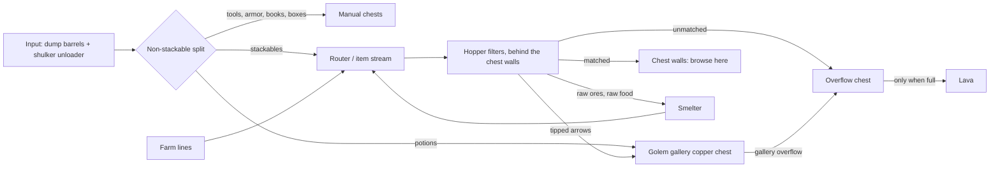

# Storage: how to group things

**Part of:** [Storage and sorting](storage-and-sorting.md)
**Status:** ⬜ Draft recommendation, not built
**Server:** Bedrock 26.50. Every redstone build must be a Bedrock-tested design.

The storage hall will be a grand custom build that Jeffrey designs (see [building style: inspiration](building-style.md#inspiration)). This file deliberately doesn't set a shape, size, or palette. It covers four things:
1. **Functional grouping:** what has to sit next to what.
2. **Item grouping:** how the chest walls are organized.
3. **Item-by-item chest allocation:** every item type, how many chests it gets, and how it's sorted.
4. **Growth stages:** the order the system gets built, tied to game phases. This is the single source of truth for storage stages.

It also lists the hard technical constraints any shape has to fit around.

Decided: **hopper filters fed by an item stream do the primary sorting** (Bedrock chest-hall style). **Copper golems are a showpiece gallery** near the entrance.

## 1. Functional grouping

### Item flow

### Adjacency rules
1. **Input sits next to the router.** The dump barrels and the shulker unloader feed one short line into the router. The non-stackable split comes first, before any filter.
2. **The router feeds the start of the item stream.** Farm lines also join at the start of the stream, not halfway along it.
3. **Filters sit directly behind the chest wall they fill.** Each filter slice feeds its own chest(s) straight through the wall, with the service space behind it.
4. **Service access runs behind every chest wall.** Keep a 3-block gap with a walkable route, so filters can be fixed without touching the front.
5. **The machine side holds the smelter, overflow, and lava, together.** The smelter is fed by filter slices, and its output goes back to the router. Lava sits directly behind the overflow chest at the end of the stream. Keep this side away from wood and from the showpiece areas.
6. **The golem gallery goes near the entrance, where it's visible.** It's fed from the router into its copper chest, and its overflow goes to the main overflow, never back into the router. Seal it off from every other chest.
7. **Related item groups sit side by side** (see §2): ores and metals next to where smelter output lands, and brewing ingredients next to the golem gallery's potions.
8. **Keep the expansion end open.** The end of the stream and the far end of the chest walls must have room to add slices without moving the input, router, or machines.

### Hard constraints any shape has to fit around (verified)
| Constraint | Source |
| --- | --- |
| A **3-block service gap** behind storage walls | [Building style](building-style.md) |
| One hopper moves **2.5 items/s** (~9,000/hour). Plan farm lines around that. | [Bedrock WIKI: Stackable Sorting](https://bedrockwiki.com/books/storage-tech/page/stackable-sorting) |
| One water source pushes items **up to 9 blocks** in an item stream | [Bedrock WIKI: Item Streams](https://bedrockwiki.com/books/storage-tech/page/item-streams) |
| On Bedrock, full-speed stacked input leaks a few items past filters (MCPE-28890), so always end in an overflow chest | [Tutorial: Hopper](https://minecraft.wiki/w/Tutorial:Hopper#Item_sorter) |
| **Nothing conductive directly on a chest or copper chest. On Bedrock, no bottom slab either.** Stairs, glass, and ice are OK, and chests stack. | [Chest](https://minecraft.wiki/w/Chest), [Copper Chest](https://minecraft.wiki/w/Copper_Chest) |
| Golems: the **overflow chest must be the farthest** from the golem | Community designs, Bedrock ([thread](https://www.reddit.com/r/minecraftbedrock/comments/1vtq2mx/copper_golem_sorter_on_bedrock_keeps_prioritizing/)) |
| Golems: **keep at least 1 item in every display chest.** An **empty chest accepts anything**, so never let a hopper drain a golem chest. | [Copper Golem](https://minecraft.wiki/w/Copper_Golem) |
| Golems: on Bedrock they ignore chests they **can't see** | [Copper Golem](https://minecraft.wiki/w/Copper_Golem) |
| Golems: they reach chests **1 block up and 2 down**, and search a 65×17×65 area, so seal the gallery | [Copper Golem](https://minecraft.wiki/w/Copper_Golem) |
| Golems open non-iron doors, so use iron doors for the gallery | [Copper Golem](https://minecraft.wiki/w/Copper_Golem) |
| Lava can ignite nearby flammable blocks, so no wood near the lava | [Lava](https://minecraft.wiki/w/Lava) |
| Bedrock spawn-proofing: most monsters can't spawn where block light is above 0, or on carpet, bottom slabs, stairs, or glass | [Mob spawning](https://minecraft.wiki/w/Mob_spawning) |

## 2. Item grouping for the chest walls

**Browsing order:** start with the most-used groups nearest the entrance. Put related groups next to each other.

**Bulk** = several chests for one item. **Slice** = one chest per item type. Exact per-item counts are in [§3](#3-item-by-item-chest-allocation).

| # | Group | What goes in it | Sorted by | Size |
| --- | --- | --- | --- | --- |
| 1 | **Stone family** | Cobblestone, cobbled deepslate, stone, deepslate, granite/diorite/andesite, tuff, dirt, gravel, sand | Hoppers | **Bulk** for cobble, cobbled deepslate, and dirt. Slices for the rest. |
| 2 | **Wood family** | Logs by type, planks, stripped logs, saplings, sticks | Hoppers | **Bulk** for your main build wood. Slices for the rest. |
| 3 | **Farming & food** | Wheat, seeds, carrots, potatoes, sugar cane, cooked food, bone meal, eggs, hay bales | Hoppers (raw meat/fish go to the smoker first) | **Bulk** for farm outputs |
| 4 | **Ores & metals** | Coal, raw ores, iron/gold ingots, nuggets, diamonds, emeralds, lapis, quartz | Hoppers (raw ores go to the blast furnace first) | **Bulk** for iron ingots and coal. Put next to where smelter output lands. |
| 5 | **Copper** | Copper ingots and blocks, cut copper, grates, bulbs, lanterns, honeycomb (wax) | Hoppers | Slices. Put next to Ores & metals. |
| 6 | **Decorative** | Bricks, glass, wool, concrete, terracotta, wool/concrete stairs and slabs, dyes, flowers | Hoppers | Slices. Lots of item types, low volume. |
| 7 | **Redstone** | Redstone dust, repeaters, comparators, pistons, observers, hoppers, droppers, dispensers | Hoppers | Slices |
| 8 | **Transport** | Rails, minecarts, boats, fireworks | Hoppers for stackables; saddles go to Manual | Slices |
| 9 | **Mob drops** | Bones, string, gunpowder, rotten flesh, arrows, spider eyes, leather, feathers, slimeballs, ender pearls | Hoppers | **Bulk** for mob-farm outputs |
| 10 | **Brewing** | Nether wart, blaze rods/powder, glass bottles, sugar, glistering melon, magma cream, ghast tears, fermented spider eyes | Hoppers | Slices. **Put next to the golem gallery** (potions). |
| 11 | **Potions & tipped arrows** | Potions by type, tipped arrows by type | **Golem gallery** (on Bedrock, golems tell these types apart) | Display chests |
| 12 | **Nether** | Netherrack, blackstone, basalt, soul sand/soil, glowstone, nether bricks | Hoppers | Slices (bulk for netherrack if you need it) |
| 13 | **End** | End stone, purpur, chorus fruit, shulker shells | Hoppers | Slices |
| 14 | **Tools, armor & enchanting** | Tools, armor, enchanted books (all unstackable), plus books and bookshelves | **Manual** (unstackables come out at the non-stackable split) | A few labeled chests, near the workshop/enchanting area |
| 15 | **Shulker boxes** | Empty and full boxes | **Manual** (the unloader returns empty boxes) | A box chest at the input |
| 16 | **Misc / new items** | Anything without a slice yet, for weekly review | Overflow chest | One chest. Add a slice for anything that keeps showing up. |

**Rules of thumb**
- Items that **stack to 16** (ender pearls, eggs, snowballs, signs, honey bottles) need a filter variant with different filler counts. The wiki notes 15/14 on Bedrock hybrids ([Tutorial: Hopper](https://minecraft.wiki/w/Tutorial:Hopper#Item_sorter)).
- **Never send to lava:** anything unstackable, shulker boxes, or netherite/ancient debris (netherite doesn't burn). The junk list for lava is Jeffrey's call.
- **Label every chest with an item frame** (sneak to place one on a chest; on Bedrock it's a block, so one per spot) ([Item Frame](https://minecraft.wiki/w/Item_Frame)).

## 3. Item-by-item chest allocation

> **One table per stage:** [storage-stages.md](storage-stages.md) shows each growth stage on its own, listing only what that stage adds.

Starting recommendations for a small survival server with a wheat farm, a tree farm, and mob farms later. These are counts, not a layout: where each chest sits is up to the hall design (and the [adjacency rules](#1-functional-grouping)).

**Units**
- **DC** = one double chest's worth (54 slots, 3,456 items of a 64-stack item). **SC** = one single chest (27 slots). **DC-eq** = DC + SC ÷ 2, used for subtotals.
- How you build a 2 DC or 4 DC allocation (several chests on one filter, or a separate bulk module) is the slice design's job. Pick a Bedrock-tested one.

**Sorted by**
- **Filter:** its own hopper filter slice.
- **Filter (16):** a filter slice for an item that stacks to 16, which needs different filler counts (the wiki notes 15/14 on Bedrock hybrids, [Tutorial: Hopper](https://minecraft.wiki/w/Tutorial:Hopper#Item_sorter)).
- **Mixed (manual):** one shared chest, **no filter**. These items ride the stream into the overflow chest, and you move them over on the weekly review. If one keeps piling up, give it its own slice.
- **Smelter first:** a filter slice sends it to the smelter; the result comes back through the router and lands in its own chest. No storage chest for the raw item.
- **Manual:** unstackables (out at the non-stackable split) or things you put away by hand.
- **Golem:** the golem gallery.
- **Overflow:** the end of the stream.

**Stage** = the [growth stage](#4-growth-stages) when the item gets its slice or chest in the hall. **★** = leave expansion room next to it (space for more chests, or a spot to promote it to its own slice).

Items from recent drops were checked against the Minecraft Wiki (2026-10-07): the Copper Age copper items, Chaos Cubed sulfur and cinnabar (26.30), the golden dandelion (26.10), and Wilderness Bound poplar, wool and concrete stairs and slabs, cushions, shelf mushrooms, red shrubs, and straw beds (26.50, [changelog](https://minecraft.wiki/w/Bedrock_Edition_26.50)). Recent-drop items are marked with their version. Every stack size flagged here (16 vs 64 vs unstackable) was checked on the item's [Minecraft Wiki](https://minecraft.wiki) page.

### Totals

| Group | DC | SC | DC-eq | Filter slices |
| --- | --- | --- | --- | --- |
| 1. Stone family | 13 | 8 | 17 | 13 |
| 2. Wood family | 6 | 10 | 11 | 9 |
| 3. Farming & food | 7 | 15 | 14.5 | 16 |
| 4. Ores & metals | 5 | 9 | 9.5 | 10 |
| 5. Copper | 2 | 4 | 4 | 3 |
| 6. Decorative | 10 | 15 | 17.5 | 7 |
| 7. Redstone | 0 | 6 | 3 | 2 |
| 8. Transport | 0 | 6 | 3 | 2 |
| 9. Mob drops | 4 | 8 | 8 | 10 |
| 10. Brewing ingredients | 0 | 7 | 3.5 | 6 |
| 11. Potions & tipped arrows (golem gallery, module 1) | 0 | 11 | 5.5 | 0 |
| 12. Nether | 2 | 5 | 4.5 | 4 |
| 13. End | 1 | 4 | 3 | 3 |
| 14. Tools, armor & enchanting (manual) | 3 | 4 | 5 | 2 |
| 15. Shulker boxes (manual) | 0 | 2 | 1 | 0 |
| 16. Misc / overflow | 3 | 0 | 3 | 0 |
| **Grand total** | **56** | **114** | **113** | **87** |

### Per-item tables

#### 1. Stone family

| Item | Chests | Sorted by | Stage | Notes |
| --- | --- | --- | --- | --- |
| Cobblestone ★ | 4 DC | Filter | 1 | Bulk. Junk-to-lava candidate once full (your call) |
| Cobbled deepslate ★ | 3 DC | Filter | 1 | Bulk from deep mining |
| Dirt ★ | 2 DC | Filter | 1 | Bulk for terraforming |
| Stone | 1 DC | Filter | 1 | Smelted cobble; makes smooth stone (blast furnaces) and stone bricks |
| Gravel | 1 DC | Filter | 1 |  |
| Sand | 1 DC | Filter | 1 | Feeds the smelter for glass |
| Deepslate | 1 SC | Filter | 2 | Silk Touch only |
| Granite | 1 SC | Filter | 2 |  |
| Diorite | 1 SC | Filter | 2 |  |
| Andesite | 1 SC | Filter | 2 |  |
| Tuff | 1 SC | Filter | 2 |  |
| Flint | 1 SC | Filter | 2 | From gravel |
| Obsidian | 1 SC | Filter | 2 |  |
| **Mixed chest:** red sand, coarse dirt, rooted dirt, mud, clay balls, moss blocks, podzol, mycelium, calcite, smooth basalt, dripstone blocks, pointed dripstone | 1 DC | Mixed (manual) | 2 | Low volume; one chest for all of them |
| **Mixed chest:** sulfur, cinnabar, sulfur spikes (sulfur caves, added in 26.30) | 1 SC | Mixed (manual) | 2 | Only once you find a sulfur cave |
| **Subtotal** | **13 DC + 8 SC = 17 DC-eq** | **13 filter slices** | | |

#### 2. Wood family

| Item | Chests | Sorted by | Stage | Notes |
| --- | --- | --- | --- | --- |
| Main wood logs (your tree-farm species) ★ | 3 DC | Filter | 1 | Bulk from the tree farm |
| Main wood planks | 1 DC | Filter | 1 |  |
| Main wood stripped logs | 1 SC | Filter | 2 |  |
| Main wood saplings | 1 SC | Filter | 2 | Tree-farm surplus; compost extras |
| Sticks | 1 SC | Filter | 2 |  |
| Accent log #1, #2, #3 (the species you build with most after the main one) ★ | 3 SC | Filter | 2 | 1 chest each, 3 slices |
| **Mixed chest:** all other logs (oak, spruce, birch, jungle, acacia, dark oak, mangrove, cherry, pale oak, poplar, minus the ones above) | 1 DC | Mixed (manual) | 2 | Poplar was added in 26.50 |
| **Mixed chest:** other planks and stripped logs | 1 DC | Mixed (manual) | 2 |  |
| **Mixed chest:** other saplings (incl. poplar saplings, mangrove propagules) | 1 SC | Mixed (manual) | 2 |  |
| **Mixed chest:** sheared leaves | 1 SC | Mixed (manual) | 2 |  |
| Bamboo | 1 SC | Filter | 2 | Scaffolding |
| **Mixed chest:** signs and hanging signs (all woods) | 1 SC | Mixed (manual) | 2 | Stack to 16 |
| **Subtotal** | **6 DC + 10 SC = 11 DC-eq** | **9 filter slices** | | |

#### 3. Farming & food

| Item | Chests | Sorted by | Stage | Notes |
| --- | --- | --- | --- | --- |
| Wheat ★ | 2 DC | Filter | 1 | Wheat-farm output |
| Wheat seeds | 1 DC | Filter | 1 | Farm surplus; compost extras |
| Carrots | 1 DC | Filter | 1 |  |
| Potatoes | 1 DC | Filter | 1 | Poisonous potatoes go to overflow (junk candidate) |
| Sugar cane ★ | 1 DC | Filter | 1 | Paper (books, maps) and sugar |
| Hay bales | 1 DC | Filter | 2 | Compressed wheat; also crafts straw beds (26.50) |
| Bread | 1 SC | Filter | 2 |  |
| Baked potatoes | 1 SC | Filter | 2 | Smoker output |
| Cooked meat #1 and #2 (the two animals you farm, e.g. steak, cooked porkchop) | 2 SC | Filter | 2 | 1 chest each; smoker output |
| Raw meat and raw fish | — | Smelter first | 2 | Smoker first; the cooked result comes back to the router |
| **Mixed chest:** other cooked food (cooked mutton, chicken, rabbit, cod, salmon) | 1 SC | Mixed (manual) | 2 |  |
| Pumpkins | 1 SC | Filter | 2 | Carved pumpkins for golems |
| Melon slices | 1 SC | Filter | 2 | Glistering melon for brewing |
| Apples | 1 SC | Filter | 2 | Tree-farm drop |
| Golden carrots | 1 SC | Filter | 2 |  |
| Eggs | 1 SC | Filter (16) | 2 | Stack to 16. Brown and blue eggs are separate items: filter your chickens' color, add the others by hand |
| Bone meal | 1 SC | Filter | 2 |  |
| **Mixed chest:** beetroot, beetroot seeds | 1 SC | Mixed (manual) | 2 |  |
| **Mixed chest:** sweet berries, glow berries, cocoa beans, kelp, dried kelp, dried kelp blocks, torchflower seeds, pitcher pods | 1 SC | Mixed (manual) | 2 |  |
| **Mixed chest:** brown mushrooms, red mushrooms, shelf mushrooms (26.50) | 1 SC | Mixed (manual) | 2 | Stew ingredients |
| **Mixed chest:** pumpkin pie, cookies, honey bottles | 1 SC | Mixed (manual) | 2 | Honey bottles stack to 16 |
| Stews and soups | — | Manual | 2 | Unstackable: they come out at the non-stackable split |
| **Subtotal** | **7 DC + 15 SC = 14.5 DC-eq** | **16 filter slices** | | |

#### 4. Ores & metals

| Item | Chests | Sorted by | Stage | Notes |
| --- | --- | --- | --- | --- |
| Coal ★ | 2 DC | Filter | 1 | Smelter fuel and torches |
| Iron ingots ★ | 2 DC | Filter | 1 | 5 per hopper; more once an iron farm runs |
| Charcoal | 1 DC | Filter | 2 | Tree-farm logs through the smelter |
| Raw iron, raw gold, raw copper | — | Smelter first | 2 | Blast furnace first; ingots come back to the router |
| Iron nuggets | 1 SC | Filter | 2 |  |
| Gold ingots | 1 SC | Filter | 2 |  |
| Gold nuggets | 1 SC | Filter | 2 |  |
| Diamonds | 1 SC | Filter | 2 | Never lava |
| Emeralds ★ | 1 SC | Filter | 2 | Grow it if you build a trading hall |
| Lapis lazuli | 1 SC | Filter | 2 | Enchanting |
| Nether quartz | 1 SC | Filter | 2 | 1 per comparator, and most filter slices use one |
| **Mixed chest:** storage blocks (iron, gold, diamond, emerald, lapis, coal, redstone blocks), amethyst shards | 1 SC | Mixed (manual) | 2 |  |
| **Mixed chest:** ancient debris, netherite scrap, netherite ingots | 1 SC | Manual | 2 | Never lava (netherite doesn't burn and would clog the disposal). Put away by hand; don't dump into the input |
| **Subtotal** | **5 DC + 9 SC = 9.5 DC-eq** | **10 filter slices** | | |

#### 5. Copper

| Item | Chests | Sorted by | Stage | Notes |
| --- | --- | --- | --- | --- |
| Copper ingots | 1 DC | Filter | 2 | Golems, copper chests, copper building blocks |
| Copper nuggets | 1 SC | Filter | 2 | From smelting copper tools and armor; for copper torches, lanterns, chains |
| Honeycomb | 1 SC | Filter | 2 | Wax for golems and copper |
| **Mixed chest:** blocks of copper (each oxidation and waxed state is its own item) | 1 SC | Mixed (manual) | 2 | Golems can be built from any state |
| **Mixed chest:** cut copper and its stairs and slabs, chiseled copper, copper grates, doors, trapdoors, bulbs, bars, chains, lightning rods, copper torches, copper lanterns ★ | 1 DC | Mixed (manual) | 2 | Many item types (oxidation states multiply them) |
| **Mixed chest:** gallery spares: copper chests, carved pumpkins, copper golem statues | 1 SC | Manual | 4 | On Bedrock, statues that froze in survival don't stack (MCPE-225273) |
| **Subtotal** | **2 DC + 4 SC = 4 DC-eq** | **3 filter slices** | | |

#### 6. Decorative

| Item | Chests | Sorted by | Stage | Notes |
| --- | --- | --- | --- | --- |
| Main build block #1 (your pick) ★ | 2 DC | Filter | 3 | Bulk; whatever the hall and base are made of |
| Main build block #2 (your pick) ★ | 2 DC | Filter | 3 | Bulk |
| Glass | 1 DC | Filter | 2 | Smelter output from sand |
| Glass panes | 1 SC | Filter | 3 |  |
| Torches | 1 SC | Filter | 2 |  |
| Item frames | 1 SC | Filter | 2 | For labeling every chest |
| White wool | 1 SC | Filter | 3 | Sheep output; dye as needed |
| **Mixed chest:** colored wool (15 colors) | 1 SC | Mixed (manual) | 3 |  |
| **Mixed chest:** carpets (16 colors) | 1 SC | Mixed (manual) | 3 |  |
| **Mixed chest:** wool stairs and wool slabs (26.50; 16 colors each, 32 item types) | 1 DC | Mixed (manual) | 3 | More types than a single chest has slots |
| **Mixed chest:** cushions (26.50, 16 colors) | 1 SC | Mixed (manual) | 3 | Stack to 16 |
| **Mixed chest:** concrete (16 colors) | 1 SC | Mixed (manual) | 3 |  |
| **Mixed chest:** concrete powder (16 colors) | 1 SC | Mixed (manual) | 3 |  |
| **Mixed chest:** concrete stairs and slabs (26.50; 32 item types) | 1 DC | Mixed (manual) | 3 |  |
| **Mixed chest:** terracotta, dyed terracotta, glazed terracotta (33 types) | 1 DC | Mixed (manual) | 3 |  |
| **Mixed chest:** stained glass and stained glass panes (32 types) | 1 DC | Mixed (manual) | 3 |  |
| **Mixed chest:** dyes (16) | 1 SC | Mixed (manual) | 3 |  |
| **Mixed chest:** bricks (item) and brick blocks | 1 SC | Mixed (manual) | 3 |  |
| **Mixed chest:** flowers, incl. wildflowers, cactus flowers, eyeblossoms, golden dandelions | 1 SC | Mixed (manual) | 3 |  |
| **Mixed chest:** foliage: leaf litter, short and tall dry grass, bushes, firefly bushes, ferns, vines, red shrubs (26.50) | 1 SC | Mixed (manual) | 3 |  |
| **Mixed chest:** lanterns, soul lanterns, iron chains, glow item frames | 1 SC | Mixed (manual) | 3 |  |
| **Mixed chest:** banners, paintings, flower pots | 1 SC | Mixed (manual) | 3 | Banners stack to 16 |
| **Mixed chest:** other decorative stone (mud bricks, packed mud, tuff bricks, resin bricks, sulfur and cinnabar bricks, polished variants, stairs/slabs/walls) ★ | 1 DC | Mixed (manual) | 3 | Promote any you start using a lot to its own slice |
| **Subtotal** | **10 DC + 15 SC = 17.5 DC-eq** | **7 filter slices** | | |

#### 7. Redstone

| Item | Chests | Sorted by | Stage | Notes |
| --- | --- | --- | --- | --- |
| Redstone dust ★ | 1 SC | Filter | 3 |  |
| Hoppers | 1 SC | Filter | 3 | Build stock for new slices |
| **Mixed chest:** comparators, repeaters, redstone torches | 1 SC | Mixed (manual) | 3 |  |
| **Mixed chest:** pistons, sticky pistons, observers, droppers, dispensers, crafters | 1 SC | Mixed (manual) | 3 |  |
| **Mixed chest:** levers, buttons, pressure plates, tripwire hooks, daylight detectors, target blocks, note blocks, redstone lamps | 1 SC | Mixed (manual) | 3 |  |
| **Mixed chest:** slime blocks, honey blocks ★ | 1 SC | Mixed (manual) | 3 | Flying machine stock (end game) |
| **Subtotal** | **0 DC + 6 SC = 3 DC-eq** | **2 filter slices** | | |

#### 8. Transport

| Item | Chests | Sorted by | Stage | Notes |
| --- | --- | --- | --- | --- |
| Rails | 1 SC | Filter | 3 |  |
| Firework rockets ★ | 1 SC | Filter | 3 | Elytra fuel later |
| **Mixed chest:** powered, detector, activator rails | 1 SC | Mixed (manual) | 3 |  |
| **Mixed chest:** leads, name tags, dried ghasts | 1 SC | Mixed (manual) | 3 |  |
| Boats, chest boats, minecarts (all types) | 1 SC | Manual | 3 | Unstackable: from the non-stackable split |
| Saddles, harnesses, horse armor (incl. copper), nautilus armor | 1 SC | Manual | 3 | Unstackable |
| **Subtotal** | **0 DC + 6 SC = 3 DC-eq** | **2 filter slices** | | |

#### 9. Mob drops

| Item | Chests | Sorted by | Stage | Notes |
| --- | --- | --- | --- | --- |
| Rotten flesh ★ | 1 DC | Filter | 3 | Mob-farm bulk; junk-to-lava candidate |
| Bones ★ | 1 DC | Filter | 3 | Mob-farm bulk; bone meal |
| String ★ | 1 DC | Filter | 3 | Mob-farm bulk |
| Gunpowder ★ | 1 DC | Filter | 3 | Mob-farm bulk; rockets |
| Arrows | 1 SC | Filter | 3 |  |
| Spider eyes | 1 SC | Filter | 3 |  |
| Ender pearls | 1 SC | Filter (16) | 3 | Stack to 16 |
| Slimeballs | 1 SC | Filter | 3 | Slime blocks for the flying machine |
| Leather | 1 SC | Filter | 3 | Books |
| Feathers | 1 SC | Filter | 3 |  |
| **Mixed chest:** ink sacs, glow ink sacs | 1 SC | Mixed (manual) | 3 |  |
| **Mixed chest:** prismarine shards, prismarine crystals, nautilus shells, hearts of the sea, armadillo scutes, turtle scutes, rabbit hide, wind charges, breeze rods, cobwebs | 1 SC | Mixed (manual) | 3 |  |
| Mob-dropped tools, armor, bows | — | Manual | 3 | Unstackable: to the non-stackable intake, never lava |
| **Subtotal** | **4 DC + 8 SC = 8 DC-eq** | **10 filter slices** | | |

#### 10. Brewing ingredients

| Item | Chests | Sorted by | Stage | Notes |
| --- | --- | --- | --- | --- |
| Nether wart ★ | 1 SC | Filter | 3 | Grow it if you build a wart farm |
| Blaze rods | 1 SC | Filter | 3 |  |
| Blaze powder | 1 SC | Filter | 3 |  |
| Glass bottles | 1 SC | Filter | 3 |  |
| Sugar | 1 SC | Filter | 3 |  |
| Glowstone dust | 1 SC | Filter | 3 |  |
| **Mixed chest:** glistering melon slices, magma cream, ghast tears, fermented spider eyes, rabbit's feet, phantom membranes, pufferfish, dragon's breath | 1 SC | Mixed (manual) | 3 |  |
| **Subtotal** | **0 DC + 7 SC = 3.5 DC-eq** | **6 filter slices** | | |

#### 11. Potions & tipped arrows (golem gallery, module 1)

| Item | Chests | Sorted by | Stage | Notes |
| --- | --- | --- | --- | --- |
| Gallery input copper chest | 1 SC | Golem | 4 | Fed by the router (brewing-stand potion filter + tipped-arrow slice) |
| Display chests: Healing, Regeneration, Strength, Swiftness, Fire Resistance, Night Vision, Slow Falling, Splash Healing, Tipped arrows (1 type) | 9 SC | Golem | 4 | 1 chest per type (golems tell types apart on Bedrock). Potions are unstackable, so 27 per chest. Keep 1 in each |
| Gallery overflow (farthest chest) | 1 SC | Golem | 4 | Drains to the main overflow, never back to the router |
| **Subtotal** | **0 DC + 11 SC = 5.5 DC-eq** | **0 filter slices** | | |

#### 12. Nether

| Item | Chests | Sorted by | Stage | Notes |
| --- | --- | --- | --- | --- |
| Netherrack ★ | 1 DC | Filter | 3 | Grow it only if you build with it |
| Blackstone | 1 SC | Filter | 3 |  |
| Basalt | 1 SC | Filter | 3 |  |
| Glowstone | 1 SC | Filter | 3 |  |
| **Mixed chest:** soul sand, soul soil | 1 SC | Mixed (manual) | 3 |  |
| **Mixed chest:** nether bricks (block) and nether brick (item) | 1 SC | Mixed (manual) | 3 |  |
| **Mixed chest:** crimson and warped stems, nether wart blocks, warped wart blocks, shroomlights, magma blocks, crying obsidian, gilded blackstone, crimson and warped fungi | 1 DC | Mixed (manual) | 3 |  |
| **Subtotal** | **2 DC + 5 SC = 4.5 DC-eq** | **4 filter slices** | | |

#### 13. End

| Item | Chests | Sorted by | Stage | Notes |
| --- | --- | --- | --- | --- |
| End stone ★ | 1 DC | Filter | 5 |  |
| Purpur blocks | 1 SC | Filter | 5 |  |
| Shulker shells | 1 SC | Filter | 5 | Never lava; 2 per shulker box |
| **Mixed chest:** chorus fruit, popped chorus fruit | 1 SC | Mixed (manual) | 5 |  |
| **Mixed chest:** end rods, eyes of ender | 1 SC | Mixed (manual) | 5 |  |
| **Subtotal** | **1 DC + 4 SC = 3 DC-eq** | **3 filter slices** | | |

#### 14. Tools, armor & enchanting (manual)

| Item | Chests | Sorted by | Stage | Notes |
| --- | --- | --- | --- | --- |
| Tools and weapons (incl. copper tools, spears, maces, bows, crossbows, tridents, shields) | 1 DC | Manual | 3 | Unstackable |
| Armor (incl. copper armor, turtle shells) | 1 DC | Manual | 3 | Unstackable |
| Enchanted books ★ | 1 DC | Manual | 3 | Unstackable |
| Books | 1 SC | Filter | 3 |  |
| Bookshelves | 1 SC | Filter | 3 |  |
| **Mixed chest:** valuables: totems of undying, elytra, heavy cores, trial keys, ominous bottles, bottles o' enchanting | 1 SC | Manual | 3 | Never lava |
| **Mixed chest:** music discs, goat horns, written books, books and quills | 1 SC | Manual | 3 | Discs, horns, books and quills are unstackable; written books stack to 16 |
| **Subtotal** | **3 DC + 4 SC = 5 DC-eq** | **2 filter slices** | | |

#### 15. Shulker boxes (manual)

| Item | Chests | Sorted by | Stage | Notes |
| --- | --- | --- | --- | --- |
| Empty shulker boxes ★ | 1 SC | Manual | 5 | The unloader returns empties here. Unstackable, never lava |
| Packed boxes and kits | 1 SC | Manual | 5 | Never lava |
| **Subtotal** | **0 DC + 2 SC = 1 DC-eq** | **0 filter slices** | | |

#### 16. Misc / overflow

| Item | Chests | Sorted by | Stage | Notes |
| --- | --- | --- | --- | --- |
| Main overflow (end of the stream, in front of the lava) | 2 DC | Overflow | 1 | Weekly review; also where mixed-chest items wait. Promote anything that keeps showing up |
| Non-stackable intake (from the split) | 1 DC | Manual | 1 | Sort by hand into groups 8, 14, 15 |
| **Subtotal** | **3 DC + 0 SC = 3 DC-eq** | **0 filter slices** | | |

### Allocation notes
- **Never lava** (keep these out of the stream or give them a slice before the lava goes live): anything unstackable, shulker boxes and shells, diamonds, netherite and ancient debris, valuables.
- **Stack to 16** (filter variant or manual): eggs, ender pearls, snowballs, signs and hanging signs, honey bottles, banners, cushions, written books, empty buckets. Armor stands stack to 64 on Bedrock (16 on Java).
- **Unstackable** (non-stackable split, then manual): tools, armor, enchanted books, potions, shulker boxes, boats, minecarts, saddles, harnesses, horse and nautilus armor, music discs, goat horns, totems, elytra, stews and soups, filled buckets, books and quills, bundles.
- **Golem gallery chests are wooden chests seeded with 1 item each.** Never let a hopper drain one.
- **Not listed on purpose:** spawn eggs and creative-only items, and items the wiki says are unobtainable in survival in 26.50 (portfolio, photo).

## 4. Growth stages

> **One table per stage:** [storage-stages.md](storage-stages.md) breaks this down into a self-contained item table for each stage, generated from §3.

**This is the one place the storage build-out stages live.** [Storage and sorting](storage-and-sorting.md#stages) points here, and the [tracker](../progress/tracker.md) milestones match these stage numbers. Function and order only: the hall's shape and size are Jeffrey's design.

**Every stage keeps rule 8:** the end of the stream and the far ends of the chest walls stay open, so the next stage adds slices there without moving the input, router, or machines.

| Stage | Game phase | What gets automated | Added (from §3) |
| --- | --- | --- | --- |
| 0 | [Phase 4](phase-4-the-base.md#1-storage-wall) | Nothing yet: manual chests by group, plus one test slice | 16 group chests + 1 input chest (17 SC, temporary; not in the 113) |
| 1 | Phase 4 → 5 | Input, router, overflow, bulk items | 29 DC-eq, 15 slices |
| 2 | [Phase 5](phase-5-infrastructure.md) | The rest of groups 1–5, plus the smelter loop | 31.5 DC-eq, 39 slices |
| 3 | Phase 5 | Groups 6–10, 12, 14, plus the lava disposal | 42.5 DC-eq, 30 slices |
| 4 | Phase 5 | Golem gallery showpiece (group 11) | 6 DC-eq (11 gallery chests + spares), 0 chest-wall slices |
| 5 | After the End | End group, shulker boxes, and the shulker unloader | 4 DC-eq, 3 slices |
| 6 | Ongoing | Expansion | As needed (★ items first) |

Running total once Stage 5 is done: **113 DC-eq, 87 filter slices.**

### Stage 0: manual chests by group, plus a test slice
- **Automated:** nothing. One labeled chest per [item group](#2-item-grouping-for-the-chest-walls) (16) plus one input chest by the door. This is the Phase 4 storage wall.
- **Test:** build one Bedrock hopper filter slice (from [Stackable Sorting](https://bedrockwiki.com/books/storage-tech/page/stackable-sorting)) in a test area, with an overflow chest, and test it with a junk item.
- **Needs:** wood for chests, item frames for labels, 1 slice's worth of hoppers and redstone parts.
- **Done when:** everything you own has a group chest, and the test slice sorts its item with nothing leaking past the overflow.

### Stage 1: input, router, overflow, and bulk slices
- **Automated (15 slices):** cobblestone, cobbled deepslate, dirt, stone, gravel, sand, main wood logs, main wood planks, wheat, wheat seeds, carrots, potatoes, sugar cane, coal, iron ingots.
- **Also built:** input barrels and the router, the non-stackable split into a 1 DC intake, and the 2 DC main overflow at the end of the stream (no lava yet).
- **Chests added:** 29 DC-eq. The Stage 0 group chests stay as manual chests for everything else.
- **Needs:**
  - Iron for hoppers (5 iron ingots + 1 chest each). Count the chosen slice design's hoppers × 15, plus the input line.
  - Nether quartz for comparators (one Nether trip), and redstone.
  - Water for the item stream, and barrels.
  - A site near the home base, logged in [coordinates](../notes/coordinates.md).
  - Hopper locking when idle, for lag.
- **Done when:** dumping inventory into the input barrels sends bulk items to their chests, unstackables to the intake, and everything else to the overflow, with nothing lost.

### Stage 2: rest of groups 1–5, plus the smelter loop
- **Automated (39 slices):** every **Filter** row in groups 1–5. Also glass, torches, and item frames from group 6.
- **Smelter loop:** raw iron, gold, and copper go to blast furnaces; raw meat and fish go to smokers. The output goes back to the router.
- **Chests added:** 31.5 DC-eq, including the group 1–5 mixed chests.
- **Needs:**
  - Blast furnaces (5 iron ingots + 1 furnace + 3 smooth stone) and smokers (4 logs + 1 furnace).
  - Fuel from the coal and charcoal slices.
  - Much more iron for hoppers: this is the biggest slice jump.
- **Done when:** raw ore and raw food dropped into the input come back as ingots and cooked food in their own chests, without you touching the furnaces.

### Stage 3: groups 6–10, 12, 14, plus the lava disposal
- **Automated (30 slices):** every **Filter** row in groups 6 (the rest), 7, 8, 9, 10, 12, and 14.
- **Lava disposal:** behind the overflow, burning only when the overflow is full (or junk slices, if you pick a junk list).
- **Chests added:** 42.5 DC-eq.
- **Needs:**
  - Mob farms running (the four bulk mob-drop slices are sized for them).
  - Nether access for blaze rods and nether wart.
  - A lava source.
- **Before the lava goes live:** every never-lava item must have a slice or go out at the non-stackable split, and shulker shells and netherite stay out of the input.
- **Done when:** farm and mob output sorts hands-free, and the lava has only destroyed junk in testing.

### Stage 4: golem gallery showpiece
- **Automated:** group 11 (potions and tipped arrows), using module 1: 1 waxed golem, 1 waxed copper input chest, 9 seeded display chests, and the farthest overflow draining to the main overflow.
- **Router side:** a brewing-stand potion filter and a tipped-arrow slice feed the gallery's copper chest.
- **Chests added:** 6 DC-eq: the 11 gallery chests, plus the gallery spares chest in group 5.
- **Needs:**
  - A block of copper (9 copper ingots) and a carved pumpkin per golem, plus honeycomb (shear a bee nest with a campfire under it).
  - Optionally a spare copper chest (8 copper ingots + 1 chest).
  - Brewed potions (Nether access).
  - Iron doors and a glass viewing front.
- **First step:** test one golem with 3–4 seeded chests plus a farthest overflow, and check that glass doesn't break its line of sight.
- **Done when:**
  - The golem visibly sorts each potion type and the tipped arrows into its own display chest behind glass.
  - No empty or unseeded chest is in golem range, and no hopper drains a display chest.
  - The golem and its copper chest are waxed.

### Stage 5: End group, shulker boxes, and the unloader
- **Automated (3 slices):** end stone, purpur blocks, shulker shells.
- **Shulker unloader:** feeds the input line and returns empty boxes to the group 15 chest.
- **Chests added:** 4 DC-eq: group 13, plus 2 SC for group 15.
- **Needs:**
  - End city trips for shulker shells; each box is 2 shulker shells + 1 chest.
  - A dispenser and a piston for the unloader.
- **Done when:** dropping a full shulker box at the input empties it into the sorter and returns the empty box, with no box ever reaching the lava.

### Stage 6: expansion (ongoing)
- Add slices at the open end. Grow the **★** items first, and promote mixed-chest items that keep filling the overflow.
- Golem module 2 for more potion and tipped-arrow types (+11 chests, about 5.5 DC-eq).
- Expand the smelter as ore and food volume grows.
- Dress the hall as the [Copper storage hall](building-goals.md#2-copper-storage-hall).
- Add a backup storage room (Phase 5 backups), and clean up anything that causes lag.

## 5. Technical references

- Bedrock WIKI: [Chest Halls](https://bedrockwiki.com/books/storage-tech/page/chest-halls), [Stackable Sorting](https://bedrockwiki.com/books/storage-tech/page/stackable-sorting), [Item Streams](https://bedrockwiki.com/books/storage-tech/page/item-streams), [Types of Input](https://bedrockwiki.com/books/storage-tech/page/types-of-input), [Box unloaders](https://bedrockwiki.com/books/storage-tech/page/box-unloaders)
- Always loaded: [Server config: ticking area](multiplayer-server.md#ticking-area-iron-farm-and-item-sorter). Every input and output link has to be inside the ticking area, or items freeze at the edge.
- Minecraft Wiki: [Tutorial: Hopper](https://minecraft.wiki/w/Tutorial:Hopper) (Bedrock sorter notes, brewing-stand potion filter), [Copper Golem](https://minecraft.wiki/w/Copper_Golem)
- Golem module designs (editions mostly not stated; test one on our server first):
  - [9 + 1 module (r/technicalminecraft)](https://www.reddit.com/r/technicalminecraft/comments/1r1jpfa/copper_golem_item_sorter_help/)
  - [small guy, 200+ chests (2025-10-31)](https://www.youtube.com/watch?v=MGCl8oHpA6k)
  - [Kaji, silent 3×3 (2026-07-20)](https://www.youtube.com/watch?v=TLwnKMX_GEk)
  - [silentwisperer, 5 designs, Bedrock & Java (2025-10-01)](https://www.youtube.com/watch?v=4XM68iqBkGU)
  - [one-wide tileable (2025-07-04)](https://www.reddit.com/r/technicalminecraft/comments/1lrrkqp/one_wide_tillable_copper_golem_sorter/)
