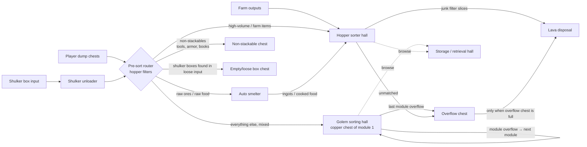

# Storage layout and zones (draft)

**Part of:** [Storage and sorting](storage-and-sorting.md), the automated item sorter with copper golems + hopper pipes
**Status:** ⬜ Draft, not built
**Server:** Bedrock 26.50. Every redstone build must be a Bedrock-tested design.

Jeffrey's ask: *"Since we will be using golems and hopper pipes… we need to clearly define the areas and responsibilities."* This file splits the system into **zones**. Each zone has one job, defined inputs and outputs, and things it must never do. It also collects the real community layouts we're borrowing from.

> **How to read the sizes:** a size is only quoted from a source when that source actually states it. Everything else is marked **(estimate)** and is our own guess, to be adjusted once Jeffrey picks a footprint.

## 1. Reference layouts found

Checked 2026-10-07. Reddit pages were read through search snippets (Reddit blocks direct fetches), so dates are shown only where they could be confirmed.

### Copper golem sorters

| Layout | Source (date) | Edition | What it says | What we borrow |
| --- | --- | --- | --- | --- |
| **3×3 module: 9 double chests + 1 overflow per golem** | ["Copper golem item sorter help", r/technicalminecraft](https://www.reddit.com/r/technicalminecraft/comments/1r1jpfa/copper_golem_item_sorter_help/) (date not confirmed) | Not stated | 9 double chests sideways in a 3×3. Golem held on a stair under an open trapdoor and pinned with chains. Copper chest on one side; a regular **10th chest one level higher** as overflow. Tileable side by side; overflow → **one hopper** → next module's copper chest. Reason given: golems remember ~10 chests, and walking is slow. | The **9 + 1 module** as our golem building block, chained by overflow hoppers |
| **"Tutorial – Copper Golem Auto Sorter … 200+ Chests"** | [YouTube, *small guy*](https://www.youtube.com/watch?v=MGCl8oHpA6k) (2025-10-31) | Not stated | 3×3 of chests per golem. Golem in a **minecart on a rail on a mud block** behind the chests, fenced in. Copper chest + overflow chest above. A comparator closes a **trapdoor** when the copper chest is empty so the golem stays quiet. Tileable: **two hoppers** under the overflow → next module. Used for 200+ chests. | Golem confinement (minecart), the trapdoor "quiet when idle" trick, and the proof that it scales to 200+ chests |
| **"Silent 3x3 Copper Golem Sorter"** | [YouTube, *Kaji*](https://www.youtube.com/watch?v=TLwnKMX_GEk) (2026-07-20) | Not stated | A trapdoor blocks the copper chest until items arrive. The golem is positioned forward so it checks all 9 chests before the overflow, and a shelf blocks it from reaching a chest. **"Only two blocks deep"**, but needs space below. An alternate version stacks modules into a **six-high wall** of sorted chests. (He credits the trapdoor trick to a Cortez Reno video.) | The **2-deep** module depth (source-stated), and the option to stack modules into a tall wall |
| **"EASY Copper Golem SORTING SYSTEM (5 Designs)"** | [YouTube, *silentwisperer*](https://www.youtube.com/watch?v=4XM68iqBkGU) (2025-10-01) | **Bedrock & Java** (per title) | Layers of 9 sorting chests per golem, zig-zagging upward with a hopper + chest linking each layer to the next copper chest. Golems are boxed in with glass/solid blocks. | A layered (vertical) option if floor space is tight. Bedrock-claimed. |
| **One-wide tileable golem sorter** | [r/technicalminecraft, u/Alicorns](https://www.reddit.com/r/technicalminecraft/comments/1lrrkqp/one_wide_tillable_copper_golem_sorter/) (2025-07-04) | Not stated (posted before the full release) | **8 chests per golem** in a line with a 1-wide walkway on top. Carry-over chest one block higher with 2 hoppers → next copper chest. Notes that 9 caused pauses near the 10-chest limit. | The **line layout** alternative, and "8 per golem is safer than 9" |
| **Smallest/cheapest tileable** | [r/redstone, u/RevealAcademic804](https://www.reddit.com/r/redstone/comments/1ostx6m/smallest_cheapest_tileable_copper_golem_sorter/) (2025-11-09) | Not stated | 1 hopper + 1 chest + 1 golem per 3 double chests. The author notes you must keep at least 1 item in each chest. | Confirms the **seeded-chest rule** |
| **Bedrock overflow-priority problem** | ["Copper Golem sorter on Bedrock keeps prioritizing the overflow chest", r/minecraftbedrock](https://www.reddit.com/r/minecraftbedrock/comments/1vtq2mx/copper_golem_sorter_on_bedrock_keeps_prioritizing/) (date not confirmed) | **Bedrock** | A 9 + 1 module where the auto-emptied overflow got used first. Replies: golems check chests **closest first**, so the overflow must be the **farthest** chest. In a grid, hold the golem forward (trapdoor, minecart on stairs). In a line it isn't an issue. | **Rule: overflow is always the farthest chest from the golem** |
| Bedrock troubleshooting threads | [r/technicalminecraft "copper golem not checking all chest"](https://www.reddit.com/r/technicalminecraft/comments/1unndi3/copper_golem_not_checking_all_chest/) (2026-07-04), [r/MinecraftBedrockers "Copper Golem not working properly"](https://www.reddit.com/r/MinecraftBedrockers/comments/1uswxuv/copper_golem_not_working_properly/) (2026-07-10) | Bedrock (in replies / subreddit) | Golems skipping a chest. Fixes: push the golem up against the chest wall, and make the dump chest require a short walk. One case was fixed by replacing the golem. | Commissioning checklist: test each module with one item per chest |

Mechanics behind these, from [Copper Golem (Minecraft Wiki)](https://minecraft.wiki/w/Copper_Golem):
- A golem remembers 9 chests, and after 10 failures it wanders 7 s.
- Its reach is 1 block up and 2 blocks down, and its search area is 65×17×65.
- On Bedrock it ignores chests it can't see.

### Bedrock hopper sorters and storage halls

| Layout | Source (date) | Edition | What it says | What we borrow |
| --- | --- | --- | --- | --- |
| **Chest halls (octa / deca)** | [Bedrock WIKI: Chest Halls](https://bedrockwiki.com/books/storage-tech/page/chest-halls) (storage-tech book, last activity ~2025) | **Bedrock** | A chest hall is a hall where each **1-block-wide slice** holds several chests, each fed by its own filter. The most common are **octa (8 chests per slice)** and **deca (10 per slice)**. Display blocks or item frames show what's in each chest. **Hopper locking** roughly halves hopper lag. Mangrove roots are noted as a conductive block a chest can still open under; copper grates let comparators read through while non-conductive. | The **1-wide slice** unit, item-frame labels, and global hopper locking when the hall is idle |
| **SS3 item filters (TechRock / ImpulseSV filters)** | [Bedrock WIKI: Stackable Sorting](https://bedrockwiki.com/books/storage-tech/page/stackable-sorting) | **Bedrock** | Compact, tileable, overflow-proof filters. The SS3 filter hopper needs **≥46 items** of prefill. One hopper = **2.5 items/s ≈ 9,000/hour**. 2× hopper-speed filters are better for farm outputs than main storage. | Filter type for our hopper hall slices. **2×HS filters for farm lines.** |
| **Item streams (ice + water)** | [Bedrock WIKI: Item Streams](https://bedrockwiki.com/books/storage-tech/page/item-streams) | **Bedrock** | Hopper lines are the slowest and most expensive way to distribute items. An ice/water stream over the filters is common. **One water source pushes items across up to 9 blocks.** | Use a water/ice stream over the hopper hall filters instead of a long hopper pipe |
| **Input types, input buffers, box unloaders** | Bedrock WIKI: [Types of Input](https://bedrockwiki.com/books/storage-tech/page/types-of-input), [Input Buffers](https://bedrockwiki.com/books/storage-tech/page/input-buffers), [Box unloaders](https://bedrockwiki.com/books/storage-tech/page/box-unloaders) | **Bedrock** | Loose-item input is simplest, and loose input often splits out non-stackables. Shulker box input is more efficient. An input buffer holds items until the storage "runs" (useful if the area might unload). Unloader types: FIT, arrays, SSU. | Input zone design: loose dump chests + shulker unloader, and the non-stackable split |
| **Bedrock-optimized and hybrid hopper sorters** | [Tutorial: Hopper (Minecraft Wiki)](https://minecraft.wiki/w/Tutorial:Hopper#Item_sorter) | **Bedrock** variants listed | The wiki lists a "Bedrock optimized hopper item sorter". For hybrid sorters on Bedrock it suggests 20 instead of 21 filler items, and 15/14 for 16-stack items. Bedrock hopper pipes at full speed leak a few items past filters (MCPE-28890). | Fallback filter designs, plus the "don't run full stacks at full speed" rule |

> ⚠️ **Prefill numbers differ by design** (e.g. 41 + 4 fillers in simple sorters, ≥46 for SS3, 20/21 fillers in hybrids). Use the exact numbers from the one Bedrock design we pick, and test each slice with a junk item first.

## 2. Zones and responsibilities



Golem and hopper hall chests *are* the retrieval hall: the player browses their front faces. The service corridor runs behind them.

### Zone table

| Zone | Responsibility | Inputs | Outputs | Must NOT | Rough size | Bedrock notes |
| --- | --- | --- | --- | --- | --- | --- |
| **A. Input** | Take items from the player fast | Player (dump chests by the door); shulker boxes | Router input line | Hold items long-term. Feed golem chests directly. | 3–5 wide × 3 deep × 3 high, incl. unloader (estimate) | The Phase 4 "input chest by the door" lives here. If the storage might unload while away, add an input buffer (Bedrock WIKI). |
| **A2. Shulker unloader** | Empty full boxes into the router; return empty boxes | Shulker boxes from Input | Items → Router; empty boxes → box chest | Send boxes into the sorter or lava | 3 × 3 × 4 (estimate) | Dispenser places the box, piston breaks it (see [storage plan](storage-and-sorting.md#shulker-box-auto-unloader)). Pick a Bedrock unloader design. |
| **B. Pre-sort / router** | Split the stream: farm/bulk items → hoppers; ores/raw food → smelter; non-stackables and boxes → their own chests; **everything else → golem hall** | Input, unloader | Hopper hall, smelter, non-stackable chest, golem module 1 copper chest | **Feed any golem destination (wooden) chest.** The golem "empty chest" trap: hopper-drained wooden chests become empty, and golems fill them with anything. Never route to lava directly. | 1 slice per routed item type + ~4 for the non-stackable split (estimate); ~10 × 4 × 5 to start (estimate) | Use Bedrock SS3/hybrid filters. Avoid full-stack full-speed hopper pipes (MCPE-28890). A water/ice stream over the filters is fine (≤9 blocks per source). |
| **C. Hopper sorter hall** | Bulk and farm items, one item type per chest (or per double chest) | Router; farm lines; smelter output | Storage chests (browsable); unmatched → overflow; junk slices → lava | Take golem-hall items. Destroy anything that isn't on the junk list. | **1-block-wide slices**, octa (8) or deca (10) chests per slice (Bedrock WIKI). Start with ~8 slices: 8 × 5 deep × 6 high (estimate) | Global hopper locking when idle cuts lag (Bedrock WIKI). Label with item frames. |
| **D. Golem sorting hall** | Everyday mixed items from copper chests into seeded wooden chests | Copper chest of module 1 (from Router) | Wooden storage chests; overflow → next module's copper chest; last overflow → overflow zone | Have any **unseeded or empty** wooden chest in reach except the module's overflow. Let golems reach another module's chests. Use barrels or ender chests (golems ignore them). | Module = **9 chests + 1 overflow per golem** (sources above). Kaji's module is "only two blocks deep" (source). Footprint per module of 3×3 double chests ≈ 6 wide × 2–3 deep × 4 high (estimate). | Overflow chest must be the **farthest** from the golem. Hold the golem forward (trapdoor, chains, minecart). On Bedrock, golems ignore chests they can't see. Wax golems and copper chests. A trapdoor + comparator keeps idle golems quiet. |
| **E. Auto smelter** | Smelt ores (blast furnaces) and cook food (smokers) | Router ore/raw-food lines; fuel chest | Output → Hopper hall input (or straight to storage chests) | Get unfiltered input (hoppers push *any* item into a furnace top) | 4–8 furnaces in a row: ~8 × 3 × 4 (estimate) | See [storage plan](storage-and-sorting.md#auto-furnace--smelter-array). Pick a Bedrock furnace-array design. |
| **F. Overflow + lava disposal** | Hold unmatched items; burn junk and true overflow | Last golem module overflow; hopper hall end; junk slices | Overflow chest (kept); lava (destroyed) | Receive non-stackables, shulker boxes, or netherite (netherite doesn't burn) | Overflow double chest + lava cell: 4 × 3 × 3 (estimate) | Decision: lava. Overflow → lava only after the overflow chest fills. |
| **G. Storage / retrieval hall** | Where the player browses and grabs items | — (the front faces of zones C and D) | Player | Contain hoppers or golems on the player side | 3-wide aisle between two chest walls (estimate) | Item frames on chests (Bedrock WIKI: most solid blocks stop chests opening). No bottom slabs on top of copper chests (they block opening on Bedrock). |
| **H. Service corridor** | Space behind the chest walls for golem cells, filters, wiring | — | — | Become a walkway golems can escape into | **3 blocks** behind each storage wall ([building style](building-style.md)) | Golem cells (2–3 deep) fit inside the 3-block gap. Iron doors only (golems open non-iron doors). |
| **I. Expansion space** | Room to add golem modules and hopper slices | — | — | Be filled with anything permanent | Reserve ≥ 50% of each hall's length (estimate) | Leave the router line extendable at the far end. |

## 3. What goes to golems vs. hoppers (draft)

| Route | Items (draft; Jeffrey to edit) | Why |
| --- | --- | --- |
| **Hopper hall** (high-volume, exact item) | Cobblestone, cobbled deepslate, dirt, stone, gravel, sand; iron farm output (iron ingots, poppies); sugar cane; mob farm drops (rotten flesh, bones, arrows, string, gunpowder); smelter output (iron/copper/gold ingots) | Volume beats golem speed (16 items per trip, 3 s per chest checked) |
| **Smelter** | Raw iron/copper/gold, ore blocks → blast furnaces; raw meat/fish/potatoes → smokers | From the plan's auto-furnace section |
| **Golem hall** (everyday mixed) | Logs, planks, saplings by wood type; seeds and crops; cooked food; flowers and dyes; wool; redstone components; decorative blocks; low-volume mob drops; copper items; **potions and tipped arrows** (Bedrock golems can tell their types apart) | Many item types at low volume, where golem modules are cheap |
| **Non-stackable chest** (manual) | Tools, armor, enchanted books, shulker boxes | Golems ignore enchantments and durability. Keep these away from lava. |
| **Lava** | Junk list only (Jeffrey to decide, e.g. extra dirt, rotten flesh beyond 1 chest) | Decision: lava. Never non-stackables or netherite. |

## 4. Floor plan (DRAFT, all dimensions are estimates)

Top-down, north up, 1 character ≈ 1 block, not to scale in height. Assumes everything on one level. A stacked or underground version is an open question.

```
   ←──────────────────────── ~36 blocks (estimate) ────────────────────────→
  ┌──────────────────────────────────────────────────────────────────────────┐
  │ H service corridor (3) — golem cells + router/filter wiring              │
  ├──────────────────────────────────────────────────────────────────────────┤
  │ D GOLEM HALL wall: [M1 9+1][M2 9+1][M3 9+1][M4 9+1]   [ I expansion → ]  │  each module ≈ 6 wide
  ├──────────────────────────────────────────────────────────────────────────┤
  │ G RETRIEVAL AISLE (3 wide) — item frames on every chest                  │
  ├──────────────────────────────────────────────────────────────────────────┤
  │ C HOPPER HALL wall: [s1][s2][s3][s4][s5][s6][s7][s8]  [ I expansion → ]  │  1-wide slices, octa/deca
  ├──────────────────────────────────────────────────────────────────────────┤
  │ H service corridor (3) — filters, water/ice stream, hopper locking       │
  └──────────────────────────────────────────────────────────────────────────┘
   west end:                                              east end:
   [A INPUT + A2 UNLOADER] → [B ROUTER] (feeds C and D)   [F OVERFLOW + LAVA]
   [E SMELTER] beside B, output back into C               (sealed, away from wood)
```

| Block of the plan | Width (E–W) | Depth (N–S) | Height | Basis |
| --- | --- | --- | --- | --- |
| Service corridor, each side | full length | 3 | 4–6 | 3 blocks from building-style.md; height estimate |
| Golem hall wall (4 modules to start) | ~24 + expansion | 2–3 | 4 | 9 + 1 module (sources); 2-deep per Kaji; widths estimate |
| Retrieval aisle | full length | 3 | 3–4 | estimate |
| Hopper hall wall (8 slices) | 8 + expansion | 5 | 6 | 1-wide slices (Bedrock WIKI); depth/height estimate |
| Input + unloader + router + smelter (west end) | ~12 | ~17 (full depth) | 5 | estimate |
| Overflow + lava (east end) | ~4 | ~6 | 3 | estimate |
| **Total draft footprint** | **~36–48** | **~17** | **~6–8** | estimate |

## 5. Build order (fits the stages in the storage plan)

1. **Pick the site and footprint** (open questions below). Reserve all zones, including expansion, before building anything.
2. **Input + overflow chest** first, so nothing is ever lost while the rest is built.
3. **Golem module M1** in its final position (Stage 1). Seed all 9 chests and test with one item per chest.
4. **Router skeleton:** the non-stackable split + "everything else → M1 copper chest".
5. **More golem modules** (M2–M4), chained through overflow hoppers.
6. **Hopper hall slices** for the first farm items, plus the router lines feeding them.
7. **Auto smelter**, fed by router lines, output into the hopper hall.
8. **Lava disposal** behind the overflow chest, and junk slices.
9. **Shulker unloader** in the Input zone.
10. Dress it up as the [Copper storage hall](building-goals.md#2-copper-storage-hall).

## 6. Open questions for Jeffrey

- [ ] **Footprint limit:** how big can it be? The draft is ~36–48 × 17 blocks.
- [ ] **Underground or above ground?** Underground hides the wiring and lava. Above ground fits the Copper storage hall showpiece.
- [ ] **How close to the Copper storage hall build?** Same building (golems behind glass) or the machinery underneath it?
- [ ] **One level or stacked?** Kaji and silentwisperer show stacked golem modules (six-high wall / layers).
- [ ] **Golem confinement style:** stair + trapdoor + chains, or minecart on rail?
- [ ] **Which farm items get hopper slices first?**
- [ ] **Junk list** for lava.

## 7. Unverified / to test on our server

- None of the golem module videos and posts above state that they were tested on **Bedrock 26.50** specifically, except silentwisperer's title ("Bedrock & Java") and the Bedrock subreddit threads. Build one module and test it before tiling.
- Chest **check order** (closest first) and the "overflow must be farthest" rule come from community replies, not the wiki. They match the wiki's "nearest chest" wording.
- All widths, depths, and heights marked **(estimate)** are ours.
