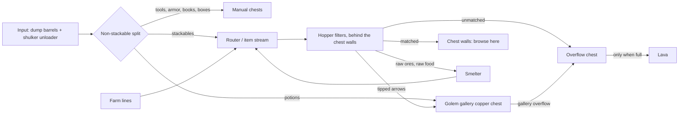

# Storage: how to group things

**Part of:** [Storage and sorting](storage-and-sorting.md)
**Status:** ⬜ Draft recommendation, not built
**Server:** Bedrock 26.50. Every redstone build must be a Bedrock-tested design.

The storage hall will be a grand custom build that Jeffrey designs (see [building style: inspiration](building-style.md#inspiration)). This file deliberately doesn't set a shape, size, or palette. It covers two things:
1. **Functional grouping:** what has to sit next to what.
2. **Item grouping:** how the chest walls are organized.

It also lists the hard technical constraints any shape has to fit around.

Decided: **hopper filters fed by an item stream do the primary sorting** (Bedrock chest-hall style). **Copper golems are a showpiece gallery** near the entrance.

## 1. Functional grouping

### Item flow

### Adjacency rules
1. **Input sits next to the router.** The dump barrels and the shulker unloader feed one short line into the router. The non-stackable split comes first, before any filter.
2. **The router feeds the start of the item stream.** Farm lines also join at the start of the stream, not halfway along it.
3. **Filters sit directly behind the chest wall they fill.** Each filter slice feeds its own chest(s) straight through the wall, with the service space behind it.
4. **Service access runs behind every chest wall.** Keep a 3-block gap with a walkable route, so filters can be fixed without touching the front.
5. **The machine side holds the smelter, overflow, and lava, together.** The smelter is fed by filter slices, and its output goes back to the router. Lava sits directly behind the overflow chest at the end of the stream. Keep this side away from wood and from the showpiece areas.
6. **The golem gallery goes near the entrance, where it's visible.** It's fed from the router into its copper chest, and its overflow goes to the main overflow, never back into the router. Seal it off from every other chest.
7. **Related item groups sit side by side** (see §2): ores and metals next to where smelter output lands, and brewing ingredients next to the golem gallery's potions.
8. **Keep the expansion end open.** The end of the stream and the far end of the chest walls must have room to add slices without moving the input, router, or machines.

### Hard constraints any shape has to fit around (verified)
| Constraint | Source |
| --- | --- |
| A **3-block service gap** behind storage walls | [Building style](building-style.md) |
| One hopper moves **2.5 items/s** (~9,000/hour). Plan farm lines around that. | [Bedrock WIKI: Stackable Sorting](https://bedrockwiki.com/books/storage-tech/page/stackable-sorting) |
| One water source pushes items **up to 9 blocks** in an item stream | [Bedrock WIKI: Item Streams](https://bedrockwiki.com/books/storage-tech/page/item-streams) |
| On Bedrock, full-speed stacked input leaks a few items past filters (MCPE-28890), so always end in an overflow chest | [Tutorial: Hopper](https://minecraft.wiki/w/Tutorial:Hopper#Item_sorter) |
| **Nothing conductive directly on a chest or copper chest. On Bedrock, no bottom slab either.** Stairs, glass, and ice are OK, and chests stack. | [Chest](https://minecraft.wiki/w/Chest), [Copper Chest](https://minecraft.wiki/w/Copper_Chest) |
| Golems: the **overflow chest must be the farthest** from the golem | Community designs, Bedrock ([thread](https://www.reddit.com/r/minecraftbedrock/comments/1vtq2mx/copper_golem_sorter_on_bedrock_keeps_prioritizing/)) |
| Golems: **keep at least 1 item in every display chest.** An **empty chest accepts anything**, so never let a hopper drain a golem chest. | [Copper Golem](https://minecraft.wiki/w/Copper_Golem) |
| Golems: on Bedrock they ignore chests they **can't see** | [Copper Golem](https://minecraft.wiki/w/Copper_Golem) |
| Golems: they reach chests **1 block up and 2 down**, and search a 65×17×65 area, so seal the gallery | [Copper Golem](https://minecraft.wiki/w/Copper_Golem) |
| Golems open non-iron doors, so use iron doors for the gallery | [Copper Golem](https://minecraft.wiki/w/Copper_Golem) |
| Lava can ignite nearby flammable blocks, so no wood near the lava | [Lava](https://minecraft.wiki/w/Lava) |
| Bedrock spawn-proofing: most monsters can't spawn where block light is above 0, or on carpet, bottom slabs, stairs, or glass | [Mob spawning](https://minecraft.wiki/w/Mob_spawning) |

## 2. Item grouping for the chest walls

**Browsing order:** start with the most-used groups nearest the entrance. Put related groups next to each other.

**Bulk** = several chests for one item. **Slice** = one chest per item type.

| # | Group | What goes in it | Sorted by | Size |
| --- | --- | --- | --- | --- |
| 1 | **Stone family** | Cobblestone, cobbled deepslate, stone, deepslate, granite/diorite/andesite, tuff, dirt, gravel, sand | Hoppers | **Bulk** for cobble, cobbled deepslate, and dirt. Slices for the rest. |
| 2 | **Wood family** | Logs by type, planks, stripped logs, saplings, sticks | Hoppers | **Bulk** for your main build wood. Slices for the rest. |
| 3 | **Farming & food** | Wheat, seeds, carrots, potatoes, sugar cane, cooked food, bone meal, eggs, hay bales | Hoppers (raw meat/fish go to the smoker first) | **Bulk** for farm outputs |
| 4 | **Ores & metals** | Coal, raw ores, iron/gold ingots, nuggets, diamonds, emeralds, lapis, quartz | Hoppers (raw ores go to the blast furnace first) | **Bulk** for iron ingots and coal. Put next to where smelter output lands. |
| 5 | **Copper** | Copper ingots and blocks, cut copper, grates, bulbs, lanterns, honeycomb (wax) | Hoppers | Slices. Put next to Ores & metals. |
| 6 | **Decorative** | Bricks, glass, wool, concrete, terracotta, wool/concrete stairs and slabs, dyes, flowers | Hoppers | Slices. Lots of item types, low volume. |
| 7 | **Redstone** | Redstone dust, repeaters, comparators, pistons, observers, hoppers, droppers, dispensers | Hoppers | Slices |
| 8 | **Transport** | Rails, minecarts, boats, fireworks | Hoppers for stackables; saddles go to Manual | Slices |
| 9 | **Mob drops** | Bones, string, gunpowder, rotten flesh, arrows, spider eyes, leather, feathers, slimeballs, ender pearls | Hoppers | **Bulk** for mob-farm outputs |
| 10 | **Brewing** | Nether wart, blaze rods/powder, glass bottles, sugar, glistering melon, magma cream, ghast tears, fermented spider eyes | Hoppers | Slices. **Put next to the golem gallery** (potions). |
| 11 | **Potions & tipped arrows** | Potions by type, tipped arrows by type | **Golem gallery** (on Bedrock, golems tell these types apart) | Display chests |
| 12 | **Nether** | Netherrack, blackstone, basalt, soul sand/soil, glowstone, nether bricks | Hoppers | Slices (bulk for netherrack if you need it) |
| 13 | **End** | End stone, purpur, chorus fruit, shulker shells | Hoppers | Slices |
| 14 | **Tools, armor & enchanting** | Tools, armor, enchanted books (all unstackable), plus books and bookshelves | **Manual** (unstackables come out at the non-stackable split) | A few labeled chests, near the workshop/enchanting area |
| 15 | **Shulker boxes** | Empty and full boxes | **Manual** (the unloader returns empty boxes) | A box chest at the input |
| 16 | **Misc / new items** | Anything without a slice yet, for weekly review | Overflow chest | One chest. Add a slice for anything that keeps showing up. |

**Rules of thumb**
- Items that **stack to 16** (ender pearls, eggs, snowballs, signs, honey bottles) need a filter variant with different filler counts. The wiki notes 15/14 on Bedrock hybrids ([Tutorial: Hopper](https://minecraft.wiki/w/Tutorial:Hopper#Item_sorter)).
- **Never send to lava:** anything unstackable, shulker boxes, or netherite/ancient debris (netherite doesn't burn). The junk list for lava is Jeffrey's call.
- **Label every chest with an item frame** (sneak to place one on a chest; on Bedrock it's a block, so one per spot) ([Item Frame](https://minecraft.wiki/w/Item_Frame)).

## 3. Technical references

- Bedrock WIKI: [Chest Halls](https://bedrockwiki.com/books/storage-tech/page/chest-halls), [Stackable Sorting](https://bedrockwiki.com/books/storage-tech/page/stackable-sorting), [Item Streams](https://bedrockwiki.com/books/storage-tech/page/item-streams), [Types of Input](https://bedrockwiki.com/books/storage-tech/page/types-of-input), [Box unloaders](https://bedrockwiki.com/books/storage-tech/page/box-unloaders)
- Minecraft Wiki: [Tutorial: Hopper](https://minecraft.wiki/w/Tutorial:Hopper) (Bedrock sorter notes, brewing-stand potion filter), [Copper Golem](https://minecraft.wiki/w/Copper_Golem)
- Golem module designs (editions mostly not stated; test one on our server first):
  - [9 + 1 module (r/technicalminecraft)](https://www.reddit.com/r/technicalminecraft/comments/1r1jpfa/copper_golem_item_sorter_help/)
  - [small guy, 200+ chests (2025-10-31)](https://www.youtube.com/watch?v=MGCl8oHpA6k)
  - [Kaji, silent 3×3 (2026-07-20)](https://www.youtube.com/watch?v=TLwnKMX_GEk)
  - [silentwisperer, 5 designs, Bedrock & Java (2025-10-01)](https://www.youtube.com/watch?v=4XM68iqBkGU)
  - [one-wide tileable (2025-07-04)](https://www.reddit.com/r/technicalminecraft/comments/1lrrkqp/one_wide_tillable_copper_golem_sorter/)
