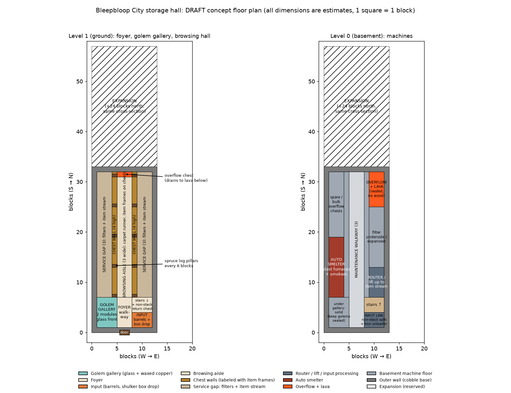
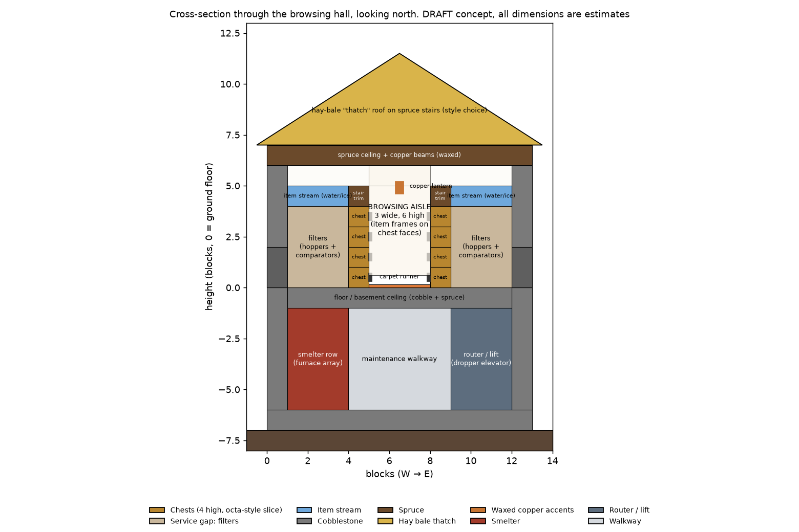
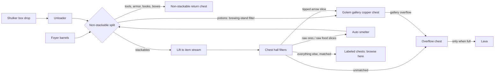

# Storage hall: recommended layout and block palette (draft)

**Part of:** [Storage and sorting](storage-and-sorting.md)
**Status:** ⬜ Draft recommendation, not built
**Server:** Bedrock 26.50. Every redstone build must be a Bedrock-tested design.

Jeffrey's direction (2026-10-07): *"focus on making the golems a visual thing in the front of the hall, not necessarily as the primary sorting mechanism… what I was mainly wanting is a recommended layout of block types and halls."*

So, the recommendation in one paragraph:
- **Hopper filters fed by a water/ice item stream do all the real sorting**, Bedrock chest-hall style.
- **Copper golems are the showpiece:** a glass-fronted **golem gallery** in the entrance foyer, where two waxed golems sort potions and tipped arrows into display chests you can watch.
- **Two levels:** the browsing hall on the ground floor, the machines (router lift, smelter, overflow + lava) in a basement directly underneath.
- **Palette:** spruce + cobblestone shell, a hay-bale "thatch" accent, and waxed copper as the accent metal (the repo's cozy-autumn-village theme).

> **Labels used below.** **Verified** = checked on the Minecraft Wiki or Bedrock WIKI (linked). **Recommendation** = a style or design choice, open to change. **(estimate)** = our own dimension or count, not from any source.


*Draft concept floor plan: ground floor (left) and basement (right). All dimensions are estimates. Source script: [tools/storage_diagrams.py](../tools/storage_diagrams.py).*


*Draft concept cross-section through the browsing hall, looking north. All dimensions are estimates.*

## 1. Hall arrangement (recommendation)

Walk-through order, south to north: **door → foyer with golem gallery and input → browsing hall → overflow at the far end**, with the machines one floor down. The hall grows **north** along the same cross-section.

| Hall / area | Where | What's in it | Size (W × L × H) |
| --- | --- | --- | --- |
| **Foyer** | Entrance, south end, ground floor | Door; central walkway; **input** barrels + shulker box drop (east side); stairs down + non-stackable return chest (east); **golem gallery** (west side) | 13 × 7 × 6 interior (estimate) |
| **Golem gallery** | West side of the foyer | 2 golem modules behind glass, display chests the player can open from the foyer | 4 × 6 floor area, 5 high (estimate) |
| **Browsing hall** | North of the foyer, ground floor | 3-wide aisle; a **chest wall 4 chests high** on each side, labeled with item frames; pillars every 6 blocks | 13 × 25 × 6 interior to the ceiling (estimate) |
| **Service gaps** | Behind each chest wall (both sides) | Filter hoppers + comparators feeding each chest; the **item stream** runs along the top; this is the [3-block service gap](building-style.md) | 3 wide each, full hall length (3 from building-style.md; rest estimate) |
| **Overflow chest** | North end of the aisle | Unmatched items land here; it drains to the lava cell below only when full | 1 double chest (estimate) |
| **Basement: input line + router/lift** | Under the foyer and east service gap | Non-stackable split, shulker unloader mechanism, dropper lift carrying input up to the item stream | 4 × 12 (estimate) |
| **Basement: auto smelter** | Under the west service gap | Blast furnaces (ores) + smokers (food), output returned to the input line | 3 × 12 (estimate) |
| **Basement: overflow + lava** | Under the north end | Sealed lava cell, no wood nearby | 3 × 7 (estimate) |
| **Basement: maintenance walkway** | Under the aisle, full length | Access to the underside of filters, lift, and smelter | 3 wide (estimate) |
| **Expansion** | North, both levels | Same cross-section, +24 blocks | 13 × 24 (estimate) |

**Overall footprint (estimate):** **13 × 33 blocks built, 13 × 57 with expansion**. About 19 blocks top to bottom: a 6-high basement + floor + a 6-high hall + ceiling + a roof about 4.5 high.

**Capacity (estimate, simple arithmetic):** 25 blocks of hall minus 5 pillars ≈ **20 one-block slices** per side. 20 slices × 4 chests × 2 sides ≈ **160 item types** at full length; double that with the expansion. Build **6 slices first (48 item types)**.

**Why two levels (recommendation):** the browsing hall stays clean and quiet-looking, the lava and smelter stay away from wood and players, and the hall can grow north without moving machines. *Single-level alternative:* put the basement contents in a ~10-block annex on the west side. That's easier to dig, but longer to walk and harder to keep pretty.

**Where it sits (recommendation):** next to the home base at world spawn, with the door facing the base's main path or the planned [spawn town square](building-goals.md#3-spawn-town-square). The spawn area has big caves, so check that the basement doesn't break into one. If it does, wall it off and light it.

### Chest hall slice (how the sorting works)

- A **slice** is one block wide: chests stacked on the aisle side, a filter behind each chest, and the item stream passing over the filters. Bedrock WIKI calls 8-chest slices "octa" halls and 10-chest slices "deca" halls; ours, with 4 chests on each side of the aisle, is octa-style. **Verified** concept ([Chest Halls](https://bedrockwiki.com/books/storage-tech/page/chest-halls)).
- **Filters:** use a Bedrock filter design from [Stackable Sorting](https://bedrockwiki.com/books/storage-tech/page/stackable-sorting) (e.g. the tileable, overflow-proof SS3 filters). One hopper moves 2.5 items/s (~9,000/hour). Bedrock WIKI notes the **bottom chest's filter often needs a dropper elevator**, so pick a hall design that shows the full 4-high wiring.
- **Item stream:** water + ice over the filter hoppers. One water source carries items across **up to 9 blocks**, so plan a source every ≤9 blocks ([Item Streams](https://bedrockwiki.com/books/storage-tech/page/item-streams)).
- **End of the line:** whatever no filter catches reaches the **overflow chest**, which drains to lava only when full.

### Golem gallery (showpiece)

- **What it sorts (recommendation):** **potions** and **tipped arrows**. On Bedrock, golems tell potion and tipped-arrow types apart ([Copper Golem](https://minecraft.wiki/w/Copper_Golem)), which hopper filters can't do well.
  - Potions are non-stackable, so the router separates them with a **brewing-stand filter** (the brewing stand only accepts potions; [Tutorial: Hopper, special item filters](https://minecraft.wiki/w/Tutorial:Hopper#Potions,_books_and_shulker_boxes)) and sends them to the gallery's copper chest. The wiki design isn't marked Bedrock-specific, so test it on a world copy first.
  - Optional third set: dyes and flowers, as a colorful display.
- **Module (from the reference designs):** 1 golem, **1 copper input chest, 9 display chests, and 1 overflow chest that is the farthest from the golem**. The golem is pinned forward (trapdoor/chains or a minecart) so it checks all 9 before the overflow.
- **Layout (recommendation):** display chests 2 high along the glass partition. The player opens them from the foyer side, since chests open from any side and only the block above matters. Glass sits above the chests so you can see the golem working behind them. The golem walkway is behind, sealed on all sides.
- **Gallery rules (verified mechanics):**
  - Every display chest keeps **at least 1 item** (golems put anything into an empty chest).
  - **Never drain a display chest with a hopper**, which would empty it.
  - Gallery overflow goes to the **main overflow chest**, not back into the router, to avoid loops.
  - Wax every golem and copper chest.
  - **No bottom slab on top of any chest or copper chest** (blocks opening on Bedrock).
  - Keep line of sight: on Bedrock, golems ignore chests they can't see.
  - **Iron door** (or none) into the golem walkway, since golems open non-iron doors.
  - Seal the gallery so golems can't path to the hall's chests (their search area is 65×17×65).

## 2. Block palette (recommendation, cozy autumn village)

One palette, used everywhere, per [building style](building-style.md): **spruce + cobblestone**, with **waxed copper** accents and **hay-bale "thatch"** as a roof accent. Use stairs, slabs, and walls for depth. Wool/concrete stairs and slabs (new in this drop) give the colored trim.

| Element | Recommended block | Notes |
| --- | --- | --- |
| Outer wall, base course (2 high) | Cobblestone, with cobblestone wall blocks as a plinth | Style |
| Outer wall, upper | Spruce planks between stripped spruce log posts | Style |
| Pillars (every 6 blocks) | Spruce logs, capped with spruce stairs | Style. Pillars also mark slice groups. |
| Beams | Stripped spruce logs + **waxed cut copper** strips | Style. Wax at the color you like (honeycomb stops oxidation). **Verified:** waxing ([Block of Copper](https://minecraft.wiki/w/Block_of_Copper)). |
| Roof | Spruce stairs/slabs, with **hay bale** ridge and eaves as "thatch" | A full hay roof is roughly 500+ hay bales (~4,500+ wheat; estimate), so use hay as an accent. Jeffrey's straw-bed thatch idea works for the [starter cottage](building-goals.md#1-thatch-roof-starter-cottage). |
| Ceiling | Spruce planks + spruce slabs | Style |
| Aisle floor | Spruce planks with an **orange/brown carpet runner** down the middle | **Verified (Bedrock):** mobs can't spawn on carpet ([Mob spawning](https://minecraft.wiki/w/Mob_spawning)) |
| Foyer floor | Cobblestone + spruce in a checker or border | Style |
| Trim above the top chest row | **Spruce stairs**, or **orange/brown wool stairs** for color | **Verified:** stairs don't stop a chest opening. **Never a bottom slab or a conductive block directly on a chest.** ([Chest](https://minecraft.wiki/w/Chest)) |
| Chest labels | **Item frames** on each chest front (sneak to place) | **Verified:** item frames go on chests while sneaking. On Bedrock an item frame is a block: one per spot, it can't share space ([Item Frame](https://minecraft.wiki/w/Item_Frame)). |
| Main lighting | **Copper lanterns** hanging over the aisle every ~5 blocks | **Verified:** copper lantern light 15 ([Copper Lantern](https://minecraft.wiki/w/Copper_Lantern)) |
| Accent lighting | **Copper bulbs** in the pillars, waxed while unoxidized | **Verified:** bulb light drops with oxidation: 15 / 12 / 8 / 4 ([Copper Bulb](https://minecraft.wiki/w/Copper_Bulb)) |
| Golem gallery front | **Glass** above the display chests; **waxed exposed or weathered cut copper** frame; **copper grate** floor | **Verified:** mobs can't spawn on glass or copper grates; glass doesn't stop a chest opening ([Glass](https://minecraft.wiki/w/Glass), [Copper Grate](https://minecraft.wiki/w/Copper_Grate)) |
| Gallery chests | **Copper chests** (golem input only) + regular chests (display) | Golem rules above |
| Player input | **Barrels** in the foyer | **Verified:** hoppers fill and empty barrels; barrels open even with a block above; golems ignore barrels ([Barrel](https://minecraft.wiki/w/Barrel), [Copper Golem](https://minecraft.wiki/w/Copper_Golem)) |
| Storage chests | Plain chests, stacked 4 high | **Verified:** chests aren't conductive, so stacked chests still open ([Chest](https://minecraft.wiki/w/Chest)) |
| Service gaps | Whatever the filter design needs; cover the top with spruce slabs or glass for looks | Bedrock WIKI notes **mangrove roots** are the only conductive block a chest can still open under, and **copper grates** let comparators read through while non-conductive ([Chest Halls](https://bedrockwiki.com/books/storage-tech/page/chest-halls)) |
| Basement | Cobblestone / cobbled deepslate walls, stone floor, lanterns | Style. **No wood near the lava cell.** |
| Lava cell | Sealed with cobblestone/glass, no wood within a few blocks | **Verified:** lava can set nearby flammable blocks on fire, including through gaps ([Lava](https://minecraft.wiki/w/Lava)) |
| Doors | Spruce door at the entrance; **iron door** into the golem walkway | Golems open non-iron doors |

### Bedrock practical notes (verified)
- **Spawn-proofing:** on Bedrock, most Overworld monsters can't spawn where the **block light is above 0**. They also can't spawn on **carpet, bottom slabs, stairs, chests, or glass** ([Mob spawning, Bedrock conditions](https://minecraft.wiki/w/Mob_spawning)). With lanterns every ~5 blocks and a carpet runner, the hall shouldn't spawn mobs. Light the basement and service gaps too.
- **Chest opening:** a chest can't open with a **conductive block** above it. On Bedrock a **bottom slab** also blocks it. Stairs, glass, and ice are fine ([Chest](https://minecraft.wiki/w/Chest)). Copper chests follow the same rule ([Copper Chest](https://minecraft.wiki/w/Copper_Chest)).
- **Noise:** wool **blocks vibrations** for sculk sensors. The wiki says **wool stairs don't occlude vibrations** (they're just not detected when walked on) ([Wool](https://minecraft.wiki/w/Wool), [Wool Stairs](https://minecraft.wiki/w/Wool_Stairs)). We couldn't verify that wool dampens ordinary sound, so treat wool trim as color, not soundproofing. For quiet golems, the reference designs use a **trapdoor that closes when the copper chest is empty** (community videos, not wiki-verified).
- **Lag:**
  - Prefer **water/ice streams** over long hopper pipes.
  - **Lock the hall's hoppers when it isn't sorting**; Bedrock WIKI says locked hoppers lag about half as much ([Chest Halls](https://bedrockwiki.com/books/storage-tech/page/chest-halls)).
  - On Bedrock, hopper chains with **air or non-container blocks on top** run better than ones topped with containers ([Hopper](https://minecraft.wiki/w/Hopper)).
  - Keep the golem gallery small (2 golems).

## 3. Item routing (draft)

| Route | Items (draft; Jeffrey to edit) |
| --- | --- |
| **Hopper chest hall** (primary) | Everything stackable you keep: building blocks (cobblestone, cobbled deepslate, stone, dirt, sand, gravel, spruce/other logs and planks), ores and ingots, farm output (wheat, carrots, potatoes, sugar cane), mob drops (bones, string, gunpowder, rotten flesh), redstone parts, food, decorative blocks |
| **Auto smelter** (basement) | Raw iron/copper/gold and ore blocks → blast furnaces; raw meat/fish/potatoes → smokers; output → back to the input line |
| **Golem gallery** (showpiece) | Potions (via a brewing-stand filter) and tipped arrows; optional dyes/flowers set |
| **Non-stackable chest** (foyer, manual) | Tools, armor, enchanted books, shulker boxes |
| **Overflow → lava** | Unmatched items once the overflow chest is full; junk list (Jeffrey decides). Never non-stackables or netherite (netherite doesn't burn). |



## 4. ASCII versions (draft, estimates)

Ground floor (north up, 1 char ≈ 1 block wide; lengths compressed):
```
 N  ┌─────────────────────────────┐   ← expansion continues north (+24)
    │ S S S c . O . c S S S       │   O = overflow chest (drains to lava below)
    │ S S S c . . . c S S S       │
    │ S S S P . . . P S S S       │   P = spruce log pillar (every 6)
    │ S S S c . ~ . c S S S       │   c = chest wall, 4 chests high, item frames
    │ S S S c . ~ . c S S S       │   . = aisle (3 wide), ~ = carpet runner
    │ S S S c . ~ . c S S S       │   S = service gap (3): filters + item stream
    │ S S S P . . . P S S S       │
    ├─────────────────────────────┤
    │ G G G G | f f f | B B B B   │   G = golem gallery (glass front at |)
    │ G G G G | f f f | s s s s   │   f = foyer walkway, B = input barrels/box drop
    │ G G G G | f f f | s s n n   │   s = stairs down, n = non-stackable return chest
 S  └──────────── door ───────────┘
      ←──────── 13 wide (est.) ──────→
```

Cross-section, looking north (heights in blocks, estimates):
```
 +11  ................/\..................   hay "thatch" ridge on spruce stairs roof
  +7  ==== spruce ceiling + waxed copper beams ====
  +5  | stream | st |   lantern  | st | stream |   st = stair trim above chests
  +4  | filt   | C  |            | C  | filt   |   C = chest (4 high)
  +1  | filt   | C  |  aisle 3w  | C  | filt   |
   0  ===== cobble/spruce floor  (carpet runner) =====
  -1  | smelter | maintenance walkway | lift/router |
  -6  ===== basement floor (stone) =====
```

## 5. Materials summary (rough; simple arithmetic from the estimated dimensions)

| Area | Main counts (estimate) |
| --- | --- |
| **Hall shell** (13 × 33 footprint) | Floor ~430 blocks (spruce + cobble), carpet runner ~75, ceiling ~430 spruce. Outer walls ~92-block perimeter × 7 high ≈ 640 blocks (≈185 cobblestone base + ≈460 spruce/logs). Roof: spruce stairs/slabs, hay bales as accent only. |
| **Browsing hall, first 6 slices** | 48 chests + 48 item frames. Filters ≈ 2 hoppers + 1 comparator per chest ⇒ ~96 hoppers (~480 iron) + ~48 comparators (~48 nether quartz); depends on the chosen Bedrock design. Full hall (20 slices/side): ~160 chests. |
| **Golem gallery** | 2 copper blocks (18 copper ingots) + 2 carved pumpkins → 2 golems + 2 copper chests; ~4 honeycomb (2 golems + 2 copper chests); 18 display chests + 2 overflow chests; ~24 glass; copper grate floor ~16; 1 iron door |
| **Lighting** | ~5 copper lanterns over the aisle, ~4 in the foyer, ~8 lanterns in the basement, copper bulbs in pillars (optional) |
| **Basement** | Dig ~13 × 33 × 6; cobblestone walls; furnaces/blast furnaces/smokers per the [storage plan](storage-and-sorting.md#materials-verified-recipes-only); dropper lift |

## 6. Build order

1. **Reserve the footprint** (13 × 57 incl. expansion) and dig the basement.
2. **Shell first:** foyer + first 6–8 blocks of the browsing hall, roofed and lit. Build one floor at a time ([building style](building-style.md)).
3. **Input + overflow:** foyer barrels → input line → overflow chest at the far end, so nothing is lost while building.
4. **Router + lift + first hopper slices** (6 slices = 48 item types) with item frames.
5. **Auto smelter** in the basement, fed by ore/raw-food slices.
6. **Lava** behind the overflow chest, plus junk slices.
7. **Golem gallery** (showcase stage): build one module, test one item per chest, then the second module.
8. **Shulker unloader** in the foyer/basement input line.
9. Extend slices north as storage grows; dress the hall as the [Copper storage hall](building-goals.md#2-copper-storage-hall).

## 7. Open questions for Jeffrey

- [ ] OK with **two levels** (browsing hall on top, machines in the basement)?
- [ ] **Footprint:** is 13 × 33 (13 × 57 with expansion) OK near spawn?
- [ ] **Chest wall height:** 4 high (more items per slice, needs elevator wiring) or 3 high (simpler)?
- [ ] **Golem gallery set:** potions + tipped arrows, or something else on display?
- [ ] **Palette:** spruce + cobble + waxed copper OK, or deepslate + spruce (the other building-style option)?
- [ ] **Roof:** spruce with hay accents, or go all-in on hay/straw-bed thatch?
- [ ] Junk list for lava.

## 8. References

**Bedrock storage tech** (Bedrock-specific):
- [Bedrock WIKI: Chest Halls](https://bedrockwiki.com/books/storage-tech/page/chest-halls). Borrowed: the slice concept, octa/deca halls, item-frame labels, hopper locking.
- [Bedrock WIKI: Stackable Sorting](https://bedrockwiki.com/books/storage-tech/page/stackable-sorting). Borrowed: SS3 filters, hopper speed (2.5/s, ~9,000/h).
- [Bedrock WIKI: Item Streams](https://bedrockwiki.com/books/storage-tech/page/item-streams). Borrowed: water/ice streams, ≤9 blocks per water source.
- Bedrock WIKI [Types of Input](https://bedrockwiki.com/books/storage-tech/page/types-of-input), [Input Buffers](https://bedrockwiki.com/books/storage-tech/page/input-buffers), [Box unloaders](https://bedrockwiki.com/books/storage-tech/page/box-unloaders). Borrowed: input zone design.
- [Minecraft Wiki: Tutorial: Hopper](https://minecraft.wiki/w/Tutorial:Hopper). Borrowed: the Bedrock-optimized/hybrid sorter notes, and the brewing-stand potion filter.

**Copper golem sorter designs** (used for the gallery module; editions mostly not stated):
- ["Copper golem item sorter help", r/technicalminecraft](https://www.reddit.com/r/technicalminecraft/comments/1r1jpfa/copper_golem_item_sorter_help/). The 9 + 1 module, golem pinned with trapdoor/chains.
- [small guy: "Copper Golem Auto Sorter… 200+ Chests" (2025-10-31)](https://www.youtube.com/watch?v=MGCl8oHpA6k). Minecart confinement, trapdoor quiet trick.
- [Kaji: "Silent 3x3 Copper Golem Sorter" (2026-07-20)](https://www.youtube.com/watch?v=TLwnKMX_GEk). A 2-deep module.
- [silentwisperer: "EASY Copper Golem SORTING SYSTEM (5 Designs)" (2025-10-01)](https://www.youtube.com/watch?v=4XM68iqBkGU). Title says Bedrock & Java.
- [u/Alicorns: one-wide tileable (2025-07-04)](https://www.reddit.com/r/technicalminecraft/comments/1lrrkqp/one_wide_tillable_copper_golem_sorter/). The line layout.
- [r/minecraftbedrock: overflow-priority problem](https://www.reddit.com/r/minecraftbedrock/comments/1vtq2mx/copper_golem_sorter_on_bedrock_keeps_prioritizing/). Bedrock: the overflow must be farthest.

**Mechanics** (Minecraft Wiki): [Copper Golem](https://minecraft.wiki/w/Copper_Golem), [Chest](https://minecraft.wiki/w/Chest), [Copper Chest](https://minecraft.wiki/w/Copper_Chest), [Mob spawning](https://minecraft.wiki/w/Mob_spawning), [Item Frame](https://minecraft.wiki/w/Item_Frame), [Barrel](https://minecraft.wiki/w/Barrel), [Glass](https://minecraft.wiki/w/Glass), [Copper Grate](https://minecraft.wiki/w/Copper_Grate), [Copper Lantern](https://minecraft.wiki/w/Copper_Lantern), [Copper Bulb](https://minecraft.wiki/w/Copper_Bulb), [Wool](https://minecraft.wiki/w/Wool), [Wool Stairs](https://minecraft.wiki/w/Wool_Stairs), [Lava](https://minecraft.wiki/w/Lava), [Hopper](https://minecraft.wiki/w/Hopper), [Hay Bale](https://minecraft.wiki/w/Hay_Bale)

## 9. Not verified / to test
- All dimensions, counts, and the floor plans are **estimates**.
- Whether glass blocks a golem's "line of sight" on Bedrock: the wiki only says golems ignore chests they can't see. Test the gallery with glass before committing.
- Golem module behavior on Bedrock 26.50: the reference designs mostly don't state an edition. Build and test one module.
- Ordinary sound dampening by wool (not found on the wiki).
- The hopper/comparator counts per slice depend on the Bedrock filter design chosen.
