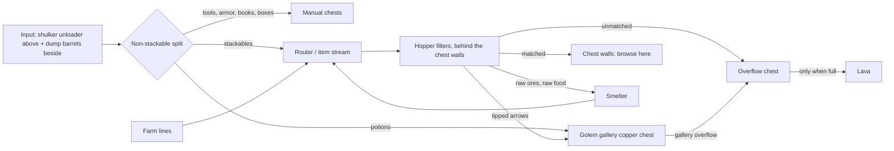

# Storage: how to group things

**Part of:** [Storage and sorting](storage-and-sorting.md)
**Status:** ⬜ Draft recommendation, not built
**Server:** Bedrock 26.50. Every redstone build must be a Bedrock-tested design.

The storage hall will be a grand custom build that Jeffrey designs (see [building style: inspiration](building-style.md#inspiration)). This file doesn't set a shape, size, or palette; the only layout is [Jeffrey's own sketch](#hall-layout-jeffreys-sketch). It covers four things:
1. **Functional grouping:** what has to sit next to what.
2. **Item grouping:** how the chest walls are organized.
3. **Item-by-item chest allocation:** every item type, how many chests it gets, and how it's sorted.
4. **Growth stages:** the order the system gets built, tied to game phases. This is the single source of truth for storage stages.

It also lists the hard technical constraints any shape has to fit around.

Decided: **hopper filters fed by an item stream do the primary sorting** (Bedrock chest-hall style). **Copper golems are a showpiece gallery** near the entrance.

## Hall layout (Jeffrey's sketch)

*Jeffrey's own layout, redrawn from his sketch. The stage labels are the order the wings get built. Sizes and the architecture are his; nothing here adds dimensions.*

**Zones, back to front.** Jeffrey's stage labels are the **build order** of the hall: which wing gets built when. What goes in each wing is planned for the **finished** hall (see [final layout](#final-layout-finished-hall)), and each build stage automates whatever lives in the wings it builds.
- **Machinery:** the full width of the back. Left to right: auto smelter (with room for more machines); the **shulker unloader at the center, at the head of the aisle**, with the **router directly below it**; then the dump-barrel input, intake, overflow, and lava on the right.
- **Central aisle:** runs from Machinery to the Dome.
- **Back-left and back-right wings (Stage 5):** the back band on both sides of the aisle. Both are built in one stage.
- **Mid-left and mid-right wings (Stage 3):** the middle band on both sides.
- **Front-left wing (Stage 1)** and **front-right wing (Stage 2)**, both touching the Dome.
- **Every wing is a hallway** with a chest wall on both sides, each wall backed by its own service gap with hopper filters ([item flow](#item-flow)).
- **Dome:** a large overhead dome at the front-center entrance, home of the **Stage 4** golem gallery.
- **Build order:** front-left (1) → front-right (2) → mid-left and mid-right (3) → Dome (4) → back-left and back-right (5).

### Item flow

![Storage hall item flow and final wing contents: shulker unloader above the router at the center of Machinery, dump barrels to its right, smelter loop on the left; the item stream runs under the floor down the left of the aisle past back-left (Stage 5: decorative colors and finishes, Nether, End), mid-left (Stage 3: ores and metals, copper, redstone) and front-left (Stage 1: stone family), crosses under the Dome (Stage 4: golem gallery), and runs up the right past front-right (Stage 2: farming and food, brewing), mid-right (Stage 3: wood, decorative build blocks) and back-right (Stage 5: mob drops, tools, armor and enchanting, transport) to the overflow and lava](../assets/storage-hall-flow.png)

*Flow schematic drawn on Jeffrey's layout, with each wing's build stage and its contents in the finished hall. Not to scale; it shows where items go, not sizes. Generator: [tools/storage_hall_flow.py](../tools/storage_hall_flow.py).*

**How items move**
1. **In (Machinery, back center):** the **shulker unloader** sits at the center of Machinery, at the head of the aisle, and feeds **straight down into the router** directly below it. The **dump-barrel input** sits to the right of the router and feeds it from the side. Every item, from boxes or barrels, enters through the router. The router splits off unstackables into the **intake** chest before any filter (rule 1).
2. **Smelter loop (Machinery, left of the router):** the router sends raw ore and raw food to the **auto smelter** (blast furnaces and smokers). Ingots and cooked food go back to the router and get sorted like any other item. There's room in Machinery for more machines.
3. **Main stream, a U under the floor:** from the router the stream runs **down the left side of the central aisle**, past the branch points for the **back-left (Stage 5), mid-left (Stage 3) and front-left (Stage 1)** wings. It **crosses under the Dome**, then runs **up the right side** past the **front-right (Stage 2), mid-right (Stage 3) and back-right (Stage 5)** wings.
4. **Each wing is a hallway with a chest wall on both sides.** Each wall's browse side faces the hallway, and each wall is backed by its **own service gap** holding that wall's **hopper filters**. The wing's **branch loop** leaves the stream, runs out along the service gap behind one wall, crosses under the hallway at the outer end (dashed in the diagram), and comes back along the service gap behind the other wall to rejoin the stream. Anything neither wall filters rides the loop back onto the stream.
5. **End of the stream (Machinery, right side):** the **intake** (unstackables from the router), the **overflow**, and the **lava** sit on the right of Machinery. whatever is left lands in the **overflow**. Only junk goes on to the **lava** behind it. The lava stays at the back, away from the Dome and the wood-heavy wings (rule 5).
6. **Potion line (dashed):** the router's potion filter and tipped-arrow slice send those items along a separate line up the aisle to the **copper chest in the Dome**. The golem sorts them into the display chests, which sit in a ring sealed behind glass. **Gallery overflow goes to the main overflow, never back to the router** (rule 6).

### Final layout (finished hall)

Every group's spot in the **completed** hall. Counts are from [§3](#3-item-by-item-chest-allocation), whose Zone column matches this table. Per-stage tables are in [storage-stages.md](storage-stages.md).

| Wing | Build stage | Groups (final) | DC-eq | Slices | Growth room reserved (★ items) |
| --- | --- | --- | --- | --- | --- |
| Front-left | 1 | 1 Stone family | 17 | 13 | +5: cobblestone +2 DC, cobbled deepslate +2 DC, dirt +1 DC |
| Front-right | 2 | 3 Farming & food; 10 Brewing (at the Dome end) | 18 | 22 | +4: wheat +1 DC, sugar cane +1 DC, nether wart +1 SC, promoted food/crop mixed items +1.5 |
| Mid-left | 3 | 4 Ores & metals; 5 Copper; 7 Redstone | 16 | 15 | +6: iron ingots +2 DC, coal +1 DC, emeralds +1 DC, cut-copper mixed +1 DC, redstone dust +1 SC, slime/honey +1 SC |
| Mid-right | 3 | 2 Wood family; 6 Decorative: build blocks (main build blocks #1 and #2, glass, glass panes, torches, item frames) | 17.5 | 15 | +4.5: main logs +1 DC, accent logs +1 SC each, main build blocks +1 DC each |
| Back-left | 5 | 6 Decorative: colors & finishes (wool, carpets, concrete, terracotta, stained glass, dyes, flowers, bricks, decorative stone…); 12 Nether; 13 End | 18.5 | 8 | +3.5: other decorative stone +1 DC, netherrack +1 DC, end stone +1 DC, promoted mixed +1 SC |
| Back-right | 5 | 9 Mob drops; 14 Tools, armor & enchanting; 8 Transport | 16 | 14 | +6: rotten flesh, bones, string, gunpowder +1 DC each, enchanted books +1 DC, firework rockets +1 SC, promoted mixed +1 SC |
| Dome | 4 | 11 Potions & tipped arrows (golem module 1); gallery spares chest (group 5) | 6 | 0 | +5.5: golem module 2 |
| Machinery | 1 (+5) | 16 Main overflow 2 DC + non-stackable intake 1 DC (Stage 1); 15 Shulker-box chests 2 SC beside the unloader (Stage 5) | 4 | 0 | Empty shulker boxes +1 SC; overflow grows as needed |
| **Total** | | | **113** | **87** | **+29 in the wings, +5.5 in the Dome** |

**Capacity: two walls per wing, balanced.** The wings carry 16–18.5 DC-eq each. With the reserves above, every wing comes to about **20–22 DC-eq**, so the six wings can be built the same size. That's about **22 DC-eq of design room per wing: 44 chest faces, 22 per wall** (a double chest is 2 faces, a single chest 1). How high the chests stack and how long the walls run is Jeffrey's call; this is only the count.

| Wing | DC-eq now | + reserve | Design room | Faces per wall (of 22) | Slices per service gap |
| --- | --- | --- | --- | --- | --- |
| Front-left | 17 | 5 | 22 | 17 now | 6–7 |
| Front-right | 18 | 4 | 22 | 18 now | 11 |
| Mid-left | 16 | 6 | 22 | 16 now | 7–8 |
| Mid-right | 17.5 | 4.5 | 22 | 17–18 now | 7–8 |
| Back-left | 18.5 | 3.5 | 22 | 18–19 now | 4 |
| Back-right | 16 | 6 | 22 | 16 now | 7 |

- **Front-right has the most filters per gap (11)**: farming has many small slices, plus brewing. It's the busiest service gap but still well spread.
- **Back-left has the fewest filters (4 per gap)** because colors & finishes are mostly mixed chests. Its reserve is the smallest, but it also has the open outer wall ends.
- **Beyond the reserve:** add chests at the outer end of either wall and stretch the branch loop's turnaround outward (rule 8). Each wing grows at its own outer end, so expansion isn't all dumped in one wing.

**Inside each wing.** The branch loop runs out along the **back wall's** service gap (toward Machinery) and returns along the **front wall's** gap. Put the heavy-flow bulk slices on the back wall at the aisle end, where the loop starts. That's also the end nearest the aisle and the Dome, so the busiest chests are the easiest to reach. Low-volume slices and mixed chests go on the return wall.
- **Front-left:** back wall: cobblestone, cobbled deepslate, dirt, stone, gravel, sand. Front wall: deepslate, granite, diorite, andesite, tuff, flint, obsidian, mixed earth, sulfur.
- **Front-right:** back wall: wheat, seeds, carrots, potatoes, sugar cane, hay. Front wall: cooked food, the other food slices, eggs (stack-16 filter), mixed food. Brewing goes at the Dome end, next to the gallery.
- **Mid-left:** back wall: coal, iron ingots, charcoal, copper ingots (most of the smelter output). Front wall: nuggets, gold, diamonds, emeralds, lapis, quartz, copper extras, redstone.
- **Mid-right:** back wall: main logs, main planks, main build blocks #1 and #2, glass. Front wall: accent logs, stripped logs, saplings, sticks, bamboo, panes, torches, item frames, mixed wood.
- **Back-left:** back wall: shulker shells, end stone, netherrack, purpur, blackstone, basalt, glowstone, white wool. Front wall: the color and finish mixed chests, plus the Nether and End mixed chests.
- **Back-right:** back wall: rotten flesh, bones, string, gunpowder, then the other mob-drop slices (ender pearls use a stack-16 filter), rails, rockets, books, bookshelves. The hand-sorted chests (tools, armor, enchanted books, valuables, discs, boats, saddles) go on the side nearest the **intake** in Machinery, since you sort them by hand from it.

**Why each group lives where it does**
- **Busiest in front, by the Dome:** stone (front-left) and food (front-right) are what you reach for most and what flows in hardest. Front-left is Stage 1, so the heaviest bulk stream (mining) is automated first.
- **Brewing next to the gallery (rule 7):** brewing sits at the Dome end of front-right, right beside the potions. It also pairs with farming: sugar, melons and nether wart are farm products.
- **Metals on the smelter's side (rule 7):** ores, copper and redstone go in **mid-left**, the closest wing to the smelter (left side of Machinery) that's built before the End. It's the second branch on the left, so ingots coming back from the smelter through the router meet their slices early. Redstone sits with them because hoppers, comparators and copper bulbs are made from iron, quartz and copper. Back-left would be even closer to the smelter, but it isn't built until after the End, which would leave iron and coal sorted by hand for most of the game.
- **Building materials:** stone is front-left. Wood and the main build blocks are mid-right, across the aisle and one band back. The colors and finishes you use less often are in back-left.
- **Rare and late items at the back:** End items only exist after the End. Nether blocks and colors & finishes are low-volume, so they share back-left. The Nether group is mostly building blocks; the Nether brewing ingredients (nether wart, blaze rods and powder, glowstone dust, magma cream, ghast tears) are already in the Brewing group by the gallery.
- **Hand-sorted gear next to the intake:** the intake is in Machinery on the right, at the back-right wing. Tools, armor, enchanted books and transport (boats, saddles) all come out of the intake and get put away by hand, so they live right there. Mob drops share the wing, and their junk (rotten flesh) is the last slice before the overflow and lava.

**Stream order.** Left side, in order: back-left, mid-left, front-left. Then under the Dome. Right side: front-right, mid-right, back-right, then the overflow and the lava.
- **Never-lava items are caught early.** Shulker shells (back-left) and diamonds (mid-left) are the first two branches after the router. Netherite and valuables are put away by hand, and unstackables leave at the router.
- **Junk ends next to the lava.** Rotten flesh in back-right is the last slice before the overflow.
- **Stack-16 filters:** eggs (front-right) and ender pearls (back-right). Place them away from the bulk slices. Stream position doesn't matter for them.
- **Every item has exactly one slice,** so which wing it passes first doesn't change where it lands. A few items leaking past a filter at full speed (MCPE-28890) is why the stream always ends in an overflow chest.

**Trunk line and branch points.** The trunk is the whole U: router → down the left side → under the Dome → up the right side → overflow. Front-left is the last branch on the left, but the overflow is at the back right, so **Stage 1 builds the entire U**. That includes the crossing under the Dome site, so the Stage 4 Dome build doesn't dig up a live stream. Leave a capped branch point at every other wing. Because the trunk and branch points exist from Stage 1, any wing can be built out of order with no rework (for example, back-right early if the mob farm needs it). The stream end and the outer wall ends stay open (rule 8).

### Router and input location (decided: back, by the router)

Jeffrey's layout puts all input in Machinery (option (a)): the **shulker unloader at the center, directly above the router** at the head of the aisle, and the **dump barrels just right of the router**. The intake is on the right with the overflow and lava, and the smelter is on the left. The U-shaped stream solves the problem option (a) had before: the stream starts at the back, comes forward down one side, and goes back on the other, so it ends at the overflow and lava in the back without a loop and without lava near the Dome.

| | Back, by the router (chosen) |
| --- | --- |
| Dumping | A walk to the back of the hall |
| Stream | Router → U → overflow → lava, all ending at the back. Rules 1, 2, 5, 8 hold. |
| Smelter loop | Short: the smelter is just left of the router |
| Shulker unloader | Feeds straight down into the router; no separate input line |
| Golem gallery feed | One potion line up the aisle to the Dome's copper chest |
| Farm lines | Join at the router in the back (rule 2) |

**Stage 1 must leave the unloader's spot free.** The unloader isn't built until Stage 5, but it sits directly above the router. So in Stage 1, keep the space above the router clear and leave the router's top input open (capped) so the unloader can drop in later without rebuilding the router (rule 8).

**Optional later: a front dump point at the Dome.** If the walk to the back gets old, add a dump chest or barrel near the entrance, outside the gallery seal. It needs its own line back to the router at the start of the stream, not a drop into the U partway along it (rule 2). It's an add-on, not part of any stage.

### Golem gallery seal and ticking area
- **Seal the Dome from the chest walls.** It sits right next to the front-left and front-right wings. Golems search **65×17×65** and reach chests 1 block up and 2 down, so wall or glass off the gallery so they can't walk out to the wing chests. Use iron doors (golems open other doors). Inside the gallery, the only wooden chests should be the seeded display chests, in their ring behind glass ([Copper Golem](https://minecraft.wiki/w/Copper_Golem)).
- **Lines into and out of the Dome:** the potion line enters at the copper chest, and the gallery overflow leaves for the main overflow, both by hopper through the seal. The main stream passes under the Dome floor and has no chests, so it doesn't give the golems anything to reach. The search box reaches 2 blocks down, though, so keep any chest or container on the under-Dome stretch more than 2 blocks below the golem's floor.
- **Ticking area:** if possible, fit the whole hall plus the iron farm inside one ticking area (max 100 chunks; [Server config: ticking area](multiplayer-server.md#ticking-area-iron-farm-and-item-sorter)). Every input and output link must be inside it.

## 1. Functional grouping

### Item flow

### Adjacency rules
1. **Input sits next to the router.** In Jeffrey's layout the shulker unloader feeds straight down into the router from above, and the dump barrels feed it from the right. The non-stackable split comes first, before any filter.
2. **The router feeds the start of the item stream.** Farm lines also join at the start of the stream, not halfway along it.
3. **Filters sit directly behind the chest wall they fill.** Each filter slice feeds its own chest(s) straight through the wall, with the service space behind it.
4. **Service access runs behind every chest wall.** Keep a 3-block gap with a walkable route, so filters can be fixed without touching the front.
5. **The machine side holds the smelter, overflow, and lava, together.** The smelter is fed by filter slices, and its output goes back to the router. Lava sits directly behind the overflow chest at the end of the stream. Keep this side away from wood and from the showpiece areas.
6. **The golem gallery goes near the entrance, where it's visible.** It's fed from the router into its copper chest, and its overflow goes to the main overflow, never back into the router. Seal it off from every other chest.
7. **Related item groups sit side by side** (see §2): ores and metals on the smelter's side (mid-left), and brewing ingredients next to the golem gallery's potions (front-right, Dome end).
8. **Keep the expansion end open.** The end of the stream and the far end of the chest walls must have room to add slices without moving the input, router, or machines.

### Hard constraints any shape has to fit around (verified)
| Constraint | Source |
| --- | --- |
| A **3-block service gap** behind storage walls | [Building style](building-style.md) |
| One hopper moves **2.5 items/s** (~9,000/hour). Plan farm lines around that. | [Bedrock WIKI: Stackable Sorting](https://bedrockwiki.com/books/storage-tech/page/stackable-sorting) |
| One water source pushes items **up to 9 blocks** in an item stream | [Bedrock WIKI: Item Streams](https://bedrockwiki.com/books/storage-tech/page/item-streams) |
| On Bedrock, full-speed stacked input leaks a few items past filters (MCPE-28890), so always end in an overflow chest | [Tutorial: Hopper](https://minecraft.wiki/w/Tutorial:Hopper#Item_sorter) |
| **Nothing conductive directly on a chest or copper chest. On Bedrock, no bottom slab either.** Stairs, glass, and ice are OK, and chests stack. | [Chest](https://minecraft.wiki/w/Chest), [Copper Chest](https://minecraft.wiki/w/Copper_Chest) |
| Golems: the **overflow chest must be the farthest** from the golem | Community designs, Bedrock ([thread](https://www.reddit.com/r/minecraftbedrock/comments/1vtq2mx/copper_golem_sorter_on_bedrock_keeps_prioritizing/)) |
| Golems: **keep at least 1 item in every display chest.** An **empty chest accepts anything**, so never let a hopper drain a golem chest. | [Copper Golem](https://minecraft.wiki/w/Copper_Golem) |
| Golems: on Bedrock they ignore chests they **can't see** | [Copper Golem](https://minecraft.wiki/w/Copper_Golem) |
| Golems: they reach chests **1 block up and 2 down**, and search a 65×17×65 area, so seal the gallery | [Copper Golem](https://minecraft.wiki/w/Copper_Golem) |
| Golems open non-iron doors, so use iron doors for the gallery | [Copper Golem](https://minecraft.wiki/w/Copper_Golem) |
| Lava can ignite nearby flammable blocks, so no wood near the lava | [Lava](https://minecraft.wiki/w/Lava) |
| Bedrock spawn-proofing: most monsters can't spawn where block light is above 0, or on carpet, bottom slabs, stairs, or glass | [Mob spawning](https://minecraft.wiki/w/Mob_spawning) |

## 2. Item grouping for the chest walls

**Browsing order:** start with the most-used groups nearest the entrance. Put related groups next to each other.

**Bulk** = several chests for one item. **Slice** = one chest per item type. Exact per-item counts are in [§3](#3-item-by-item-chest-allocation).

| # | Group | What goes in it | Sorted by | Size |
| --- | --- | --- | --- | --- |
| 1 | **Stone family** | Cobblestone, cobbled deepslate, stone, deepslate, granite/diorite/andesite, tuff, dirt, gravel, sand | Hoppers | **Bulk** for cobble, cobbled deepslate, and dirt. Slices for the rest. |
| 2 | **Wood family** | Logs by type, planks, stripped logs, saplings, sticks | Hoppers | **Bulk** for your main build wood. Slices for the rest. |
| 3 | **Farming & food** | Wheat, seeds, carrots, potatoes, sugar cane, cooked food, bone meal, eggs, hay bales | Hoppers (raw meat/fish go to the smoker first) | **Bulk** for farm outputs |
| 4 | **Ores & metals** | Coal, raw ores, iron/gold ingots, nuggets, diamonds, emeralds, lapis, quartz | Hoppers (raw ores go to the blast furnace first) | **Bulk** for iron ingots and coal. Mid-left, on the smelter's side. |
| 5 | **Copper** | Copper ingots and blocks, cut copper, grates, bulbs, lanterns, honeycomb (wax) | Hoppers | Slices. Put next to Ores & metals. |
| 6 | **Decorative** | Bricks, glass, wool, concrete, terracotta, wool/concrete stairs and slabs, dyes, flowers | Hoppers | Slices. Lots of item types, low volume. |
| 7 | **Redstone** | Redstone dust, repeaters, comparators, pistons, observers, hoppers, droppers, dispensers | Hoppers | Slices |
| 8 | **Transport** | Rails, minecarts, boats, fireworks | Hoppers for stackables; saddles go to Manual | Slices |
| 9 | **Mob drops** | Bones, string, gunpowder, rotten flesh, arrows, spider eyes, leather, feathers, slimeballs, ender pearls | Hoppers | **Bulk** for mob-farm outputs |
| 10 | **Brewing** | Nether wart, blaze rods/powder, glass bottles, sugar, glistering melon, magma cream, ghast tears, fermented spider eyes | Hoppers | Slices. **Next to the golem gallery** (front-right, Dome end). |
| 11 | **Potions & tipped arrows** | Potions by type, tipped arrows by type | **Golem gallery** (on Bedrock, golems tell these types apart) | Display chests |
| 12 | **Nether** | Netherrack, blackstone, basalt, soul sand/soil, glowstone, nether bricks | Hoppers | Slices (bulk for netherrack if you need it) |
| 13 | **End** | End stone, purpur, chorus fruit, shulker shells | Hoppers | Slices |
| 14 | **Tools, armor & enchanting** | Tools, armor, enchanted books (all unstackable), plus books and bookshelves | **Manual** (unstackables come out at the non-stackable split) | A few labeled chests in back-right, next to the intake they're hand-sorted from |
| 15 | **Shulker boxes** | Empty and full boxes | **Manual** (the unloader returns empty boxes) | A box chest beside the unloader (Machinery, center) |
| 16 | **Misc / new items** | Anything without a slice yet, for weekly review | Overflow chest | One chest. Add a slice for anything that keeps showing up. |

**Rules of thumb**
- Items that **stack to 16** (ender pearls, eggs, snowballs, signs, honey bottles) need a filter variant with different filler counts. The wiki notes 15/14 on Bedrock hybrids ([Tutorial: Hopper](https://minecraft.wiki/w/Tutorial:Hopper#Item_sorter)).
- **Never send to lava:** anything unstackable, shulker boxes, or netherite/ancient debris (netherite doesn't burn). The junk list for lava is Jeffrey's call.
- **Label every chest with an item frame** (sneak to place one on a chest; on Bedrock it's a block, so one per spot) ([Item Frame](https://minecraft.wiki/w/Item_Frame)).

## 3. Item-by-item chest allocation

> **One table per stage:** [storage-stages.md](storage-stages.md) shows each growth stage on its own, listing only what that stage adds.

Starting recommendations for a small survival server with a wheat farm, a tree farm, and mob farms later. The Zone column places each item in a wing of [Jeffrey's hall](#hall-layout-jeffreys-sketch) for the finished hall ([final layout](#final-layout-finished-hall)); exact chest positions and sizes are his design.

**Units**
- **DC** = one double chest's worth (54 slots, 3,456 items of a 64-stack item). **SC** = one single chest (27 slots). **DC-eq** = DC + SC ÷ 2, used for subtotals.
- How you build a 2 DC or 4 DC allocation (several chests on one filter, or a separate bulk module) is the slice design's job. Pick a Bedrock-tested one.

**Sorted by**
- **Filter:** its own hopper filter slice.
- **Filter (16):** a filter slice for an item that stacks to 16, which needs different filler counts (the wiki notes 15/14 on Bedrock hybrids, [Tutorial: Hopper](https://minecraft.wiki/w/Tutorial:Hopper#Item_sorter)).
- **Mixed (manual):** one shared chest, **no filter**. These items ride the stream into the overflow chest, and you move them over on the weekly review. If one keeps piling up, give it its own slice.
- **Smelter first:** a filter slice sends it to the smelter; the result comes back through the router and lands in its own chest. No storage chest for the raw item.
- **Manual:** unstackables (out at the non-stackable split) or things you put away by hand.
- **Golem:** the golem gallery.
- **Overflow:** the end of the stream.

**Stage** = the [build stage](#4-growth-stages) of the wing the item lives in, which is when it gets its slice or chest in the hall. **Zone** = its wing in the [final layout](#final-layout-finished-hall) of the finished hall. **★** = leave expansion room next to it (each wing reserves growth room for its ★ items).

Items from recent drops were checked against the Minecraft Wiki (2026-10-07): the Copper Age copper items, Chaos Cubed sulfur and cinnabar (26.30), the golden dandelion (26.10), and Wilderness Bound poplar, wool and concrete stairs and slabs, cushions, shelf mushrooms, red shrubs, and straw beds (26.50, [changelog](https://minecraft.wiki/w/Bedrock_Edition_26.50)). Recent-drop items are marked with their version. Every stack size flagged here (16 vs 64 vs unstackable) was checked on the item's [Minecraft Wiki](https://minecraft.wiki) page.

### Totals

| Group | DC | SC | DC-eq | Filter slices |
| --- | --- | --- | --- | --- |
| 1. Stone family | 13 | 8 | 17 | 13 |
| 2. Wood family | 6 | 10 | 11 | 9 |
| 3. Farming & food | 7 | 15 | 14.5 | 16 |
| 4. Ores & metals | 5 | 9 | 9.5 | 10 |
| 5. Copper | 2 | 4 | 4 | 3 |
| 6. Decorative | 10 | 15 | 17.5 | 7 |
| 7. Redstone | 0 | 6 | 3 | 2 |
| 8. Transport | 0 | 6 | 3 | 2 |
| 9. Mob drops | 4 | 8 | 8 | 10 |
| 10. Brewing ingredients | 0 | 7 | 3.5 | 6 |
| 11. Potions & tipped arrows (golem gallery, module 1) | 0 | 11 | 5.5 | 0 |
| 12. Nether | 2 | 5 | 4.5 | 4 |
| 13. End | 1 | 4 | 3 | 3 |
| 14. Tools, armor & enchanting (manual) | 3 | 4 | 5 | 2 |
| 15. Shulker boxes (manual) | 0 | 2 | 1 | 0 |
| 16. Misc / overflow | 3 | 0 | 3 | 0 |
| **Grand total** | **56** | **114** | **113** | **87** |

### Per-item tables

#### 1. Stone family

| Item | Chests | Sorted by | Stage | Zone | Notes |
| --- | --- | --- | --- | --- | --- |
| Cobblestone ★ | 4 DC | Filter | 1 | Front-left | Bulk. Junk-to-lava candidate once full (your call) |
| Cobbled deepslate ★ | 3 DC | Filter | 1 | Front-left | Bulk from deep mining |
| Dirt ★ | 2 DC | Filter | 1 | Front-left | Bulk for terraforming |
| Stone | 1 DC | Filter | 1 | Front-left | Smelted cobble; makes smooth stone (blast furnaces) and stone bricks |
| Gravel | 1 DC | Filter | 1 | Front-left | |
| Sand | 1 DC | Filter | 1 | Front-left | Feeds the smelter for glass |
| Deepslate | 1 SC | Filter | 1 | Front-left | Silk Touch only |
| Granite | 1 SC | Filter | 1 | Front-left | |
| Diorite | 1 SC | Filter | 1 | Front-left | |
| Andesite | 1 SC | Filter | 1 | Front-left | |
| Tuff | 1 SC | Filter | 1 | Front-left | |
| Flint | 1 SC | Filter | 1 | Front-left | From gravel |
| Obsidian | 1 SC | Filter | 1 | Front-left | |
| **Mixed chest:** red sand, coarse dirt, rooted dirt, mud, clay balls, moss blocks, podzol, mycelium, calcite, smooth basalt, dripstone blocks, pointed dripstone | 1 DC | Mixed (manual) | 1 | Front-left | Low volume; one chest for all of them |
| **Mixed chest:** sulfur, cinnabar, sulfur spikes (sulfur caves, added in 26.30) | 1 SC | Mixed (manual) | 1 | Front-left | Only once you find a sulfur cave |
| **Subtotal** | **13 DC + 8 SC = 17 DC-eq** | **13 filter slices** | | | |

#### 2. Wood family

| Item | Chests | Sorted by | Stage | Zone | Notes |
| --- | --- | --- | --- | --- | --- |
| Main wood logs (your tree-farm species) ★ | 3 DC | Filter | 3 | Mid-right | Bulk from the tree farm |
| Main wood planks | 1 DC | Filter | 3 | Mid-right | |
| Main wood stripped logs | 1 SC | Filter | 3 | Mid-right | |
| Main wood saplings | 1 SC | Filter | 3 | Mid-right | Tree-farm surplus; compost extras |
| Sticks | 1 SC | Filter | 3 | Mid-right | |
| Accent log #1, #2, #3 (the species you build with most after the main one) ★ | 3 SC | Filter | 3 | Mid-right | 1 chest each, 3 slices |
| **Mixed chest:** all other logs (oak, spruce, birch, jungle, acacia, dark oak, mangrove, cherry, pale oak, poplar, minus the ones above) | 1 DC | Mixed (manual) | 3 | Mid-right | Poplar was added in 26.50 |
| **Mixed chest:** other planks and stripped logs | 1 DC | Mixed (manual) | 3 | Mid-right | |
| **Mixed chest:** other saplings (incl. poplar saplings, mangrove propagules) | 1 SC | Mixed (manual) | 3 | Mid-right | |
| **Mixed chest:** sheared leaves | 1 SC | Mixed (manual) | 3 | Mid-right | |
| Bamboo | 1 SC | Filter | 3 | Mid-right | Scaffolding |
| **Mixed chest:** signs and hanging signs (all woods) | 1 SC | Mixed (manual) | 3 | Mid-right | Stack to 16 |
| **Subtotal** | **6 DC + 10 SC = 11 DC-eq** | **9 filter slices** | | | |

#### 3. Farming & food

| Item | Chests | Sorted by | Stage | Zone | Notes |
| --- | --- | --- | --- | --- | --- |
| Wheat ★ | 2 DC | Filter | 2 | Front-right | Wheat-farm output |
| Wheat seeds | 1 DC | Filter | 2 | Front-right | Farm surplus; compost extras |
| Carrots | 1 DC | Filter | 2 | Front-right | |
| Potatoes | 1 DC | Filter | 2 | Front-right | Poisonous potatoes go to overflow (junk candidate) |
| Sugar cane ★ | 1 DC | Filter | 2 | Front-right | Paper (books, maps) and sugar |
| Hay bales | 1 DC | Filter | 2 | Front-right | Compressed wheat; also crafts straw beds (26.50) |
| Bread | 1 SC | Filter | 2 | Front-right | |
| Baked potatoes | 1 SC | Filter | 2 | Front-right | Smoker output |
| Cooked meat #1 and #2 (the two animals you farm, e.g. steak, cooked porkchop) | 2 SC | Filter | 2 | Front-right | 1 chest each; smoker output |
| Raw meat and raw fish | — | Smelter first | 2 | Front-right | Smoker first; the cooked result comes back to the router |
| **Mixed chest:** other cooked food (cooked mutton, chicken, rabbit, cod, salmon) | 1 SC | Mixed (manual) | 2 | Front-right | |
| Pumpkins | 1 SC | Filter | 2 | Front-right | Carved pumpkins for golems |
| Melon slices | 1 SC | Filter | 2 | Front-right | Glistering melon for brewing |
| Apples | 1 SC | Filter | 2 | Front-right | Tree-farm drop |
| Golden carrots | 1 SC | Filter | 2 | Front-right | |
| Eggs | 1 SC | Filter (16) | 2 | Front-right | Stack to 16. Brown and blue eggs are separate items: filter your chickens' color, add the others by hand |
| Bone meal | 1 SC | Filter | 2 | Front-right | |
| **Mixed chest:** beetroot, beetroot seeds | 1 SC | Mixed (manual) | 2 | Front-right | |
| **Mixed chest:** sweet berries, glow berries, cocoa beans, kelp, dried kelp, dried kelp blocks, torchflower seeds, pitcher pods | 1 SC | Mixed (manual) | 2 | Front-right | |
| **Mixed chest:** brown mushrooms, red mushrooms, shelf mushrooms (26.50) | 1 SC | Mixed (manual) | 2 | Front-right | Stew ingredients |
| **Mixed chest:** pumpkin pie, cookies, honey bottles | 1 SC | Mixed (manual) | 2 | Front-right | Honey bottles stack to 16 |
| Stews and soups | — | Manual | 2 | Front-right | Unstackable: they come out at the non-stackable split |
| **Subtotal** | **7 DC + 15 SC = 14.5 DC-eq** | **16 filter slices** | | | |

#### 4. Ores & metals

| Item | Chests | Sorted by | Stage | Zone | Notes |
| --- | --- | --- | --- | --- | --- |
| Coal ★ | 2 DC | Filter | 3 | Mid-left | Smelter fuel and torches |
| Iron ingots ★ | 2 DC | Filter | 3 | Mid-left | 5 per hopper; more once an iron farm runs |
| Charcoal | 1 DC | Filter | 3 | Mid-left | Tree-farm logs through the smelter |
| Raw iron, raw gold, raw copper | — | Smelter first | 3 | Mid-left | Blast furnace first; ingots come back to the router |
| Iron nuggets | 1 SC | Filter | 3 | Mid-left | |
| Gold ingots | 1 SC | Filter | 3 | Mid-left | |
| Gold nuggets | 1 SC | Filter | 3 | Mid-left | |
| Diamonds | 1 SC | Filter | 3 | Mid-left | Never lava |
| Emeralds ★ | 1 SC | Filter | 3 | Mid-left | Grow it if you build a trading hall |
| Lapis lazuli | 1 SC | Filter | 3 | Mid-left | Enchanting |
| Nether quartz | 1 SC | Filter | 3 | Mid-left | 1 per comparator, and most filter slices use one |
| **Mixed chest:** storage blocks (iron, gold, diamond, emerald, lapis, coal, redstone blocks), amethyst shards | 1 SC | Mixed (manual) | 3 | Mid-left | |
| **Mixed chest:** ancient debris, netherite scrap, netherite ingots | 1 SC | Manual | 3 | Mid-left | Never lava (netherite doesn't burn and would clog the disposal). Put away by hand; don't dump into the input |
| **Subtotal** | **5 DC + 9 SC = 9.5 DC-eq** | **10 filter slices** | | | |

#### 5. Copper

| Item | Chests | Sorted by | Stage | Zone | Notes |
| --- | --- | --- | --- | --- | --- |
| Copper ingots | 1 DC | Filter | 3 | Mid-left | Golems, copper chests, copper building blocks |
| Copper nuggets | 1 SC | Filter | 3 | Mid-left | From smelting copper tools and armor; for copper torches, lanterns, chains |
| Honeycomb | 1 SC | Filter | 3 | Mid-left | Wax for golems and copper |
| **Mixed chest:** blocks of copper (each oxidation and waxed state is its own item) | 1 SC | Mixed (manual) | 3 | Mid-left | Golems can be built from any state |
| **Mixed chest:** cut copper and its stairs and slabs, chiseled copper, copper grates, doors, trapdoors, bulbs, bars, chains, lightning rods, copper torches, copper lanterns ★ | 1 DC | Mixed (manual) | 3 | Mid-left | Many item types (oxidation states multiply them) |
| **Mixed chest:** gallery spares: copper chests, carved pumpkins, copper golem statues | 1 SC | Manual | 4 | Dome | On Bedrock, statues that froze in survival don't stack (MCPE-225273) |
| **Subtotal** | **2 DC + 4 SC = 4 DC-eq** | **3 filter slices** | | | |

#### 6. Decorative

| Item | Chests | Sorted by | Stage | Zone | Notes |
| --- | --- | --- | --- | --- | --- |
| Main build block #1 (your pick) ★ | 2 DC | Filter | 3 | Mid-right | Bulk; whatever the hall and base are made of |
| Main build block #2 (your pick) ★ | 2 DC | Filter | 3 | Mid-right | Bulk |
| Glass | 1 DC | Filter | 3 | Mid-right | Smelter output from sand |
| Glass panes | 1 SC | Filter | 3 | Mid-right | |
| Torches | 1 SC | Filter | 3 | Mid-right | |
| Item frames | 1 SC | Filter | 3 | Mid-right | For labeling every chest |
| White wool | 1 SC | Filter | 5 | Back-left | Sheep output; dye as needed |
| **Mixed chest:** colored wool (15 colors) | 1 SC | Mixed (manual) | 5 | Back-left | |
| **Mixed chest:** carpets (16 colors) | 1 SC | Mixed (manual) | 5 | Back-left | |
| **Mixed chest:** wool stairs and wool slabs (26.50; 16 colors each, 32 item types) | 1 DC | Mixed (manual) | 5 | Back-left | More types than a single chest has slots |
| **Mixed chest:** cushions (26.50, 16 colors) | 1 SC | Mixed (manual) | 5 | Back-left | Stack to 16 |
| **Mixed chest:** concrete (16 colors) | 1 SC | Mixed (manual) | 5 | Back-left | |
| **Mixed chest:** concrete powder (16 colors) | 1 SC | Mixed (manual) | 5 | Back-left | |
| **Mixed chest:** concrete stairs and slabs (26.50; 32 item types) | 1 DC | Mixed (manual) | 5 | Back-left | |
| **Mixed chest:** terracotta, dyed terracotta, glazed terracotta (33 types) | 1 DC | Mixed (manual) | 5 | Back-left | |
| **Mixed chest:** stained glass and stained glass panes (32 types) | 1 DC | Mixed (manual) | 5 | Back-left | |
| **Mixed chest:** dyes (16) | 1 SC | Mixed (manual) | 5 | Back-left | |
| **Mixed chest:** bricks (item) and brick blocks | 1 SC | Mixed (manual) | 5 | Back-left | |
| **Mixed chest:** flowers, incl. wildflowers, cactus flowers, eyeblossoms, golden dandelions | 1 SC | Mixed (manual) | 5 | Back-left | |
| **Mixed chest:** foliage: leaf litter, short and tall dry grass, bushes, firefly bushes, ferns, vines, red shrubs (26.50) | 1 SC | Mixed (manual) | 5 | Back-left | |
| **Mixed chest:** lanterns, soul lanterns, iron chains, glow item frames | 1 SC | Mixed (manual) | 5 | Back-left | |
| **Mixed chest:** banners, paintings, flower pots | 1 SC | Mixed (manual) | 5 | Back-left | Banners stack to 16 |
| **Mixed chest:** other decorative stone (mud bricks, packed mud, tuff bricks, resin bricks, sulfur and cinnabar bricks, polished variants, stairs/slabs/walls) ★ | 1 DC | Mixed (manual) | 5 | Back-left | Promote any you start using a lot to its own slice |
| **Subtotal** | **10 DC + 15 SC = 17.5 DC-eq** | **7 filter slices** | | | |

#### 7. Redstone

| Item | Chests | Sorted by | Stage | Zone | Notes |
| --- | --- | --- | --- | --- | --- |
| Redstone dust ★ | 1 SC | Filter | 3 | Mid-left | |
| Hoppers | 1 SC | Filter | 3 | Mid-left | Build stock for new slices |
| **Mixed chest:** comparators, repeaters, redstone torches | 1 SC | Mixed (manual) | 3 | Mid-left | |
| **Mixed chest:** pistons, sticky pistons, observers, droppers, dispensers, crafters | 1 SC | Mixed (manual) | 3 | Mid-left | |
| **Mixed chest:** levers, buttons, pressure plates, tripwire hooks, daylight detectors, target blocks, note blocks, redstone lamps | 1 SC | Mixed (manual) | 3 | Mid-left | |
| **Mixed chest:** slime blocks, honey blocks ★ | 1 SC | Mixed (manual) | 3 | Mid-left | Flying machine stock (end game) |
| **Subtotal** | **0 DC + 6 SC = 3 DC-eq** | **2 filter slices** | | | |

#### 8. Transport

| Item | Chests | Sorted by | Stage | Zone | Notes |
| --- | --- | --- | --- | --- | --- |
| Rails | 1 SC | Filter | 5 | Back-right | |
| Firework rockets ★ | 1 SC | Filter | 5 | Back-right | Elytra fuel later |
| **Mixed chest:** powered, detector, activator rails | 1 SC | Mixed (manual) | 5 | Back-right | |
| **Mixed chest:** leads, name tags, dried ghasts | 1 SC | Mixed (manual) | 5 | Back-right | |
| Boats, chest boats, minecarts (all types) | 1 SC | Manual | 5 | Back-right | Unstackable: from the non-stackable split |
| Saddles, harnesses, horse armor (incl. copper), nautilus armor | 1 SC | Manual | 5 | Back-right | Unstackable |
| **Subtotal** | **0 DC + 6 SC = 3 DC-eq** | **2 filter slices** | | | |

#### 9. Mob drops

| Item | Chests | Sorted by | Stage | Zone | Notes |
| --- | --- | --- | --- | --- | --- |
| Rotten flesh ★ | 1 DC | Filter | 5 | Back-right | Mob-farm bulk; junk-to-lava candidate |
| Bones ★ | 1 DC | Filter | 5 | Back-right | Mob-farm bulk; bone meal |
| String ★ | 1 DC | Filter | 5 | Back-right | Mob-farm bulk |
| Gunpowder ★ | 1 DC | Filter | 5 | Back-right | Mob-farm bulk; rockets |
| Arrows | 1 SC | Filter | 5 | Back-right | |
| Spider eyes | 1 SC | Filter | 5 | Back-right | |
| Ender pearls | 1 SC | Filter (16) | 5 | Back-right | Stack to 16 |
| Slimeballs | 1 SC | Filter | 5 | Back-right | Slime blocks for the flying machine |
| Leather | 1 SC | Filter | 5 | Back-right | Books |
| Feathers | 1 SC | Filter | 5 | Back-right | |
| **Mixed chest:** ink sacs, glow ink sacs | 1 SC | Mixed (manual) | 5 | Back-right | |
| **Mixed chest:** prismarine shards, prismarine crystals, nautilus shells, hearts of the sea, armadillo scutes, turtle scutes, rabbit hide, wind charges, breeze rods, cobwebs | 1 SC | Mixed (manual) | 5 | Back-right | |
| Mob-dropped tools, armor, bows | — | Manual | 5 | Back-right | Unstackable: to the non-stackable intake, never lava |
| **Subtotal** | **4 DC + 8 SC = 8 DC-eq** | **10 filter slices** | | | |

#### 10. Brewing ingredients

| Item | Chests | Sorted by | Stage | Zone | Notes |
| --- | --- | --- | --- | --- | --- |
| Nether wart ★ | 1 SC | Filter | 2 | Front-right | Grow it if you build a wart farm |
| Blaze rods | 1 SC | Filter | 2 | Front-right | |
| Blaze powder | 1 SC | Filter | 2 | Front-right | |
| Glass bottles | 1 SC | Filter | 2 | Front-right | |
| Sugar | 1 SC | Filter | 2 | Front-right | |
| Glowstone dust | 1 SC | Filter | 2 | Front-right | |
| **Mixed chest:** glistering melon slices, magma cream, ghast tears, fermented spider eyes, rabbit's feet, phantom membranes, pufferfish, dragon's breath | 1 SC | Mixed (manual) | 2 | Front-right | |
| **Subtotal** | **0 DC + 7 SC = 3.5 DC-eq** | **6 filter slices** | | | |

#### 11. Potions & tipped arrows (golem gallery, module 1)

| Item | Chests | Sorted by | Stage | Zone | Notes |
| --- | --- | --- | --- | --- | --- |
| Gallery input copper chest | 1 SC | Golem | 4 | Dome | Fed by the router (brewing-stand potion filter + tipped-arrow slice) |
| Display chests: Healing, Regeneration, Strength, Swiftness, Fire Resistance, Night Vision, Slow Falling, Splash Healing, Tipped arrows (1 type) | 9 SC | Golem | 4 | Dome | 1 chest per type (golems tell types apart on Bedrock). Potions are unstackable, so 27 per chest. Keep 1 in each |
| Gallery overflow (farthest chest) | 1 SC | Golem | 4 | Dome | Drains to the main overflow, never back to the router |
| **Subtotal** | **0 DC + 11 SC = 5.5 DC-eq** | **0 filter slices** | | | |

#### 12. Nether

| Item | Chests | Sorted by | Stage | Zone | Notes |
| --- | --- | --- | --- | --- | --- |
| Netherrack ★ | 1 DC | Filter | 5 | Back-left | Grow it only if you build with it |
| Blackstone | 1 SC | Filter | 5 | Back-left | |
| Basalt | 1 SC | Filter | 5 | Back-left | |
| Glowstone | 1 SC | Filter | 5 | Back-left | |
| **Mixed chest:** soul sand, soul soil | 1 SC | Mixed (manual) | 5 | Back-left | |
| **Mixed chest:** nether bricks (block) and nether brick (item) | 1 SC | Mixed (manual) | 5 | Back-left | |
| **Mixed chest:** crimson and warped stems, nether wart blocks, warped wart blocks, shroomlights, magma blocks, crying obsidian, gilded blackstone, crimson and warped fungi | 1 DC | Mixed (manual) | 5 | Back-left | |
| **Subtotal** | **2 DC + 5 SC = 4.5 DC-eq** | **4 filter slices** | | | |

#### 13. End

| Item | Chests | Sorted by | Stage | Zone | Notes |
| --- | --- | --- | --- | --- | --- |
| End stone ★ | 1 DC | Filter | 5 | Back-left | |
| Purpur blocks | 1 SC | Filter | 5 | Back-left | |
| Shulker shells | 1 SC | Filter | 5 | Back-left | Never lava; 2 per shulker box |
| **Mixed chest:** chorus fruit, popped chorus fruit | 1 SC | Mixed (manual) | 5 | Back-left | |
| **Mixed chest:** end rods, eyes of ender | 1 SC | Mixed (manual) | 5 | Back-left | |
| **Subtotal** | **1 DC + 4 SC = 3 DC-eq** | **3 filter slices** | | | |

#### 14. Tools, armor & enchanting (manual)

| Item | Chests | Sorted by | Stage | Zone | Notes |
| --- | --- | --- | --- | --- | --- |
| Tools and weapons (incl. copper tools, spears, maces, bows, crossbows, tridents, shields) | 1 DC | Manual | 5 | Back-right | Unstackable |
| Armor (incl. copper armor, turtle shells) | 1 DC | Manual | 5 | Back-right | Unstackable |
| Enchanted books ★ | 1 DC | Manual | 5 | Back-right | Unstackable |
| Books | 1 SC | Filter | 5 | Back-right | |
| Bookshelves | 1 SC | Filter | 5 | Back-right | |
| **Mixed chest:** valuables: totems of undying, elytra, heavy cores, trial keys, ominous bottles, bottles o' enchanting | 1 SC | Manual | 5 | Back-right | Never lava |
| **Mixed chest:** music discs, goat horns, written books, books and quills | 1 SC | Manual | 5 | Back-right | Discs, horns, books and quills are unstackable; written books stack to 16 |
| **Subtotal** | **3 DC + 4 SC = 5 DC-eq** | **2 filter slices** | | | |

#### 15. Shulker boxes (manual)

| Item | Chests | Sorted by | Stage | Zone | Notes |
| --- | --- | --- | --- | --- | --- |
| Empty shulker boxes ★ | 1 SC | Manual | 5 | Machinery | The unloader returns empties here. Unstackable, never lava |
| Packed boxes and kits | 1 SC | Manual | 5 | Machinery | Never lava |
| **Subtotal** | **0 DC + 2 SC = 1 DC-eq** | **0 filter slices** | | | |

#### 16. Misc / overflow

| Item | Chests | Sorted by | Stage | Zone | Notes |
| --- | --- | --- | --- | --- | --- |
| Main overflow (end of the stream, in front of the lava) | 2 DC | Overflow | 1 | Machinery | Weekly review; also where mixed-chest items wait. Promote anything that keeps showing up |
| Non-stackable intake (from the split) | 1 DC | Manual | 1 | Machinery | Sort by hand into groups 8, 14, 15 |
| **Subtotal** | **3 DC + 0 SC = 3 DC-eq** | **0 filter slices** | | | |

### Allocation notes
- **Never lava** (keep these out of the stream or give them a slice before the lava goes live): anything unstackable, shulker boxes and shells, diamonds, netherite and ancient debris, valuables.
- **Stack to 16** (filter variant or manual): eggs, ender pearls, snowballs, signs and hanging signs, honey bottles, banners, cushions, written books, empty buckets. Armor stands stack to 64 on Bedrock (16 on Java).
- **Unstackable** (non-stackable split, then manual): tools, armor, enchanted books, potions, shulker boxes, boats, minecarts, saddles, harnesses, horse and nautilus armor, music discs, goat horns, totems, elytra, stews and soups, filled buckets, books and quills, bundles.
- **Golem gallery chests are wooden chests seeded with 1 item each.** Never let a hopper drain one.
- **Not listed on purpose:** spawn eggs and creative-only items, and items the wiki says are unobtainable in survival in 26.50 (portfolio, photo).

## 4. Growth stages

> **One table per stage:** [storage-stages.md](storage-stages.md) breaks this down into a self-contained item table for each stage, generated from §3.

**This is the one place the storage build-out stages live.** [Storage and sorting](storage-and-sorting.md#stages) points here, and the [tracker](../progress/tracker.md) milestones match these stage numbers.

**Stages follow the build order of Jeffrey's hall.** His stage labels say which wings get built when. Each stage builds its wing(s) and automates **exactly the groups that live there** in the [final layout](#final-layout-finished-hall). A group whose wing isn't built yet stays in its Stage 0 manual group chest until then.

**Every stage keeps rule 8:** the end of the stream and the far ends of the chest walls stay open, so the next stage adds slices there without moving the input, router, or machines.

| Stage | Game phase | Wings built | Groups automated | Adds (from §3) | Cumulative |
| --- | --- | --- | --- | --- | --- |
| 0 | [Phase 4](phase-4-the-base.md#1-storage-wall) | None (Phase 4 storage wall) | Nothing yet: manual chests by group, plus one test slice | 17 SC, temporary; not in the 113 | 0 / 0 |
| 1 | Phase 4 → 5 | Front-left, plus Machinery core (router, input barrels, intake, overflow) and the whole U trunk | 1 Stone family; 16 overflow + intake | 20 DC-eq, 13 slices | 20 / 13 |
| 2 | [Phase 5](phase-5-infrastructure.md) | Front-right, plus the smelter's smokers | 3 Farming & food; 10 Brewing | 18 DC-eq, 22 slices | 38 / 35 |
| 3 | Phase 5 | Mid-left and mid-right, plus blast furnaces and the lava | 4 Ores & metals; 5 Copper; 7 Redstone; 2 Wood family; 6 Decorative build blocks | 33.5 DC-eq, 30 slices | 71.5 / 65 |
| 4 | Phase 5 | Dome | 11 Potions & tipped arrows (golem module 1) + gallery spares | 6 DC-eq, 0 slices | 77.5 / 65 |
| 5 | After the End, then ongoing | Back-left and back-right, plus the shulker unloader | 6 Decorative colors & finishes; 12 Nether; 13 End; 9 Mob drops; 14 Tools, armor & enchanting; 8 Transport; 15 Shulker boxes | 35.5 DC-eq, 22 slices, then expansion | 113 / 87, then growing |

Cumulative is DC-eq / filter slices. Through Stage 5: **113 DC-eq, 87 filter slices**, the §3 grand total. Everything after that is expansion into each wing's [reserved growth room](#final-layout-finished-hall).

### Stage 0: manual chests by group, plus a test slice
- **Automated:** nothing. One labeled chest per [item group](#2-item-grouping-for-the-chest-walls) (16) plus one input chest by the door. This is the Phase 4 storage wall.
- **Test:** build one Bedrock hopper filter slice (from [Stackable Sorting](https://bedrockwiki.com/books/storage-tech/page/stackable-sorting)) in a test area, with an overflow chest, and test it with a junk item.
- **Needs:** wood for chests, item frames for labels, 1 slice's worth of hoppers and redstone parts.
- **Stays in use:** each group chest keeps working as that group's manual home until its wing is built, through Stage 5 for the back-wing groups.
- **Done when:** everything you own has a group chest, and the test slice sorts its item with nothing leaking past the overflow.

### Stage 1: front-left wing, Machinery core, and the whole trunk
- **Automated (13 slices):** group 1, Stone family: cobblestone, cobbled deepslate, dirt, stone, gravel, sand, deepslate, granite, diorite, andesite, tuff, flint, obsidian. Its two mixed chests go in too.
- **Also built:**
  - Router and input barrels in Machinery, the non-stackable split into a 1 DC intake, and the 2 DC main overflow at the stream end, back right. No lava yet.
  - The whole U-shaped [trunk](#final-layout-finished-hall), with a capped branch point at every other wing, including the crossing under the Dome site.
  - The space above the router and its top input left free for the Stage 5 shulker unloader.
- **Chests added:** 20 DC-eq: 17 for Stone, plus 3 for the overflow and intake. Every other group stays in its Stage 0 chest.
- **Needs:**
  - Iron for hoppers (5 iron ingots + 1 chest each). Count the chosen slice design's hoppers × 13, plus the input line and the trunk.
  - Nether quartz for comparators (one Nether trip), and redstone.
  - Water for the item stream (one source pushes items up to 9 blocks, so the full U needs many), and barrels.
  - A site near the home base, logged in [coordinates](../notes/coordinates.md).
  - Hopper locking when idle, for lag.
- **Farm lines:** connect only farms whose items have slices, which means mining drops for now. Other farms keep their own collection chests until their wing is built, or they flood the overflow.
- **Done when:** dumping inventory into the input barrels sends stone-family items to their chests, unstackables to the intake, and everything else to the overflow, with nothing lost.

### Stage 2: front-right wing, plus smokers
- **Automated (22 slices):** group 3, Farming & food (16), and group 10, Brewing (6), with their mixed chests. Brewing goes at the Dome end of the wing.
- **Smelter, first part:** smokers on the left of Machinery. Raw meat and fish go to the smokers, and cooked food comes back through the router to its slices. A furnace for cobblestone → stone can go in now too, since stone has a slice.
- **Chests added:** 18 DC-eq.
- **Needs:**
  - Smokers (4 logs + 1 furnace each). Fuel from coal, which still comes from its Stage 0 chest until Stage 3.
  - Iron for 22 slices' hoppers.
  - Nether access for blaze rods and nether wart, though the brewing slices can sit empty until then.
- **Farm lines:** the wheat/crop farms and the animal farm now connect to the router.
- **Done when:** crops and raw food sort hands-free, and raw food comes back cooked in its own chest without you touching the smokers.

### Stage 3: mid-left and mid-right wings, blast furnaces, and the lava
- **Automated (30 slices):**
  - **Mid-left:** group 4 Ores & metals (10), group 5 Copper (3), group 7 Redstone (2).
  - **Mid-right:** group 2 Wood family (9), and the group 6 build blocks: main build blocks #1 and #2, glass, glass panes, torches, item frames (6).
- **Smelter, second part:** blast furnaces for raw iron, gold and copper. Ingots, charcoal and glass (from sand) come back to the router and land in mid-left and mid-right.
- **Lava disposal:** behind the overflow. **Until Stage 5, it burns only an explicit junk list** (via junk slices), not "whatever overflows". The back-wing groups have no slices yet and ride into the overflow, so a full overflow must not feed the lava.
- **Chests added:** 33.5 DC-eq. This is the biggest stage: two wings at once.
- **Needs:**
  - The most iron of any stage: 30 slices' hoppers, plus blast furnaces (5 iron ingots + 1 furnace + 3 smooth stone each).
  - A lava source.
  - Tree farm and iron farm lines connected to the router now. Until this stage they keep their own collection chests.
- **Before the lava goes live:** every never-lava item needs a slice, the non-stackable split, or to stay out of the input. Diamonds get their slice in this stage. Shulker shells and netherite stay out of the input.
- **Done when:** raw ore comes back as ingots in their own chests, wood and the main build blocks sort hands-free, and the lava has only destroyed junk in testing.

### Stage 4: golem gallery showpiece (Dome)
- **Automated:** group 11 (potions and tipped arrows), using module 1: 1 waxed golem, 1 waxed copper input chest, 9 seeded display chests, and the farthest overflow draining to the main overflow.
- **Router side:** a brewing-stand potion filter and a tipped-arrow slice at the router feed the potion line up the aisle to the gallery's copper chest.
- **Chests added:** 6 DC-eq: the 11 gallery chests, plus the gallery spares chest from group 5.
- **Needs:**
  - A block of copper (9 copper ingots) and a carved pumpkin per golem, plus honeycomb (shear a bee nest with a campfire under it).
  - Optionally a spare copper chest (8 copper ingots + 1 chest).
  - Brewed potions (Nether access).
  - Iron doors and a glass viewing front.
- **First step:** test one golem with 3–4 seeded chests plus a farthest overflow, and check that glass doesn't break its line of sight.
- **Done when:**
  - The golem visibly sorts each potion type and the tipped arrows into its own display chest behind glass.
  - No empty or unseeded chest is in golem range, and no hopper drains a display chest.
  - The golem and its copper chest are waxed.

### Stage 5: back-left and back-right wings, shulker unloader, and expansion
- **Automated (22 slices):**
  - **Back-left:** group 6 colors & finishes (1 slice, white wool, plus the mixed chests), group 12 Nether (4), group 13 End (3).
  - **Back-right:** group 9 Mob drops (10), group 14 Tools, armor & enchanting (2 slices plus the manual chests), group 8 Transport (2).
- **Shulker unloader (center of Machinery, at the head of the aisle):** sits directly above the router and feeds straight down into it. Empty boxes go to the group 15 chest beside it.
- **Lava:** with every group now in place, the lava can switch to "only when the overflow is full" if Jeffrey wants.
- **Chests added:** 35.5 DC-eq: 18.5 back-left, 16 back-right, plus 2 SC for group 15.
- **Then expansion, ongoing:**
  - Grow each wing into its own [reserved growth room](#final-layout-finished-hall), ★ items first. Then extend at the outer wall ends. Promote mixed-chest items that keep filling the overflow.
  - Golem module 2 for more potion and tipped-arrow types (+11 chests, about 5.5 DC-eq). It goes in the Dome, because golems must stay inside the sealed gallery.
  - Expand the smelter as ore and food volume grows.
  - Dress the hall as the [Copper storage hall](building-goals.md#2-copper-storage-hall).
  - Add a backup storage room (Phase 5 backups), and clean up anything that causes lag.
- **Needs:**
  - End city trips for shulker shells; each box is 2 shulker shells + 1 chest.
  - A dispenser and a piston for the unloader.
  - Iron for 22 slices' hoppers.
  - The mob farm line connected to the router now. Until this stage it keeps its own collection chests.
- **Done when:** mob drops, Nether and End items sort hands-free, and dropping a full shulker box empties it into the sorter and returns the empty box, with no box ever reaching the lava. After that, expansion is ongoing with no finish line.

### Awkward points from the build order
- **Iron, coal, copper and wood wait until Stage 3.** They're heavily used but live in the mid wings. Until then, use the Stage 0 chests, and keep the iron farm and tree farm on their own collection chests. Pull hopper iron straight from the iron farm. If this gets painful, Jeffrey can build a mid wing earlier: the trunk's capped branch points make any order possible.
- **Mob drops, tools/armor/enchanting, transport, Nether and colors & finishes wait until after the End (Stage 5).**
  - The mob farm (Phase 5) keeps its own collection chests until then.
  - Tools, armor and enchanted books are hand-sorted anyway, so their Stage 0 chests (or a temporary manual chest by the intake) do the job.
  - If mob-farm volume forces it, build back-right early. It's Jeffrey's call.
- **The lava must not take overflow before Stage 5,** because unautomated groups sit in the overflow. Use a junk list only.
- **The Stage 2 smelter is only half there:** smokers (and a stone furnace) only. Ingots and glass have no slices until Stage 3, so blast furnaces and sand smelting wait for Stage 3.
- **Shulker shells** have their slice in Stage 5 (back-left). They only come from End cities, so in practice nothing waits.

## 5. Technical references

- Bedrock WIKI: [Chest Halls](https://bedrockwiki.com/books/storage-tech/page/chest-halls), [Stackable Sorting](https://bedrockwiki.com/books/storage-tech/page/stackable-sorting), [Item Streams](https://bedrockwiki.com/books/storage-tech/page/item-streams), [Types of Input](https://bedrockwiki.com/books/storage-tech/page/types-of-input), [Box unloaders](https://bedrockwiki.com/books/storage-tech/page/box-unloaders)
- Always loaded: [Server config: ticking area](multiplayer-server.md#ticking-area-iron-farm-and-item-sorter). Every input and output link has to be inside the ticking area, or items freeze at the edge.
- Minecraft Wiki: [Tutorial: Hopper](https://minecraft.wiki/w/Tutorial:Hopper) (Bedrock sorter notes, brewing-stand potion filter), [Copper Golem](https://minecraft.wiki/w/Copper_Golem)
- Golem module designs (editions mostly not stated; test one on our server first):
  - [9 + 1 module (r/technicalminecraft)](https://www.reddit.com/r/technicalminecraft/comments/1r1jpfa/copper_golem_item_sorter_help/)
  - [small guy, 200+ chests (2025-10-31)](https://www.youtube.com/watch?v=MGCl8oHpA6k)
  - [Kaji, silent 3×3 (2026-07-20)](https://www.youtube.com/watch?v=TLwnKMX_GEk)
  - [silentwisperer, 5 designs, Bedrock & Java (2025-10-01)](https://www.youtube.com/watch?v=4XM68iqBkGU)
  - [one-wide tileable (2025-07-04)](https://www.reddit.com/r/technicalminecraft/comments/1lrrkqp/one_wide_tillable_copper_golem_sorter/)
