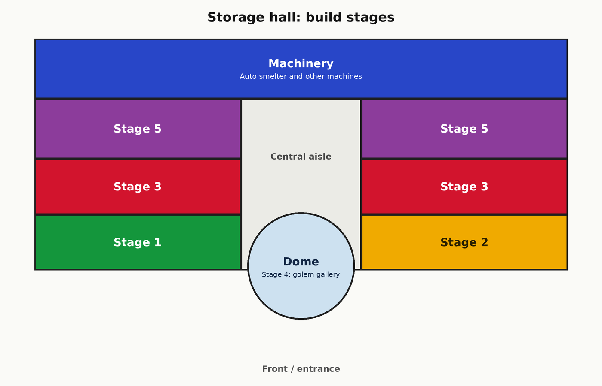
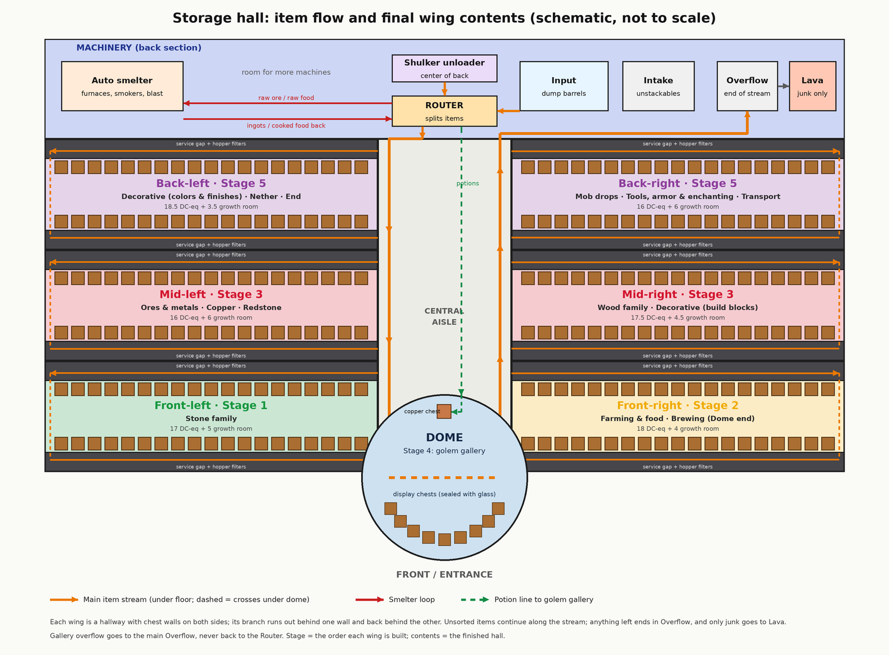

# Storage growth stages: one table per stage

**Part of:** [Storage and sorting](storage-and-sorting.md) · **Source of truth:** [storage-layout.md §3 (per-item allocation)](storage-layout.md#3-item-by-item-chest-allocation) and [§4 (growth stages)](storage-layout.md#4-growth-stages) · **Layout:** [Jeffrey's hall sketch](storage-layout.md#hall-layout-jeffreys-sketch) and [final layout](storage-layout.md#final-layout-finished-hall)
**Server:** Bedrock 26.50

*Jeffrey's layout. The stage labels are the order the wings get built.*

**How stages work:** every group has one wing in the **finished** hall. Each stage builds its wing(s) and automates exactly the groups that live there; groups whose wing isn't built yet stay in their Stage 0 manual chests. Each stage below lists **only what that stage adds**, and which wing it goes in. Every count comes straight from the §3 tables (generated from them, not retyped). If §3 or §4 changes, this file has to be regenerated.

**Units:** DC = double chest (54 slots), SC = single chest (27 slots), DC-eq = DC + SC ÷ 2. **★** = leave room to grow. Shapes and sizes are Jeffrey's design; this is counts, order, and zones only.

**How sorted:**
- **Hopper slice:** its own filter.
- **Mixed chest (manual, from overflow):** no filter; you move these from the overflow on the weekly review.
- **Smelter first:** filtered to the smelter; only the output gets a chest.
- **Manual:** unstackables or put away by hand.
- **Golem:** the gallery.

## Summary by stage

| Stage | Phase | Wings built | Groups automated | Adds DC-eq | Adds slices | Cumulative DC-eq / slices |
| --- | --- | --- | --- | --- | --- | --- |
| [Stage 0](#stage-0-manual-chests-by-group-plus-a-test-slice) | [Phase 4](phase-4-the-base.md#1-storage-wall) | None (Phase 4 storage wall) | Manual chest per group | 8.5 + test rig (temporary, not counted) | 1 test slice (not counted) | 0 / 0 |
| [Stage 1](#stage-1-front-left-wing-machinery-core-and-the-whole-trunk) | Phase 4 → 5 | Front-left + Machinery core + U trunk | 1 Stone family; 16 Overflow + intake | 20 | 13 | 20 / 13 |
| [Stage 2](#stage-2-front-right-wing-plus-smokers) | [Phase 5](phase-5-infrastructure.md) | Front-right + smokers | 3 Farming & food; 10 Brewing ingredients | 18 | 22 | 38 / 35 |
| [Stage 3](#stage-3-mid-left-and-mid-right-wings-blast-furnaces-and-the-lava) | Phase 5 | Mid-left + mid-right + blast furnaces + lava | 2 Wood family; 4 Ores & metals; 5 Copper; 6 Decorative (build blocks); 7 Redstone | 33.5 | 30 | 71.5 / 65 |
| [Stage 4](#stage-4-golem-gallery-showpiece-dome) | Phase 5 | Dome | 5 Copper (gallery spares chest); 11 Potions & tipped arrows (golem module 1) | 6 | 0 | 77.5 / 65 |
| [Stage 5](#stage-5-back-left-and-back-right-wings-shulker-unloader-and-expansion) | After the End, then ongoing | Back-left + back-right + shulker unloader | 6 Decorative (colors & finishes); 8 Transport; 9 Mob drops; 12 Nether; 13 End; 14 Tools, armor & enchanting; 15 Shulker boxes | 35.5, then expansion | 22, then as needed | 113 / 87, then growing |
| **Total through Stage 5** | | | | **113** | **87** | matches the §3 grand total |

## Summary by zone (finished hall)

DC-eq here covers chests only; machines (router, smelter, lava, unloader) have no chest count. Each wing is a hallway with a chest wall on **both** sides, each wall backed by its own service gap and filters ([item flow](storage-layout.md#item-flow)). With its reserve, every wing comes to about 22 DC-eq, so the six wings can be built the same size ([capacity](storage-layout.md#final-layout-finished-hall)).

| Zone (finished hall) | Build stage | Groups | DC-eq | Slices | Chest walls | DC-eq per wall | Growth room reserved |
| --- | --- | --- | --- | --- | --- | --- | --- |
| Front-left wing | 1 | 1 Stone family | 17 | 13 | 2 | 8.5 | +5 |
| Front-right wing | 2 | 3 Farming & food; 10 Brewing ingredients | 18 | 22 | 2 | 9 | +4 |
| Mid-left wing | 3 | 4 Ores & metals; 5 Copper; 7 Redstone | 16 | 15 | 2 | 8 | +6 |
| Mid-right wing | 3 | 2 Wood family; 6 Decorative (build blocks) | 17.5 | 15 | 2 | 8.75 | +4.5 |
| Back-left wing | 5 | 6 Decorative (colors & finishes); 12 Nether; 13 End | 18.5 | 8 | 2 | 9.25 | +3.5 |
| Back-right wing | 5 | 8 Transport; 9 Mob drops; 14 Tools, armor & enchanting | 16 | 14 | 2 | 8 | +6 |
| Dome | 4 | 5 Copper (gallery spares chest); 11 Potions & tipped arrows (golem module 1) | 6 | 0 | — | — | +5.5 (golem module 2) |
| Machinery | 1 (+5) | 15 Shulker boxes; 16 Overflow + intake | 4 | 0 | — | — | +1 SC empty boxes; overflow as needed |
| **Total** | | | **113** | **87** | | | **+29 in the wings** |

**Why Stage 0 isn't counted:** its 17 chests (and the test rig) are the temporary Phase 4 storage wall. Once a group's items get hall chests (Stages 1–5), the old group chest is free to reuse as one of that group's mixed or manual chests, so counting it would double-count. The test slice is a prototype in a test area. Golem module 2 and the other Stage 5 expansion come on top of the 113.

## Stage 0: manual chests by group, plus a test slice

| Group | Item | Chests | How sorted | Zone | Notes |
| --- | --- | --- | --- | --- | --- |
| 1. Stone family | Everything in the group | 1 SC | Manual | Phase 4 storage wall | Labeled with an item frame; temporary |
| 2. Wood family | Everything in the group | 1 SC | Manual | Phase 4 storage wall | Labeled with an item frame; temporary |
| 3. Farming & food | Everything in the group | 1 SC | Manual | Phase 4 storage wall | Labeled with an item frame; temporary |
| 4. Ores & metals | Everything in the group | 1 SC | Manual | Phase 4 storage wall | Labeled with an item frame; temporary |
| 5. Copper | Everything in the group | 1 SC | Manual | Phase 4 storage wall | Labeled with an item frame; temporary |
| 6. Decorative | Everything in the group | 1 SC | Manual | Phase 4 storage wall | Labeled with an item frame; temporary |
| 7. Redstone | Everything in the group | 1 SC | Manual | Phase 4 storage wall | Labeled with an item frame; temporary |
| 8. Transport | Everything in the group | 1 SC | Manual | Phase 4 storage wall | Labeled with an item frame; temporary |
| 9. Mob drops | Everything in the group | 1 SC | Manual | Phase 4 storage wall | Labeled with an item frame; temporary |
| 10. Brewing ingredients | Everything in the group | 1 SC | Manual | Phase 4 storage wall | Labeled with an item frame; temporary |
| 11. Potions & tipped arrows (golem gallery, module 1) | Everything in the group | 1 SC | Manual | Phase 4 storage wall | Labeled with an item frame; temporary |
| 12. Nether | Everything in the group | 1 SC | Manual | Phase 4 storage wall | Labeled with an item frame; temporary |
| 13. End | Everything in the group | 1 SC | Manual | Phase 4 storage wall | Labeled with an item frame; temporary |
| 14. Tools, armor & enchanting (manual) | Everything in the group | 1 SC | Manual | Phase 4 storage wall | Labeled with an item frame; temporary |
| 15. Shulker boxes (manual) | Everything in the group | 1 SC | Manual | Phase 4 storage wall | Labeled with an item frame; temporary |
| 16. Misc / overflow | Everything in the group | 1 SC | Manual | Phase 4 storage wall | Labeled with an item frame; temporary |
| — | Input chest by the door | 1 SC | Manual | Phase 4 storage wall | Becomes the input dump in Stage 1 |
| — | Test hopper slice + its overflow chest (test area) | 1 slice + 1 SC | Hopper slice | Test area | Prototype from [Stackable Sorting](https://bedrockwiki.com/books/storage-tech/page/stackable-sorting); test with a junk item |

- **Stage adds:** 17 SC = 8.5 DC-eq, plus the test slice and its overflow chest. All temporary, not counted in the totals
- **Cumulative (counted):** 0 DC-eq / 0 slices
- **Phase:** [Phase 4](phase-4-the-base.md#1-storage-wall)
- **Zone:** Phase 4 storage wall (before the hall)
- **Needs:** wood for chests, item frames for labels, 1 slice's worth of hoppers and redstone parts.
- **Stays in use:** each group chest keeps working as that group's manual home until its wing is built, through Stage 5 for the back-wing groups.
- **Done when:** everything you own has a group chest, and the test slice sorts its item with nothing leaking past the overflow.

## Stage 1: front-left wing, Machinery core, and the whole trunk

| Group | Item | Chests | How sorted | Zone | Notes |
| --- | --- | --- | --- | --- | --- |
| 1. Stone family | Cobblestone | 4 DC | Hopper slice | Front-left wing | ★ room to grow. Bulk. Junk-to-lava candidate once full (your call) |
| 1. Stone family | Cobbled deepslate | 3 DC | Hopper slice | Front-left wing | ★ room to grow. Bulk from deep mining |
| 1. Stone family | Dirt | 2 DC | Hopper slice | Front-left wing | ★ room to grow. Bulk for terraforming |
| 1. Stone family | Stone | 1 DC | Hopper slice | Front-left wing | Smelted cobble; makes smooth stone (blast furnaces) and stone bricks |
| 1. Stone family | Gravel | 1 DC | Hopper slice | Front-left wing |  |
| 1. Stone family | Sand | 1 DC | Hopper slice | Front-left wing | Feeds the smelter for glass |
| 1. Stone family | Deepslate | 1 SC | Hopper slice | Front-left wing | Silk Touch only |
| 1. Stone family | Granite | 1 SC | Hopper slice | Front-left wing |  |
| 1. Stone family | Diorite | 1 SC | Hopper slice | Front-left wing |  |
| 1. Stone family | Andesite | 1 SC | Hopper slice | Front-left wing |  |
| 1. Stone family | Tuff | 1 SC | Hopper slice | Front-left wing |  |
| 1. Stone family | Flint | 1 SC | Hopper slice | Front-left wing | From gravel |
| 1. Stone family | Obsidian | 1 SC | Hopper slice | Front-left wing |  |
| 1. Stone family | Red sand, coarse dirt, rooted dirt, mud, clay balls, moss blocks, podzol, mycelium, calcite, smooth basalt, dripstone blocks, pointed dripstone | 1 DC | Mixed chest (manual, from overflow) | Front-left wing | Low volume; one chest for all of them |
| 1. Stone family | Sulfur, cinnabar, sulfur spikes (sulfur caves, added in 26.30) | 1 SC | Mixed chest (manual, from overflow) | Front-left wing | Only once you find a sulfur cave |
| 16. Misc / overflow | Main overflow (end of the stream, in front of the lava) | 2 DC | Overflow | Machinery | Weekly review; also where mixed-chest items wait. Promote anything that keeps showing up |
| 16. Misc / overflow | Non-stackable intake (from the split) | 1 DC | Manual | Machinery | Sort by hand into groups 8, 14, 15 |

- **Stage adds:** 16 DC + 8 SC = **20 DC-eq**, **13 hopper slices**
- **Cumulative:** 20 DC-eq / 13 slices
- **Phase:** Phase 4 → 5
- **Zone:** Front-left wing; router, input barrels, intake and overflow in Machinery; the whole U trunk
- **Also built:**
  - Router and input barrels in Machinery, the non-stackable split into a 1 DC intake, and the 2 DC main overflow at the stream end, back right. No lava yet.
  - The whole U-shaped [trunk](storage-layout.md#final-layout-finished-hall), with a capped branch point at every other wing, including the crossing under the Dome site.
  - The space above the router and its top input left free for the Stage 5 shulker unloader.
- **Needs:**
  - Iron for hoppers (5 iron ingots + 1 chest each). Count the chosen slice design's hoppers × 13, plus the input line and the trunk.
  - Nether quartz for comparators (one Nether trip), and redstone.
  - Water for the item stream (one source pushes items up to 9 blocks, so the full U needs many), and barrels.
  - A site near the home base, logged in [coordinates](../notes/coordinates.md).
  - Hopper locking when idle, for lag.
- **Farm lines:** connect only farms whose items have slices, which means mining drops for now. Other farms keep their own collection chests until their wing is built, or they flood the overflow.
- **Done when:** dumping inventory into the input barrels sends stone-family items to their chests, unstackables to the intake, and everything else to the overflow, with nothing lost.

## Stage 2: front-right wing, plus smokers

| Group | Item | Chests | How sorted | Zone | Notes |
| --- | --- | --- | --- | --- | --- |
| 3. Farming & food | Wheat | 2 DC | Hopper slice | Front-right wing | ★ room to grow. Wheat-farm output |
| 3. Farming & food | Wheat seeds | 1 DC | Hopper slice | Front-right wing | Farm surplus; compost extras |
| 3. Farming & food | Carrots | 1 DC | Hopper slice | Front-right wing |  |
| 3. Farming & food | Potatoes | 1 DC | Hopper slice | Front-right wing | Poisonous potatoes go to overflow (junk candidate) |
| 3. Farming & food | Sugar cane | 1 DC | Hopper slice | Front-right wing | ★ room to grow. Paper (books, maps) and sugar |
| 3. Farming & food | Hay bales | 1 DC | Hopper slice | Front-right wing | Compressed wheat; also crafts straw beds (26.50) |
| 3. Farming & food | Bread | 1 SC | Hopper slice | Front-right wing |  |
| 3. Farming & food | Baked potatoes | 1 SC | Hopper slice | Front-right wing | Smoker output |
| 3. Farming & food | Cooked meat #1 and #2 (the two animals you farm, e.g. steak, cooked porkchop) | 2 SC | Hopper slice | Front-right wing | 1 chest each; smoker output |
| 3. Farming & food | Raw meat and raw fish | — | Smelter first | Front-right wing | Smoker first; the cooked result comes back to the router |
| 3. Farming & food | Other cooked food (cooked mutton, chicken, rabbit, cod, salmon) | 1 SC | Mixed chest (manual, from overflow) | Front-right wing |  |
| 3. Farming & food | Pumpkins | 1 SC | Hopper slice | Front-right wing | Carved pumpkins for golems |
| 3. Farming & food | Melon slices | 1 SC | Hopper slice | Front-right wing | Glistering melon for brewing |
| 3. Farming & food | Apples | 1 SC | Hopper slice | Front-right wing | Tree-farm drop |
| 3. Farming & food | Golden carrots | 1 SC | Hopper slice | Front-right wing |  |
| 3. Farming & food | Eggs | 1 SC | Hopper slice (stack-16 filter) | Front-right wing | Stack to 16. Brown and blue eggs are separate items: filter your chickens' color, add the others by hand |
| 3. Farming & food | Bone meal | 1 SC | Hopper slice | Front-right wing |  |
| 3. Farming & food | Beetroot, beetroot seeds | 1 SC | Mixed chest (manual, from overflow) | Front-right wing |  |
| 3. Farming & food | Sweet berries, glow berries, cocoa beans, kelp, dried kelp, dried kelp blocks, torchflower seeds, pitcher pods | 1 SC | Mixed chest (manual, from overflow) | Front-right wing |  |
| 3. Farming & food | Brown mushrooms, red mushrooms, shelf mushrooms (26.50) | 1 SC | Mixed chest (manual, from overflow) | Front-right wing | Stew ingredients |
| 3. Farming & food | Pumpkin pie, cookies, honey bottles | 1 SC | Mixed chest (manual, from overflow) | Front-right wing | Honey bottles stack to 16 |
| 3. Farming & food | Stews and soups | — | Manual | Front-right wing | Unstackable: they come out at the non-stackable split |
| 10. Brewing ingredients | Nether wart | 1 SC | Hopper slice | Front-right wing | ★ room to grow. Grow it if you build a wart farm |
| 10. Brewing ingredients | Blaze rods | 1 SC | Hopper slice | Front-right wing |  |
| 10. Brewing ingredients | Blaze powder | 1 SC | Hopper slice | Front-right wing |  |
| 10. Brewing ingredients | Glass bottles | 1 SC | Hopper slice | Front-right wing |  |
| 10. Brewing ingredients | Sugar | 1 SC | Hopper slice | Front-right wing |  |
| 10. Brewing ingredients | Glowstone dust | 1 SC | Hopper slice | Front-right wing |  |
| 10. Brewing ingredients | Glistering melon slices, magma cream, ghast tears, fermented spider eyes, rabbit's feet, phantom membranes, pufferfish, dragon's breath | 1 SC | Mixed chest (manual, from overflow) | Front-right wing |  |

- **Stage adds:** 7 DC + 22 SC = **18 DC-eq**, **22 hopper slices**
- **Cumulative:** 38 DC-eq / 35 slices
- **Phase:** [Phase 5](phase-5-infrastructure.md)
- **Zone:** Front-right wing; smokers in Machinery
- **Smelter, first part:** smokers on the left of Machinery. Raw meat and fish go to the smokers, and cooked food comes back through the router to its slices. A furnace for cobblestone → stone can go in now too, since stone has a slice.
- **Needs:**
  - Smokers (4 logs + 1 furnace each). Fuel from coal, which still comes from its Stage 0 chest until Stage 3.
  - Iron for 22 slices' hoppers.
  - Nether access for blaze rods and nether wart, though the brewing slices can sit empty until then.
- **Farm lines:** the wheat/crop farms and the animal farm now connect to the router.
- **Done when:** crops and raw food sort hands-free, and raw food comes back cooked in its own chest without you touching the smokers.

## Stage 3: mid-left and mid-right wings, blast furnaces, and the lava

| Group | Item | Chests | How sorted | Zone | Notes |
| --- | --- | --- | --- | --- | --- |
| 2. Wood family | Main wood logs (your tree-farm species) | 3 DC | Hopper slice | Mid-right wing | ★ room to grow. Bulk from the tree farm |
| 2. Wood family | Main wood planks | 1 DC | Hopper slice | Mid-right wing |  |
| 2. Wood family | Main wood stripped logs | 1 SC | Hopper slice | Mid-right wing |  |
| 2. Wood family | Main wood saplings | 1 SC | Hopper slice | Mid-right wing | Tree-farm surplus; compost extras |
| 2. Wood family | Sticks | 1 SC | Hopper slice | Mid-right wing |  |
| 2. Wood family | Accent log #1, #2, #3 (the species you build with most after the main one) | 3 SC | Hopper slice | Mid-right wing | ★ room to grow. 1 chest each, 3 slices |
| 2. Wood family | All other logs (oak, spruce, birch, jungle, acacia, dark oak, mangrove, cherry, pale oak, poplar, minus the ones above) | 1 DC | Mixed chest (manual, from overflow) | Mid-right wing | Poplar was added in 26.50 |
| 2. Wood family | Other planks and stripped logs | 1 DC | Mixed chest (manual, from overflow) | Mid-right wing |  |
| 2. Wood family | Other saplings (incl. poplar saplings, mangrove propagules) | 1 SC | Mixed chest (manual, from overflow) | Mid-right wing |  |
| 2. Wood family | Sheared leaves | 1 SC | Mixed chest (manual, from overflow) | Mid-right wing |  |
| 2. Wood family | Bamboo | 1 SC | Hopper slice | Mid-right wing | Scaffolding |
| 2. Wood family | Signs and hanging signs (all woods) | 1 SC | Mixed chest (manual, from overflow) | Mid-right wing | Stack to 16 |
| 4. Ores & metals | Coal | 2 DC | Hopper slice | Mid-left wing | ★ room to grow. Smelter fuel and torches |
| 4. Ores & metals | Iron ingots | 2 DC | Hopper slice | Mid-left wing | ★ room to grow. 5 per hopper; more once an iron farm runs |
| 4. Ores & metals | Charcoal | 1 DC | Hopper slice | Mid-left wing | Tree-farm logs through the smelter |
| 4. Ores & metals | Raw iron, raw gold, raw copper | — | Smelter first | Mid-left wing | Blast furnace first; ingots come back to the router |
| 4. Ores & metals | Iron nuggets | 1 SC | Hopper slice | Mid-left wing |  |
| 4. Ores & metals | Gold ingots | 1 SC | Hopper slice | Mid-left wing |  |
| 4. Ores & metals | Gold nuggets | 1 SC | Hopper slice | Mid-left wing |  |
| 4. Ores & metals | Diamonds | 1 SC | Hopper slice | Mid-left wing | Never lava |
| 4. Ores & metals | Emeralds | 1 SC | Hopper slice | Mid-left wing | ★ room to grow. Grow it if you build a trading hall |
| 4. Ores & metals | Lapis lazuli | 1 SC | Hopper slice | Mid-left wing | Enchanting |
| 4. Ores & metals | Nether quartz | 1 SC | Hopper slice | Mid-left wing | 1 per comparator, and most filter slices use one |
| 4. Ores & metals | Storage blocks (iron, gold, diamond, emerald, lapis, coal, redstone blocks), amethyst shards | 1 SC | Mixed chest (manual, from overflow) | Mid-left wing |  |
| 4. Ores & metals | Ancient debris, netherite scrap, netherite ingots | 1 SC | Manual | Mid-left wing | Never lava (netherite doesn't burn and would clog the disposal). Put away by hand; don't dump into the input |
| 5. Copper | Copper ingots | 1 DC | Hopper slice | Mid-left wing | Golems, copper chests, copper building blocks |
| 5. Copper | Copper nuggets | 1 SC | Hopper slice | Mid-left wing | From smelting copper tools and armor; for copper torches, lanterns, chains |
| 5. Copper | Honeycomb | 1 SC | Hopper slice | Mid-left wing | Wax for golems and copper |
| 5. Copper | Blocks of copper (each oxidation and waxed state is its own item) | 1 SC | Mixed chest (manual, from overflow) | Mid-left wing | Golems can be built from any state |
| 5. Copper | Cut copper and its stairs and slabs, chiseled copper, copper grates, doors, trapdoors, bulbs, bars, chains, lightning rods, copper torches, copper lanterns | 1 DC | Mixed chest (manual, from overflow) | Mid-left wing | ★ room to grow. Many item types (oxidation states multiply them) |
| 6. Decorative | Main build block #1 (your pick) | 2 DC | Hopper slice | Mid-right wing | ★ room to grow. Bulk; whatever the hall and base are made of |
| 6. Decorative | Main build block #2 (your pick) | 2 DC | Hopper slice | Mid-right wing | ★ room to grow. Bulk |
| 6. Decorative | Glass | 1 DC | Hopper slice | Mid-right wing | Smelter output from sand |
| 6. Decorative | Glass panes | 1 SC | Hopper slice | Mid-right wing |  |
| 6. Decorative | Torches | 1 SC | Hopper slice | Mid-right wing |  |
| 6. Decorative | Item frames | 1 SC | Hopper slice | Mid-right wing | For labeling every chest |
| 7. Redstone | Redstone dust | 1 SC | Hopper slice | Mid-left wing | ★ room to grow |
| 7. Redstone | Hoppers | 1 SC | Hopper slice | Mid-left wing | Build stock for new slices |
| 7. Redstone | Comparators, repeaters, redstone torches | 1 SC | Mixed chest (manual, from overflow) | Mid-left wing |  |
| 7. Redstone | Pistons, sticky pistons, observers, droppers, dispensers, crafters | 1 SC | Mixed chest (manual, from overflow) | Mid-left wing |  |
| 7. Redstone | Levers, buttons, pressure plates, tripwire hooks, daylight detectors, target blocks, note blocks, redstone lamps | 1 SC | Mixed chest (manual, from overflow) | Mid-left wing |  |
| 7. Redstone | Slime blocks, honey blocks | 1 SC | Mixed chest (manual, from overflow) | Mid-left wing | ★ room to grow. Flying machine stock (end game) |

- **Stage adds:** 18 DC + 31 SC = **33.5 DC-eq**, **30 hopper slices**
- **Cumulative:** 71.5 DC-eq / 65 slices
- **Phase:** Phase 5
- **Zone:** Mid-left and mid-right wings; blast furnaces and lava in Machinery
- **Smelter, second part:** blast furnaces for raw iron, gold and copper. Ingots, charcoal and glass (from sand) come back to the router and land in mid-left and mid-right.
- **Lava disposal:** behind the overflow. **Until Stage 5, it burns only an explicit junk list** (via junk slices), not "whatever overflows". The back-wing groups have no slices yet and ride into the overflow, so a full overflow must not feed the lava.
- **Needs:**
  - The most iron of any stage: 30 slices' hoppers, plus blast furnaces (5 iron ingots + 1 furnace + 3 smooth stone each).
  - A lava source.
  - Tree farm and iron farm lines connected to the router now. Until this stage they keep their own collection chests.
- **Before the lava goes live:** every never-lava item needs a slice, the non-stackable split, or to stay out of the input. Diamonds get their slice in this stage. Shulker shells and netherite stay out of the input.
- **Done when:** raw ore comes back as ingots in their own chests, wood and the main build blocks sort hands-free, and the lava has only destroyed junk in testing.

## Stage 4: golem gallery showpiece (Dome)

| Group | Item | Chests | How sorted | Zone | Notes |
| --- | --- | --- | --- | --- | --- |
| 5. Copper | Gallery spares: copper chests, carved pumpkins, copper golem statues | 1 SC | Manual | Dome | On Bedrock, statues that froze in survival don't stack (MCPE-225273) |
| 11. Potions & tipped arrows (golem gallery, module 1) | Gallery input copper chest | 1 SC | Golem | Dome | Fed by the router (brewing-stand potion filter + tipped-arrow slice) |
| 11. Potions & tipped arrows (golem gallery, module 1) | Display chests: Healing, Regeneration, Strength, Swiftness, Fire Resistance, Night Vision, Slow Falling, Splash Healing, Tipped arrows (1 type) | 9 SC | Golem | Dome | 1 chest per type (golems tell types apart on Bedrock). Potions are unstackable, so 27 per chest. Keep 1 in each |
| 11. Potions & tipped arrows (golem gallery, module 1) | Gallery overflow (farthest chest) | 1 SC | Golem | Dome | Drains to the main overflow, never back to the router |

- **Stage adds:** 0 DC + 12 SC = **6 DC-eq**, **0 hopper slices**
- **Cumulative:** 77.5 DC-eq / 65 slices
- **Phase:** Phase 5
- **Zone:** Dome
- **Router side:** a brewing-stand potion filter and a tipped-arrow slice at the router feed the potion line up the aisle to the gallery's copper chest.
- **Needs:**
  - A block of copper (9 copper ingots) and a carved pumpkin per golem, plus honeycomb (shear a bee nest with a campfire under it).
  - Optionally a spare copper chest (8 copper ingots + 1 chest).
  - Brewed potions (Nether access).
  - Iron doors and a glass viewing front.
- **First step:** test one golem with 3–4 seeded chests plus a farthest overflow, and check that glass doesn't break its line of sight.
- **Done when:**
  - The golem visibly sorts each potion type and the tipped arrows into its own display chest behind glass.
  - No empty or unseeded chest is in golem range, and no hopper drains a display chest.
  - The golem and its copper chest are waxed.

## Stage 5: back-left and back-right wings, shulker unloader, and expansion

| Group | Item | Chests | How sorted | Zone | Notes |
| --- | --- | --- | --- | --- | --- |
| 6. Decorative | White wool | 1 SC | Hopper slice | Back-left wing | Sheep output; dye as needed |
| 6. Decorative | Colored wool (15 colors) | 1 SC | Mixed chest (manual, from overflow) | Back-left wing |  |
| 6. Decorative | Carpets (16 colors) | 1 SC | Mixed chest (manual, from overflow) | Back-left wing |  |
| 6. Decorative | Wool stairs and wool slabs (26.50; 16 colors each, 32 item types) | 1 DC | Mixed chest (manual, from overflow) | Back-left wing | More types than a single chest has slots |
| 6. Decorative | Cushions (26.50, 16 colors) | 1 SC | Mixed chest (manual, from overflow) | Back-left wing | Stack to 16 |
| 6. Decorative | Concrete (16 colors) | 1 SC | Mixed chest (manual, from overflow) | Back-left wing |  |
| 6. Decorative | Concrete powder (16 colors) | 1 SC | Mixed chest (manual, from overflow) | Back-left wing |  |
| 6. Decorative | Concrete stairs and slabs (26.50; 32 item types) | 1 DC | Mixed chest (manual, from overflow) | Back-left wing |  |
| 6. Decorative | Terracotta, dyed terracotta, glazed terracotta (33 types) | 1 DC | Mixed chest (manual, from overflow) | Back-left wing |  |
| 6. Decorative | Stained glass and stained glass panes (32 types) | 1 DC | Mixed chest (manual, from overflow) | Back-left wing |  |
| 6. Decorative | Dyes (16) | 1 SC | Mixed chest (manual, from overflow) | Back-left wing |  |
| 6. Decorative | Bricks (item) and brick blocks | 1 SC | Mixed chest (manual, from overflow) | Back-left wing |  |
| 6. Decorative | Flowers, incl. wildflowers, cactus flowers, eyeblossoms, golden dandelions | 1 SC | Mixed chest (manual, from overflow) | Back-left wing |  |
| 6. Decorative | Foliage: leaf litter, short and tall dry grass, bushes, firefly bushes, ferns, vines, red shrubs (26.50) | 1 SC | Mixed chest (manual, from overflow) | Back-left wing |  |
| 6. Decorative | Lanterns, soul lanterns, iron chains, glow item frames | 1 SC | Mixed chest (manual, from overflow) | Back-left wing |  |
| 6. Decorative | Banners, paintings, flower pots | 1 SC | Mixed chest (manual, from overflow) | Back-left wing | Banners stack to 16 |
| 6. Decorative | Other decorative stone (mud bricks, packed mud, tuff bricks, resin bricks, sulfur and cinnabar bricks, polished variants, stairs/slabs/walls) | 1 DC | Mixed chest (manual, from overflow) | Back-left wing | ★ room to grow. Promote any you start using a lot to its own slice |
| 8. Transport | Rails | 1 SC | Hopper slice | Back-right wing |  |
| 8. Transport | Firework rockets | 1 SC | Hopper slice | Back-right wing | ★ room to grow. Elytra fuel later |
| 8. Transport | Powered, detector, activator rails | 1 SC | Mixed chest (manual, from overflow) | Back-right wing |  |
| 8. Transport | Leads, name tags, dried ghasts | 1 SC | Mixed chest (manual, from overflow) | Back-right wing |  |
| 8. Transport | Boats, chest boats, minecarts (all types) | 1 SC | Manual | Back-right wing | Unstackable: from the non-stackable split |
| 8. Transport | Saddles, harnesses, horse armor (incl. copper), nautilus armor | 1 SC | Manual | Back-right wing | Unstackable |
| 9. Mob drops | Rotten flesh | 1 DC | Hopper slice | Back-right wing | ★ room to grow. Mob-farm bulk; junk-to-lava candidate |
| 9. Mob drops | Bones | 1 DC | Hopper slice | Back-right wing | ★ room to grow. Mob-farm bulk; bone meal |
| 9. Mob drops | String | 1 DC | Hopper slice | Back-right wing | ★ room to grow. Mob-farm bulk |
| 9. Mob drops | Gunpowder | 1 DC | Hopper slice | Back-right wing | ★ room to grow. Mob-farm bulk; rockets |
| 9. Mob drops | Arrows | 1 SC | Hopper slice | Back-right wing |  |
| 9. Mob drops | Spider eyes | 1 SC | Hopper slice | Back-right wing |  |
| 9. Mob drops | Ender pearls | 1 SC | Hopper slice (stack-16 filter) | Back-right wing | Stack to 16 |
| 9. Mob drops | Slimeballs | 1 SC | Hopper slice | Back-right wing | Slime blocks for the flying machine |
| 9. Mob drops | Leather | 1 SC | Hopper slice | Back-right wing | Books |
| 9. Mob drops | Feathers | 1 SC | Hopper slice | Back-right wing |  |
| 9. Mob drops | Ink sacs, glow ink sacs | 1 SC | Mixed chest (manual, from overflow) | Back-right wing |  |
| 9. Mob drops | Prismarine shards, prismarine crystals, nautilus shells, hearts of the sea, armadillo scutes, turtle scutes, rabbit hide, wind charges, breeze rods, cobwebs | 1 SC | Mixed chest (manual, from overflow) | Back-right wing |  |
| 9. Mob drops | Mob-dropped tools, armor, bows | — | Manual | Back-right wing | Unstackable: to the non-stackable intake, never lava |
| 12. Nether | Netherrack | 1 DC | Hopper slice | Back-left wing | ★ room to grow. Grow it only if you build with it |
| 12. Nether | Blackstone | 1 SC | Hopper slice | Back-left wing |  |
| 12. Nether | Basalt | 1 SC | Hopper slice | Back-left wing |  |
| 12. Nether | Glowstone | 1 SC | Hopper slice | Back-left wing |  |
| 12. Nether | Soul sand, soul soil | 1 SC | Mixed chest (manual, from overflow) | Back-left wing |  |
| 12. Nether | Nether bricks (block) and nether brick (item) | 1 SC | Mixed chest (manual, from overflow) | Back-left wing |  |
| 12. Nether | Crimson and warped stems, nether wart blocks, warped wart blocks, shroomlights, magma blocks, crying obsidian, gilded blackstone, crimson and warped fungi | 1 DC | Mixed chest (manual, from overflow) | Back-left wing |  |
| 13. End | End stone | 1 DC | Hopper slice | Back-left wing | ★ room to grow |
| 13. End | Purpur blocks | 1 SC | Hopper slice | Back-left wing |  |
| 13. End | Shulker shells | 1 SC | Hopper slice | Back-left wing | Never lava; 2 per shulker box |
| 13. End | Chorus fruit, popped chorus fruit | 1 SC | Mixed chest (manual, from overflow) | Back-left wing |  |
| 13. End | End rods, eyes of ender | 1 SC | Mixed chest (manual, from overflow) | Back-left wing |  |
| 14. Tools, armor & enchanting (manual) | Tools and weapons (incl. copper tools, spears, maces, bows, crossbows, tridents, shields) | 1 DC | Manual | Back-right wing | Unstackable |
| 14. Tools, armor & enchanting (manual) | Armor (incl. copper armor, turtle shells) | 1 DC | Manual | Back-right wing | Unstackable |
| 14. Tools, armor & enchanting (manual) | Enchanted books | 1 DC | Manual | Back-right wing | ★ room to grow. Unstackable |
| 14. Tools, armor & enchanting (manual) | Books | 1 SC | Hopper slice | Back-right wing |  |
| 14. Tools, armor & enchanting (manual) | Bookshelves | 1 SC | Hopper slice | Back-right wing |  |
| 14. Tools, armor & enchanting (manual) | Valuables: totems of undying, elytra, heavy cores, trial keys, ominous bottles, bottles o' enchanting | 1 SC | Manual | Back-right wing | Never lava |
| 14. Tools, armor & enchanting (manual) | Music discs, goat horns, written books, books and quills | 1 SC | Manual | Back-right wing | Discs, horns, books and quills are unstackable; written books stack to 16 |
| 15. Shulker boxes (manual) | Empty shulker boxes | 1 SC | Manual | Machinery | ★ room to grow. The unloader returns empties here. Unstackable, never lava |
| 15. Shulker boxes (manual) | Packed boxes and kits | 1 SC | Manual | Machinery | Never lava |

- **Stage adds:** 15 DC + 41 SC = **35.5 DC-eq**, **22 hopper slices**, then expansion
- **Cumulative:** 113 DC-eq / 87 slices (the §3 grand total), then growing
- **Phase:** After the End, then ongoing
- **Zone:** Back-left and back-right wings; shulker unloader at the center of Machinery, directly above the router, with the box chests beside it; golem module 2 in the Dome
- **Shulker unloader (center of Machinery, at the head of the aisle):** sits directly above the router and feeds straight down into it. Empty boxes go to the group 15 chest beside it.
- **Lava:** with every group now in place, the lava can switch to "only when the overflow is full" if Jeffrey wants.
- **Needs:**
  - End city trips for shulker shells; each box is 2 shulker shells + 1 chest.
  - A dispenser and a piston for the unloader.
  - Iron for 22 slices' hoppers.
  - The mob farm line connected to the router now. Until this stage it keeps its own collection chests.
- **Done when:** mob drops, Nether and End items sort hands-free, and dropping a full shulker box empties it into the sorter and returns the empty box, with no box ever reaching the lava. After that, expansion is ongoing with no finish line.

### Stage 5 expansion (ongoing)

"Chests now" is the §3 starting allocation and its wing. Each wing reserves growth room for its own ★ items ([final layout](storage-layout.md#final-layout-finished-hall)); past that, extend at the outer end of either wall.

| Group | Item | Chests now | How sorted | Zone | Notes |
| --- | --- | --- | --- | --- | --- |
| 11. Potions & tipped arrows | Golem module 2: 1 copper input chest + 9 display chests + 1 farthest overflow | +11 SC (+5.5 DC-eq) | Golem | Dome | More potion and tipped-arrow types (e.g. Water Breathing, Invisibility, Leaping); 1 waxed golem; keep 1 item in each chest. Must stay in the sealed gallery |
| any | Mixed-chest items that keep filling the overflow | +1 slice each | Hopper slice | The item's own wing | Promote to its own slice, using that wing's reserve |
| 1. Stone family | Cobblestone | 4 DC (Stage 1, Front-left wing) | Hopper slice | Front-left wing (its reserved room, then the open wall end) | ★ grow first. Bulk. Junk-to-lava candidate once full (your call) |
| 1. Stone family | Cobbled deepslate | 3 DC (Stage 1, Front-left wing) | Hopper slice | Front-left wing (its reserved room, then the open wall end) | ★ grow first. Bulk from deep mining |
| 1. Stone family | Dirt | 2 DC (Stage 1, Front-left wing) | Hopper slice | Front-left wing (its reserved room, then the open wall end) | ★ grow first. Bulk for terraforming |
| 2. Wood family | Main wood logs (your tree-farm species) | 3 DC (Stage 3, Mid-right wing) | Hopper slice | Mid-right wing (its reserved room, then the open wall end) | ★ grow first. Bulk from the tree farm |
| 2. Wood family | Accent log #1, #2, #3 (the species you build with most after the main one) | 3 SC (Stage 3, Mid-right wing) | Hopper slice | Mid-right wing (its reserved room, then the open wall end) | ★ grow first. 1 chest each, 3 slices |
| 3. Farming & food | Wheat | 2 DC (Stage 2, Front-right wing) | Hopper slice | Front-right wing (its reserved room, then the open wall end) | ★ grow first. Wheat-farm output |
| 3. Farming & food | Sugar cane | 1 DC (Stage 2, Front-right wing) | Hopper slice | Front-right wing (its reserved room, then the open wall end) | ★ grow first. Paper (books, maps) and sugar |
| 4. Ores & metals | Coal | 2 DC (Stage 3, Mid-left wing) | Hopper slice | Mid-left wing (its reserved room, then the open wall end) | ★ grow first. Smelter fuel and torches |
| 4. Ores & metals | Iron ingots | 2 DC (Stage 3, Mid-left wing) | Hopper slice | Mid-left wing (its reserved room, then the open wall end) | ★ grow first. 5 per hopper; more once an iron farm runs |
| 4. Ores & metals | Emeralds | 1 SC (Stage 3, Mid-left wing) | Hopper slice | Mid-left wing (its reserved room, then the open wall end) | ★ grow first. Grow it if you build a trading hall |
| 5. Copper | Cut copper and its stairs and slabs, chiseled copper, copper grates, doors, trapdoors, bulbs, bars, chains, lightning rods, copper torches, copper lanterns | 1 DC (Stage 3, Mid-left wing) | Mixed chest (manual, from overflow) | Mid-left wing (its reserved room, then the open wall end) | ★ grow first. Many item types (oxidation states multiply them) |
| 6. Decorative | Main build block #1 (your pick) | 2 DC (Stage 3, Mid-right wing) | Hopper slice | Mid-right wing (its reserved room, then the open wall end) | ★ grow first. Bulk; whatever the hall and base are made of |
| 6. Decorative | Main build block #2 (your pick) | 2 DC (Stage 3, Mid-right wing) | Hopper slice | Mid-right wing (its reserved room, then the open wall end) | ★ grow first. Bulk |
| 6. Decorative | Other decorative stone (mud bricks, packed mud, tuff bricks, resin bricks, sulfur and cinnabar bricks, polished variants, stairs/slabs/walls) | 1 DC (Stage 5, Back-left wing) | Mixed chest (manual, from overflow) | Back-left wing (its reserved room, then the open wall end) | ★ grow first. Promote any you start using a lot to its own slice |
| 7. Redstone | Redstone dust | 1 SC (Stage 3, Mid-left wing) | Hopper slice | Mid-left wing (its reserved room, then the open wall end) | ★ grow first. |
| 7. Redstone | Slime blocks, honey blocks | 1 SC (Stage 3, Mid-left wing) | Mixed chest (manual, from overflow) | Mid-left wing (its reserved room, then the open wall end) | ★ grow first. Flying machine stock (end game) |
| 8. Transport | Firework rockets | 1 SC (Stage 5, Back-right wing) | Hopper slice | Back-right wing (its reserved room, then the open wall end) | ★ grow first. Elytra fuel later |
| 9. Mob drops | Rotten flesh | 1 DC (Stage 5, Back-right wing) | Hopper slice | Back-right wing (its reserved room, then the open wall end) | ★ grow first. Mob-farm bulk; junk-to-lava candidate |
| 9. Mob drops | Bones | 1 DC (Stage 5, Back-right wing) | Hopper slice | Back-right wing (its reserved room, then the open wall end) | ★ grow first. Mob-farm bulk; bone meal |
| 9. Mob drops | String | 1 DC (Stage 5, Back-right wing) | Hopper slice | Back-right wing (its reserved room, then the open wall end) | ★ grow first. Mob-farm bulk |
| 9. Mob drops | Gunpowder | 1 DC (Stage 5, Back-right wing) | Hopper slice | Back-right wing (its reserved room, then the open wall end) | ★ grow first. Mob-farm bulk; rockets |
| 10. Brewing ingredients | Nether wart | 1 SC (Stage 2, Front-right wing) | Hopper slice | Front-right wing (its reserved room, then the open wall end) | ★ grow first. Grow it if you build a wart farm |
| 12. Nether | Netherrack | 1 DC (Stage 5, Back-left wing) | Hopper slice | Back-left wing (its reserved room, then the open wall end) | ★ grow first. Grow it only if you build with it |
| 13. End | End stone | 1 DC (Stage 5, Back-left wing) | Hopper slice | Back-left wing (its reserved room, then the open wall end) | ★ grow first. |
| 14. Tools, armor & enchanting (manual) | Enchanted books | 1 DC (Stage 5, Back-right wing) | Manual | Back-right wing (its reserved room, then the open wall end) | ★ grow first. Unstackable |
| 15. Shulker boxes (manual) | Empty shulker boxes | 1 SC (Stage 5, Machinery) | Manual | Machinery (extra chest beside it) | ★ grow first. The unloader returns empties here. Unstackable, never lava |

- **Then expansion, ongoing:**
  - Grow each wing into its own [reserved growth room](storage-layout.md#final-layout-finished-hall), ★ items first. Then extend at the outer wall ends. Promote mixed-chest items that keep filling the overflow.
  - Golem module 2 for more potion and tipped-arrow types (+11 chests, about 5.5 DC-eq). It goes in the Dome, because golems must stay inside the sealed gallery.
  - Expand the smelter as ore and food volume grows.
  - Dress the hall as the [Copper storage hall](building-goals.md#2-copper-storage-hall).
  - Add a backup storage room (Phase 5 backups), and clean up anything that causes lag.

## Awkward points from the build order

- **Iron, coal, copper and wood wait until Stage 3.** They're heavily used but live in the mid wings. Until then, use the Stage 0 chests, and keep the iron farm and tree farm on their own collection chests. Pull hopper iron straight from the iron farm. If this gets painful, Jeffrey can build a mid wing earlier: the trunk's capped branch points make any order possible.
- **Mob drops, tools/armor/enchanting, transport, Nether and colors & finishes wait until after the End (Stage 5).**
  - The mob farm (Phase 5) keeps its own collection chests until then.
  - Tools, armor and enchanted books are hand-sorted anyway, so their Stage 0 chests (or a temporary manual chest by the intake) do the job.
  - If mob-farm volume forces it, build back-right early. It's Jeffrey's call.
- **The lava must not take overflow before Stage 5,** because unautomated groups sit in the overflow. Use a junk list only.
- **The Stage 2 smelter is only half there:** smokers (and a stone furnace) only. Ingots and glass have no slices until Stage 3, so blast furnaces and sand smelting wait for Stage 3.
- **Shulker shells** have their slice in Stage 5 (back-left). They only come from End cities, so in practice nothing waits.

**Every stage keeps rule 8:** the end of the stream and the far ends of the chest walls stay open ([adjacency rules](storage-layout.md#adjacency-rules)). Stage 1 builds the whole U-shaped trunk (router, down the left of the aisle, under the Dome, up the right to the overflow) with a capped branch point for each later wing ([item flow](storage-layout.md#item-flow)).
